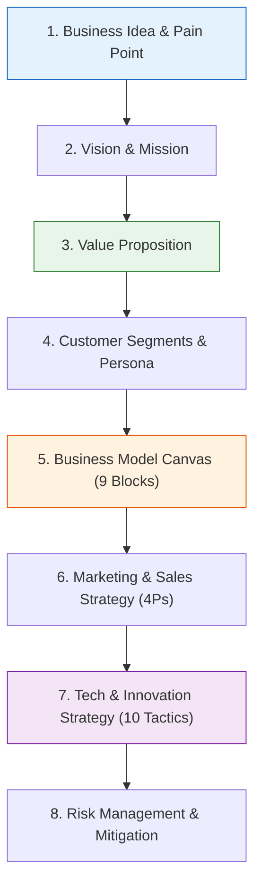
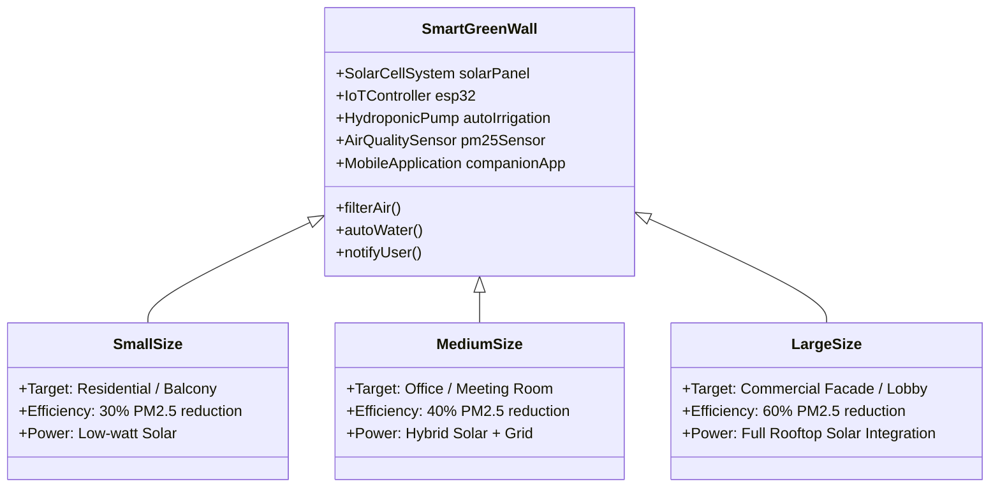

---
tags:
  - technopreneurs
  - final-project
  - bmc
  - report-guide
  - customer-discovery
  - smart-green-wall
created: 2026-09-09
updated: 2026-09-09
type: project-guide
---

# 🚀 Final Project Report & Presentation Comprehensive Guide
> **วิชา:** 080203914 ผู้ประกอบการนวัตกรรม (Innovative Technopreneurs)  
> **แหล่งข้อมูลอ้างอิง:** ถอดคำบรรยายจากไฟล์เสียงอาจารย์ผู้สอน (`20260904_105814.aac`) และการสัมภาษณ์ลูกค้า Customer Discovery (`20260126_162937.aac`, `20260126_164100.aac`)

---

## 📅 กำหนดการส่งงานและการนำเสนอ (Deadlines & Schedule)

```mermaid
timeline
    title ไทม์ไลน์การส่งเล่มรายงานและการนำเสนอโปรเจกต์นวัตกรรม
    1 ตุลาคม 2568 (12:00 น.) : ส่งไฟล์ PDF รายงานฉบับสมบูรณ์ (ทาง Line กลุ่ม)
    2 ตุลาคม 2568 (ในคาบเรียน) : ส่งเล่มรายงานฉบับพิมพ์ Hardcopy (ขาว-ดำ) : นำเสนอ Pitching กลุ่มชุดที่ 1 (10 นาที + ถามตอบ 5 นาที)
    9 ตุลาคม 2568 (ในคาบเรียน) : นำเสนอ Pitching กลุ่มชุดที่ 2 (10 นาที + ถามตอบ 5 นาที)
```

> [!IMPORTANT] กฎเหล็กการส่งเล่มและการนำเสนอ
> 1. **ส่งไฟล์ดิจิทัล:** วันพุธที่ **1 ตุลาคม 2568 ภายในเวลา 12:00 น. (เที่ยงตรง)** ส่งไฟล์ PDF รวมเล่มสมบูรณ์เข้า Line กลุ่มประจำวิชา
> 2. **ส่งรูปเล่มจริง:** วันพฤหัสบดีที่ **2 ตุลาคม 2568 ในคาบเรียน** พิมพ์แบบขาว-ดำ (Black & White) เย็บเล่มหรือเข้าเล่มให้เรียบร้อย
> 3. **เวลาการ Pitching:** กลุ่มละ **10 นาที** ตรงเวลา + **5 นาที** ช่วงตอบคำถามและรับ Feedback จากอาจารย์ผู้สอน

---

## 📑 โครงสร้างรายงานฉบับสมบูรณ์ 8 หัวข้อหลัก (8 Report Sections)

ตามคำชี้แจงของอาจารย์ผู้สอนในชั้นเรียน เล่มรายงานโปรเจกต์ต้องประกอบด้วย 8 หมวดเนื้อหาหลักอย่างครบถ้วน:



---

### หมวดที่ 1: แนวคิดธุรกิจและปัญหาของตลาด (Business Idea & Problem Statement)
* **Problem Identification:** ระบุปัญหาของผู้บริโภคหรือองค์กรธุรกิจอย่างชัดเจน (Pain Points) มีหลักฐานข้อมูลสถิติหรือความสูญเสียที่เกิดขึ้นจริงในตลาด
* **The "Why Now?":** ทำไมปัญหานี้ถึงจำเป็นต้องแก้ไขในปัจจุบัน (เช่น กฎหมายสิ่งแวดล้อมใหม่, ปัญหามลพิษ PM2.5, การเติบโตของเมือง)
* **Solution Concept:** ภาพรวมของนวัตกรรมผลิตภัณฑ์หรือบริการที่จะเข้ามาแก้ปัญหานั้น

---

### หมวดที่ 2: วิสัยทัศน์และพันธกิจ (Vision & Mission)
* **Vision (วิสัยทัศน์):** เป้าหมายระยะยาว 3-5 ปีที่องค์กรต้องการก้าวไปถึง (Inspiring, Forward-looking)
* **Mission (พันธกิจ):** ขอบเขตการดำเนินงานในปัจจุบัน องค์กรทำอะไร เพื่อใคร และส่งมอบคุณค่าอย่างไรให้เกิดผลจริง

---

### หมวดที่ 3: คุณค่าที่ส่งมอบ (Value Proposition)
* **Unique Value Proposition (UVP):** คุณค่าโดดเด่นที่คู่แข่งในตลาดไม่สามารถลอกเลียนแบบได้ง่าย
* **Value Proposition Canvas (VPC):**
  * **Customer Profile:** Jobs-to-be-done, Pains, Gains
  * **Value Map:** Products & Services, Pain Relievers, Gain Creators

---

### หมวดที่ 4: กลุ่มลูกค้าเป้าหมายและเพอร์โซนา (Customer Segments & Persona)
* **Segmentation:** แบ่งกลุ่มลูกค้าตามประชากรศาสตร์ (Demographic), ภูมิศาสตร์ (Geographic), และจิตวิทยา/พฤติกรรม (Psychographic & Behavioral)
* **User Persona Profile:** จำลองตัวแทนลูกค้ากลุ่มเป้าหมายหลัก 1-2 คน (ระบุชื่อ, อายุ, อาชีพ, รายได้, กิจวัตรประจำวัน, เป้าหมาย, และจุดเจ็บปวด)
* **Early Adopters:** กลุ่มลูกค้ากลุ่มแรกที่จะยอมจ่ายเงินทดลองใช้งานผลิตภัณฑ์ของเรา

---

### หมวดที่ 5: แบบจำลองผืนผ้าใบธุรกิจ (Business Model Canvas - BMC)
> [!TIP] เทคนิคจากอาจารย์
> ให้แสดง **ภาพรวม BMC 1 หน้าเต็ม (A4 แนวนอน)** แล้วตามด้วยการ **อธิบายเจาะลึกทั้ง 9 ช่องทีละหัวข้อ**

1. **Customer Segments (CS):** ใครคือผู้จ่ายเงิน และใครคือผู้ใช้งาน
2. **Value Propositions (VP):** สินค้า/บริการของเราแก้ปัญหาและตอบสนองความต้องการอะไร
3. **Channels (CH):** ช่องทางการเข้าถึง รับรู้ ซื้อ และบริการหลังการขาย
4. **Customer Relationships (CR):** การสร้างความสัมพันธ์ การรักษาลูกค้าเดิม และการ Upsell
5. **Revenue Streams (RS):** โครงสร้างรายได้ (ขายขาด, ค่าสมาชิก Subscription, ค่าธรรมเนียมบริการ)
6. **Key Activities (KA):** กิจกรรมสำคัญที่ต้องทำเพื่อให้ธุรกิจเดินหน้า (วิจัย, ผลิต, การตลาด)
7. **Key Resources (KR):** ทรัพยากรหลักที่ขาดไม่ได้ (เทคโนโลยี, สิทธิบัตร, ทีมวิศวกร, ทุน)
8. **Key Partners (KP):** พันธมิตรทางธุรกิจ (ซัพพลายเออร์, ผู้ร่วมทุน, หน่วยงานรัฐ, สถาบันวิจัย)
9. **Cost Structure (CS):** ต้นทุนคงที่ (Fixed Costs) และต้นทุนผันแปร (Variable Costs)

---

### หมวดที่ 6: กลยุทธ์การตลาดและการขาย (Marketing & Sales Strategy)
* **Market Positioning:** แผนผังตำแหน่งทางการตลาด (Positioning Map) เปรียบเทียบกับคู่แข่งทางตรงและทางอ้อม
* **Marketing Mix (4Ps / 7Ps):**
  * **Product:** ฟังก์ชัน, การออกแบบ, บรรจุภัณฑ์, บริการเสริม
  * **Price:** กลยุทธ์การตั้งราคา (Cost-Plus, Value-Based, Penetration Pricing)
  * **Place:** ช่องทางการจัดจำหน่าย (Online, B2B Direct Sales, Retail Distributor)
  * **Promotion:** การสื่อสารการตลาด, Content Marketing, การสาธิตใช้งานจริง (Product Demo)

---

### หมวดที่ 7: กลยุทธ์ด้านเทคโนโลยีและนวัตกรรม (Technology & Innovation Strategy)
* **3 มิติของนวัตกรรม (3 Innovation Dimensions):**
  1. *Product/Service Innovation:* นวัตกรรมตัวผลิตภัณฑ์
  2. *Process Innovation:* นวัตกรรมกระบวนการผลิตหรือการให้บริการ
  3. *Business Model Innovation:* นวัตกรรมการสร้างรายได้และการจับมือพันธมิตร
* **10 กลยุทธ์นวัตกรรม (Ten Types of Innovation Tactics):** ยกตัวอย่างอย่างน้อย 2-3 ยุทธวิธีที่นำมาประยุกต์ใช้จริง

---

### หมวดที่ 8: การประเมินและบริหารความเสี่ยง (Risk Management & Mitigation)
* จัดทำตารางวิเคราะห์ความเสี่ยง 4 ด้านหลัก:

| ประเภทความเสี่ยง | เหตุการณ์เสี่ยงที่เป็นไปได้ | ระดับผลกระทบ (High/Med/Low) | มาตรการป้องกันและแก้ไข (Mitigation Plan) |
|:---|:---|:---:|:---|
| **1. ด้านเทคโนโลยี (Tech)** | อุปกรณ์เซนเซอร์ชำรุด หรือระบบเชื่อมต่อ Cloud ล่ม | High | ใช้อุปกรณ์เกรดอุตสาหกรรม และมีระบบ Local Cache สำรองข้อมูล |
| **2. ด้านตลาดและการยอมรับ (Market)** | ลูกค้าลังเลเรื่องราคา หรือไม่เข้าใจความคุ้มค่า | Med | มีระบบผ่อนชำระ และแสดงแดชบอร์ด ROI คำนวณค่าไฟ/สุขภาพให้เห็น |
| **3. ด้านการเงินและต้นทุน (Financial)** | ต้นทุนชิ้นส่วนอิเล็กทรอนิกส์ปรับตัวสูงขึ้น | Med | ทำสัญญาจัดซื้อระยะยาวกับผู้ผลิตชิ้นส่วนโดยตรง |
| **4. ด้านกฎหมายและข้อบังคับ (Legal)** | ข้อกำหนดเรื่องการติดตั้งอาคารหรือมาตรฐานสิ่งแวดล้อม | Low | ขอรับรองมาตรฐานวิศวกรรมอาคารและ มอก. สิ่งแวดล้อม |

---

## 🌿 กรณีศึกษาการค้นพบลูกค้า: Smart Green Wall (Customer Discovery Case Study)

> ข้อมูลจากการสัมภาษณ์กลุ่มผู้ใช้งานจริง (User Interviews จากไฟล์เสียง `20260126_162937.aac` และ `20260126_164100.aac`)



### 1. ปัญหาและจุดเจ็บปวดที่พบจากการสัมภาษณ์ (Customer Pains)
1. **คนเมืองอยากมีพื้นที่สีเขียว แต่ไม่มีเวลาดูแล:** ปัญหาต้นไม้ตายเนื่องจากลืมรดน้ำ หรือรดน้ำมากเกินไป
2. **วิกฤตฝุ่น PM2.5 และมลพิษทางอากาศ:** เครื่องฟอกอากาศทั่วไปใช้ฟิลเตอร์กระดาษ HEPA ที่ต้องเปลี่ยนบ่อยและสร้างขยะ ไม่สร้างความสดชื่นหรือออกซิเจนตามธรรมชาติ
3. **ค่าไฟฟ้าในการฟอกอากาศ:** ความกังวลเรื่องการเปิดเครื่องฟอกอากาศตลอด 24 ชั่วโมง

### 2. สเปกและขนาดของผลิตภัณฑ์ที่ออกแบบตามความต้องการของลูกค้า (3 Product Sizes)
จากการวิจัยและสัมภาษณ์ลูกค้า ได้กำหนดผลิตภัณฑ์ออกเป็น 3 ขนาดหลัก:
* **ขนาดเล็ก (Small - Balcony/Studio):**
  * เหมาะสำหรับ: คอนโดมิเนียม ระเบียงห้องพัก ห้องนอน
  * ประสิทธิภาพ: กรองฝุ่นและดูดซับ PM2.5 ได้ **30%** ในรัศมีการใช้งาน
  * ระบบพลังงาน: แผงโซลาร์เซลล์ขนาดเล็ก ไม่ต้องต่อสายไฟเพิ่ม
* **ขนาดกลาง (Medium - Office/Classroom):**
  * เหมาะสำหรับ: สำนักงาน ออฟฟิศ ห้องประชุม คาเฟ่
  * ประสิทธิภาพ: กรองฝุ่นและดูดซับ PM2.5 ได้ **40%**
  * ระบบพลังงาน: Hybrid พลังงานแสงอาทิตย์ร่วมกับไฟอาคาร
* **ขนาดใหญ่ (Large - Building Facade/Lobby):**
  * เหมาะสำหรับ: ล็อบบี้อาคารพาณิชย์ โถงโรงแรม หน้าร้านค้า
  * ประสิทธิภาพ: กรองฝุ่นและดูดซับ PM2.5 ได้สูงสุดถึง **60%**
  * ระบบทำงาน: เชื่อมต่อท่อระบายน้ำอาคารและระบบ Sensor ตรวจจับสภาพอากาศระดับ Smart Building

### 3. ฟังก์ชันอัจฉริยะที่ผู้ใช้ประทับใจ (Key Differentiators)
* **Auto Irrigation:** ระบบรดน้ำไฮโดรโปนิกส์หมุนเวียนอัตโนมัติ คำนวณความชื้นในดินและสภาวะแสง ไม่ต้องรดน้ำเอง
* **Solar-Powered Eco System:** ใช้พลังงานแสงอาทิตย์ เป็นมิตรต่อสิ่งแวดล้อม และลดค่าใช้จ่ายผู้ใช้
* **Mobile App Integration:** แอปพลิเคชันแจ้งเตือนระดับฝุ่น PM2.5 ทั้งก่อนและหลังผ่าน Green Wall, แจ้งเตือนระดับน้ำในถังสำรอง, และสรุปปริมาณคาร์บอนที่ดูดซับได้

---

## 🎤 แนวทางการนำเสนอผลงาน (Pitching Presentation Guide - 10 Mins)

| นาทีที่ | หัวข้อสไลด์ (Slide Content) | สาระสำคัญที่ต้องนำเสนอ |
|:---:|:---|:---|
| **0 - 2** | **Hook & Problem Statement** | เปิดด้วยปัญหาวิกฤตที่ทุกคนสัมผัสได้ เล่าเรื่อง (Storytelling) ให้เห็น Pain Point ของเหยื่อปัญหา |
| **2 - 4** | **Solution & Product Demo** | โชว์นวัตกรรม (เช่น Smart Green Wall ทั้ง 3 ขนาด), จุดเด่นด้านพลังงานโซลาร์ และระบบเซนเซอร์ |
| **4 - 6** | **Market Opportunity & BMC** | ขนาดตลาด (TAM, SAM, SOM), ใครคือลูกค้า, โครงสร้างรายได้ (BMC 1 แผ่นฉายให้เห็นชัด) |
| **6 - 8** | **Traction & Customer Validation** | แสดงผลการสัมภาษณ์ลูกค้าจริง (Insights จาก Customer Discovery), สิ่งที่ลูกค้าชอบ และสิ่งที่นำมาปรับปรุง |
| **8 - 10** | **Business Plan, Risks & Call to Action** | กลยุทธ์การขาย (Go-to-market), แผนรับมือความเสี่ยง, และสรุปวิสัยทัศน์ของทีม |
| **10 - 15** | **Q&A Session** | ตอบคำถามอาจารย์อย่างตรงประเด็น โดยเน้นตัวเลขและหลักการที่เรียนในคลาส |

---

# References
- **Course:** 080203914 Innovative Technopreneurs
- **Related Notes:**
  - [[Innovative Technopreneurs Index]]
  - [[Lecture 1 - การเป็นผู้ประกอบการและผู้ประกอบการนวัตกรรม]]
  - [[Lecture 2 - โอกาสและการประกอบการนวัตกรรม]]
  - [[Lecture 3 - วิสัยทัศน์ พันธกิจ และตัวแบบธุรกิจ]]
  - [[Lecture 4 - กลยุทธ์การแข่งขันสำหรับผู้ประกอบการนวัตกรรม]]
  - [[Lecture 5 - กลยุทธ์ด้านนวัตกรรมและเทคโนโลยี]]
  - [[Lecture 6 - การพัฒนาสินค้าและบริการนวัตกรรม]]
