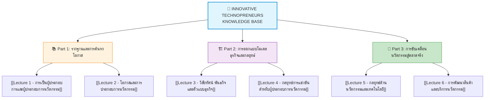

---
tags:
  - technopreneurs
  - innovation
  - index
  - master-guide
created: 2026-08-18
updated: 2026-08-18
type: index
---

# Innovative Technopreneurs - Comprehensive Master Index

> [!SUMMARY] คลังความรู้ ผู้ประกอบการนวัตกรรม (Innovative Technopreneurs) ระดับสมบูรณ์แบบ
> สารบัญดัชนีหลัก (Master Index) รวบรวม **"Mega Guides"** สำหรับวิชา 080203914 ผู้ประกอบการนวัตกรรม (Innovative Technopreneurs) คณะศิลปศาสตร์ประยุกต์ มหาวิทยาลัยเทคโนโลยีพระจอมเกล้าพระนครเหนือ เนื้อหาถูกสรุป ถอดรหัส และวิเคราะห์อย่างละเอียดจากทุกหน้าสไลด์ ทุกแผนภาพ และทุกกรณีศึกษา ครอบคลุมตั้งแต่รากฐานการเป็นผู้ประกอบการ, การค้นหาและประเมินโอกาส, การออกแบบวิสัยทัศน์ พันธกิจ และโมเดลธุรกิจ (BMC & Lean Canvas), กลยุทธ์การแข่งขันและพันธมิตร ไปจนถึงการพัฒนานวัตกรรมสินค้าและบริการ

---

# 📚 Part 1: รากฐานและการค้นหาโอกาส (Foundations & Opportunity Discovery)

การสร้างธุรกิจนวัตกรรมเริ่มต้นจากการเข้าใจพลวัตของระบบเศรษฐกิจ กลไกการทำลายล้างที่สร้างสรรค์ (Creative Destruction) และทักษะการมองหาช่องว่างและโอกาสทางเทคโนโลยีและการตลาด

- 🔹 **[[Lecture 1 - การเป็นผู้ประกอบการและผู้ประกอบการนวัตกรรม]]**
  - วิวัฒนาการและแนวคิดของ โจเซฟ ชุมปีเตอร์ (Joseph Schumpeter)
  - ทุนนิยมแบบไดนามิก (Dynamic Capitalism) & 4 เป้าหมายหลัก
  - การทำลายล้างที่สร้างสรรค์ (Creative Destruction) & การกลายพันธุ์ของผลิตภัณฑ์ (Product Mutation)
  - นิยามของผู้ประกอบการ & ความสัมพันธ์กับเทคโนโลยีและทรัพย์สินทางปัญญา
  - 3 บทบาทหลักของผู้ประกอบการยุคใหม่ในฐานะนวัตกร
  - 4 ลำดับขั้นตอนการเริ่มต้นธุรกิจในระบบทุนนิยมพลวัต
  - The Sweet Spot: จุดบรรจบ 3 มิติแห่งโอกาส
  - แบบจำลองเศรษฐกิจ (Economic Model: 3 ทุนหลัก สู่ผลลัพธ์และของเสีย)
  - กรณีศึกษาผู้ประกอบการนวัตกรรมระดับโลกและสตาร์ทอัพไทย (Grab, Freshket, Tellscore, Ookbee, Finnomena, Chiang Mai Bioveggie)
  - 8 กิจกรรมสำคัญ, สมรรถนะหลักเฉพาะตัว, โอกาส vs ความเสี่ยง, และ 5 คำถามวัดความพร้อม
- 🔹 **[[Lecture 2 - โอกาสและการประกอบการนวัตกรรม]]**
  - แหล่งที่มาของโอกาส: ปัจจัย PESTEL & การพยากรณ์แนวโน้ม
  - การสร้างวัฒนธรรมองค์กรเพื่อค้นหาโอกาสทางธุรกิจ (เปิดกว้าง, เรียนรู้, ทดลอง)
  - แรงดึงความต้องการของตลาด (Demand Pull) vs แรงผลักดันของเทคโนโลยี (Technology Push)
  - ลูกบาศก์ 3 มิติแห่งโอกาสใหม่ (Opportunity Cube)
  - เก้าช่องทางสร้างโอกาสในโลกนวัตกรรม (9 Categories of Opportunity) พร้อมกรณีศึกษา (Shokay, Smart Locks, VMware, Spotify, RFID/E-commerce, Walmart, Microscopic Supercomputing, FedEx, Honda-Nissan Merger)
  - กระบวนการพัฒนาลูกค้า 4 ขั้นตอน (Customer Development Process โดย Steve Blank)
  - การมีส่วนร่วมในตลาดผลิตภัณฑ์: แบบดั้งเดิม vs แนวทางใหม่ (ข้อมูลปฐมภูมิ vs ทุติยภูมิ)
  - เทคนิคการจัดสนทนากลุ่ม (Focus Group) & 10 เคล็ดลับการสัมภาษณ์ลูกค้าเชิงลึก (Customer Interview)
  - การสังเกตการณ์เชิงพฤติกรรม (Observational Research: กรณีศึกษา Kaiser Permanente)
  - กระบวนการคิดเชิงออกแบบ (Design Thinking 5 ขั้นตอน: IDEO & HBR 2008)
  - 4 ประเภทของนวัตกรรม (Henderson & Clark Framework: Incremental, Architectural, Modular, Radical/Disruptive)
  - การบรรจบกันของแนวโน้มสังคม วัฒนธรรม และเทคโนโลยี
  - การประเมินโอกาส: คุณลักษณะ 5 ประการ, หลักการเลือกโอกาสที่ดี, 5 ขั้นตอนพื้นฐาน, และตัวแบบเกณฑ์ 7 ประการ (7 Domains Model)

---

# 🏗️ Part 2: การออกแบบโมเดลธุรกิจและกลยุทธ์ (Business Model Design & Strategy)

การเปลี่ยนไอเดียให้กลายเป็นพิมพ์เขียวทางธุรกิจที่สร้างผลกำไรได้อย่างยั่งยืน ผ่านการผสานวิสัยทัศน์ พันธกิจ ข้อเสนอคุณค่า และการวางกลยุทธ์เชิงแข่งขัน

- 🔹 **[[Lecture 3 - วิสัยทัศน์ พันธกิจ และตัวแบบธุรกิจ]]**
  - ลำดับขั้นการแปลงนวัตกรรมสู่คุณค่าทางเศรษฐกิจ (Vision → Mission → Value Proposition → Business Model)
  - องค์ประกอบและลักษณะของวิสัยทัศน์ที่ดี (Clarity, Consistency, Uniqueness, Purposeful)
  - กรณีศึกษาและตัวอย่างคำแถลงวิสัยทัศน์ (AI Tech, Coffee Shop, Automotive, Banking, Biomedical, Healtheon/WebMD)
  - หลักการเขียนพันธกิจที่ทรงพลัง (4 คำถามหลัก: What, For whom, How, Why + กฎไม่เกิน 100 คำ)
  - กรณีศึกษาคำแถลงพันธกิจ (eBay, Genentech) และตารางเปรียบเทียบ Vision vs Mission
  - การวิเคราะห์และออกแบบข้อเสนอคุณค่า (Value Proposition Design: Customer Pains/Gains, Differentials)
  - คุณค่า 5 มิติที่ต้องส่งมอบ (Product, Price, Access, Service, Experience) พร้อมกรณีศึกษาเมทริกซ์คุณค่า
  - เครื่องมือพัฒนาโมเดลธุรกิจ (Business Model Canvas, Lean Canvas, Value Proposition Canvas)
  - เจาะลึก 9 องค์ประกอบของ Business Model Canvas (BMC) แบ่งเป็น 3 ส่วน: Desirability, Feasibility, Viability
  - กรณีศึกษาระดับโลก: Business Model Canvas ของ Apple (Hardware, Software, iTunes Ecosystem)
  - 5 จุดศูนย์กลางการพลิกโฉมโมเดลธุรกิจ (Epicenters of Business Model Innovation: Resource, Offer, Customer, Finance, Multiple-driven)
  - วงจรการออกแบบและทดสอบธุรกิจแบบวนซ้ำไม่รู้จบ (Iterative Business Design Process)
- 🔹 **[[Lecture 4 - กลยุทธ์การแข่งขันสำหรับผู้ประกอบการนวัตกรรม]]**
  - นิยามและแก่นแท้ของกลยุทธ์การแข่งขันในบริบทผู้ประกอบการนวัตกรรม
  - 8 ขั้นตอนในกระบวนการพัฒนากลยุทธ์ (Strategy Development Process)
  - กลยุทธ์การลงทุนแบบไดนามิก (Dynamic Strategy Engine) & 6 คำถามชี้ชะตาธุรกิจ
  - สมรรถนะหลักของกิจการ (Core Competencies) & การผสานทรัพยากร (Intel, 3M, Honda, Google)
  - การวิเคราะห์อุตสาหกรรม 5 มิติ และ 4 ขั้นตอนของวงจรชีวิตอุตสาหกรรม (Emergent, Growth, Mature, Decline)
  - แบบจำลองพลังทั้งหก (Six Forces Model: แรงผลักดันในการแข่งขันและบทบาทของผู้เสริม Complementors)
  - การวิเคราะห์ SWOT เชิงกลยุทธ์ & กรณีศึกษา Amgen
  - ลูกบาศก์แห่งโอกาส 3 มิติ (3D Opportunity Cube: ผลิตภัณฑ์ x ลูกค้า x ช่องทาง) เพื่อประเมินความเสี่ยง
  - การจับคู่กลยุทธ์กับความเร็วของตลาด (Position Defense vs Resource Leverage vs Emergent Approach)
  - ป้อมปราการต้านคู่แข่ง: 6 อุปสรรคในการเข้าสู่ตลาด (Barriers to Entry)
  - พีระมิดแห่งการสร้างมูลค่าและความได้เปรียบทางการแข่งขันที่ยั่งยืน (Value Creation Pyramid)
  - 10 มิติแห่งความได้เปรียบในการแข่งขัน พร้อมกรณีศึกษาบริษัทชั้นนำ
  - เครือข่ายคุณค่าและการแข่งขันแบบร่วมมือ (Value Network & Co-opetition)
  - สเปกตรัมของพันธมิตรทางธุรกิจ 6 ระดับ (Projects → R&D → Comarketing → Joint Production → Joint Ventures → Mergers)
  - ความรับผิดชอบต่อสังคม (CSR), คุณภาพชีวิต 3 ทุน (เศรษฐกิจ, สังคม, ธรรมชาติ), และเมทริกซ์คุณธรรมทางสังคม (Social Virtue Matrix)

---

# 🚀 Part 3: การขับเคลื่อนนวัตกรรมสู่ตลาดจริง (Innovation Strategy & Product Development)

ยุทธวิธีในการนำนวัตกรรมเข้าสู่ตลาด การบริหารจังหวะเวลา (Timing) และกระบวนการเปลี่ยนจินตนาการให้กลายเป็นผลิตภัณฑ์จริงที่ผู้ใช้หลงรัก

- 🔹 **[[Lecture 5 - กลยุทธ์ด้านนวัตกรรมและเทคโนโลยี]]**
  - การวิเคราะห์ผู้บุกเบิกรายแรก (First Mover) vs ผู้ติดตามที่รวดเร็ว (Fast Follower) ใน 3 สภาวะอุตสาหกรรม
  - หุบเขาแห่งความตาย (The Valley of Death) จากสิ่งประดิษฐ์ (Invention) สู่ นวัตกรรม (Innovation)
  - แบบจำลองหน้าต่างแห่งโอกาส (Window of Opportunity) และวัฏจักรความรู้สึกเร่งด่วน (The Cycle of Urgency)
  - บทเรียนกลยุทธ์จังหวะเวลา: กรณีศึกษา Silicon Valley Bank (SVB), JetBlue, และ Starbucks (Smart Imitation)
  - 3 หมวด 10 ยุทธวิธีนวัตกรรม (Ten Types of Innovation): Configuration, Offering, Experience
  - การประเมินความเป็นไปได้ของเทคโนโลยี (Significance, Radicalness, Patent Scope)
  - 4 ขั้นตอนสู่ความสำเร็จของนวัตกรรมเทคโนโลยี (Technology Factors → Business Model → Strategy → Expected Results)
  - ทฤษฎีนวัตกรรมพลิกโฉม/ก่อกวน (Disruptive Innovation): กรณีศึกษา Netflix vs Blockbuster
  - เส้นทางการยอมรับและการแพร่กระจายของนวัตกรรม (Innovation Diffusion Pathway: Niche สู่ Mainstream)
- 🔹 **[[Lecture 6 - การพัฒนาสินค้าและบริการนวัตกรรม]]**
  - รากฐานของนวัตกรรม: จินตนาการ (Imagination) → ความคิดสร้างสรรค์ (Creativity) → สิ่งประดิษฐ์ (Invention) → นวัตกรรม (Innovation)
  - ทรัพยากร 6 ประการสำหรับองค์กรสร้างสรรค์ และกลไกนวัตกรรม (Innovation Engine: ปัจจัยภายใน vs ปัจจัยภายนอก)
  - วงจรการเกิดความคิดสร้างสรรค์ 6 โหนด (The Creative Thinking Cycle)
  - โครงสร้างทีมและ 10 บทบาทในการสร้างนวัตกรรม (The 10 Faces of Innovation): บทบาทการเรียนรู้, การจัดการ, และการรังสรรค์
  - กลยุทธ์การระดมความคิดที่มีประสิทธิภาพ: แนวทาง 7 ประการ (7 Rights) และกฎข้อควรปฏิบัติ 7 ข้อ
  - รากฐานการออกแบบผลิตภัณฑ์ (Product Design Foundations: Different but Familiar)
  - ท่อส่งกระบวนการออกแบบผลิตภัณฑ์ A-F (Product Design Pipeline A-F)
  - การออกแบบผลิตภัณฑ์ให้ทนทาน (Robust Product & Robust Design)
  - เรดาร์ 5 องค์ประกอบของการใช้งานที่ดี (The Usability Radar 5 Elements)
  - สถาปัตยกรรมการออกแบบ: โมดูล (Module) vs การออกแบบโมดูลาร์ (Modular Design)
  - กระบวนการพัฒนาผลิตภัณฑ์ต้นแบบแบบวนซ้ำ (The Iterative Prototype Loop)
  - การสร้างภาพจำลองเหตุการณ์และการจำลองสถานการณ์ (Scenario & Simulation Mapping)

---

# 📈 แผนการติดตามและสถานะการเรียนรู้
- ตรวจสอบสถานะการสรุปและทบทวนเนื้อหาได้ที่ **[[Progress Checklist]]**
