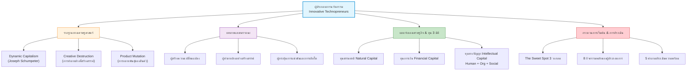
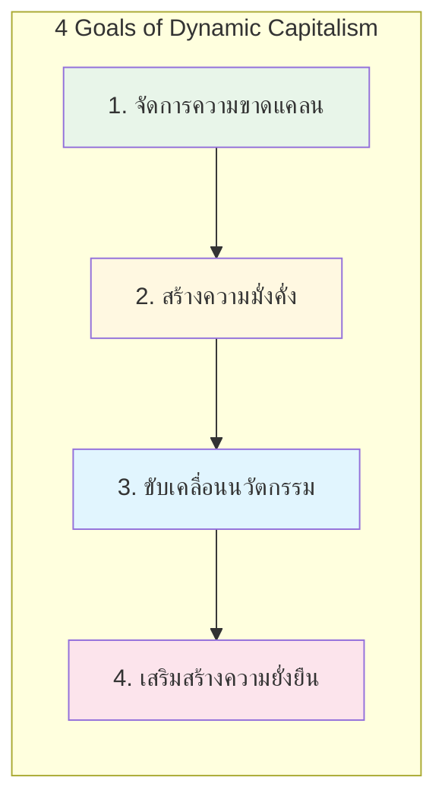
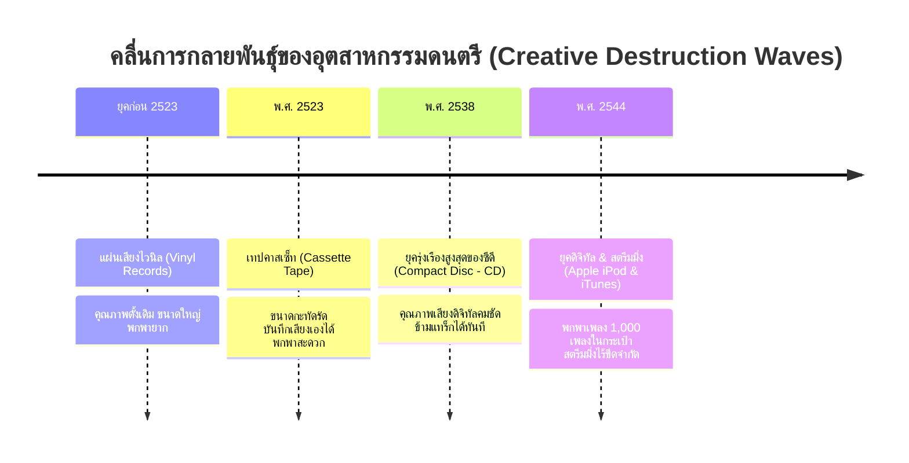
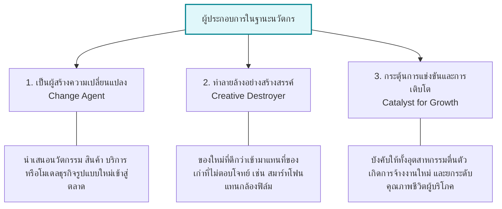
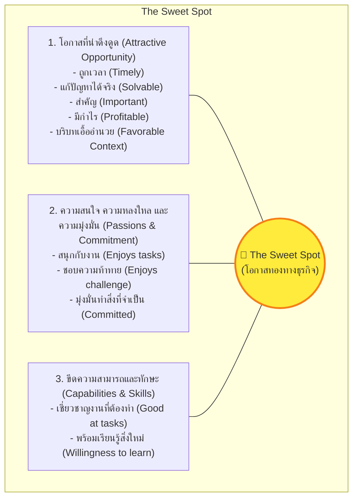
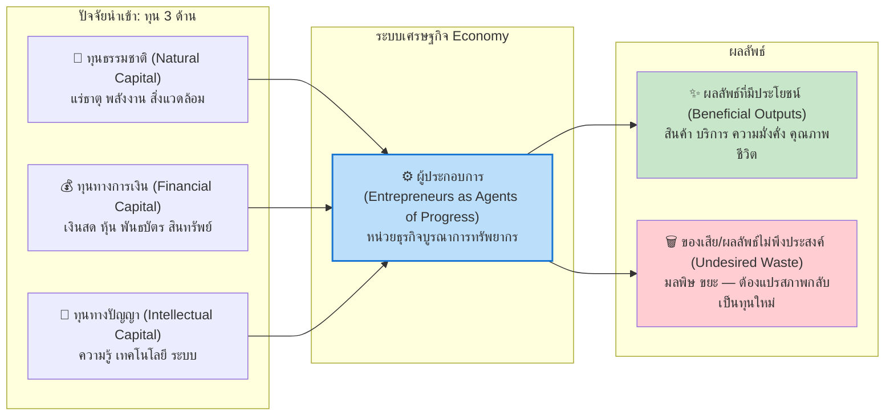
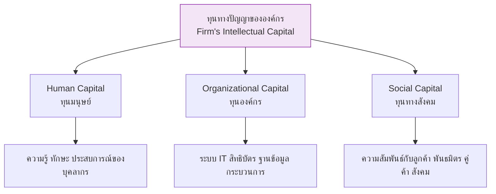
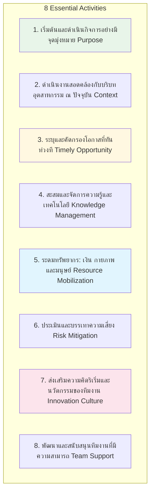

---
tags:
  - entrepreneurship
  - innovation
  - technopreneurs
  - dynamic-capitalism
  - lecture-1
created: 2026-08-18
updated: 2026-08-18
lecture: 1
type: lecture
---

# Lecture 1: การเป็นผู้ประกอบการและผู้ประกอบการนวัตกรรม - Mega Guide

> [!SUMMARY] ภาพรวมบทเรียน
> บทเรียนนี้ครอบคลุมรากฐานสำคัญของการเป็นผู้ประกอบการนวัตกรรม (Innovative Technopreneurs) ประกอบด้วย 5 ส่วนหลัก:
> 1. [[#1. ความเป็นมาของผู้ประกอบการกับนวัตกรรม]] - ทุนนิยมแบบไดนามิก (Dynamic Capitalism) และการทำลายล้างที่สร้างสรรค์ (Creative Destruction) โดย Joseph Schumpeter
> 2. [[#2. ผู้ประกอบการและเทคโนโลยี]] - นิยาม บทบาท ความสัมพันธ์ระหว่างผู้ประกอบการ นวัตกรรม และทรัพย์สินทางปัญญา
> 3. [[#3. การเริ่มต้นธุรกิจและการค้นหาโอกาส]] - ขั้นตอนการเริ่มต้นธุรกิจ และจุดบรรจบ (The Sweet Spot)
> 4. [[#4. ระบบเศรษฐกิจและการประกอบการ]] - แบบจำลองเศรษฐกิจ (Economic Model) 3 ทุนหลัก (Natural, Financial, Intellectual Capital)
> 5. [[#5. ผู้ประกอบการนวัตกรรมและกรณีศึกษา]] - กรณีศึกษาในไทยและระดับโลก, 8 กิจกรรมสำคัญ, สมรรถนะเฉพาะตัว, โอกาส vs ความเสี่ยง และ 5 คำถามวัดความพร้อม

---

# 1. ความเป็นมาของผู้ประกอบการกับนวัตกรรม

*📄 Slides 4-7*

## 1.1 แนวคิดของ โจเซฟ ชุมปีเตอร์ (Joseph Schumpeter)
การศึกษาเรื่องผู้ประกอบการกับนวัตกรรมเริ่มปรากฏชัดเจนอย่างยิ่งในช่วงทศวรรษ 1930 โดยนักเศรษฐศาสตร์ชื่อดัง **Joseph Schumpeter** ซึ่งได้เสนอแนวคิดว่าระบบเศรษฐกิจโลกไม่ได้ดำเนินไปแบบนิ่งสนิทหรือหยุดอยู่กับที่ แต่ขับเคลื่อนภายใต้ **"ระบบทุนนิยมแบบไดนามิก" (Dynamic Capitalism)**

> [!DEFINITION] ทุนนิยมแบบไดนามิก (Dynamic Capitalism / ทุนนิยมพลวัต)
> ระบบเศรษฐกิจที่มีการเปลี่ยนแปลง เคลื่อนไหว และพัฒนาสิ่งใหม่อยู่ตลอดเวลา ไม่หยุดนิ่งตายตัว โดยเชื่อว่าความเจริญเติบโตทางเศรษฐกิจไม่ได้เกิดจากการรักษาสมดุลแบบเดิมๆ แต่เกิดจากการสร้างสรรค์สิ่งใหม่ที่เข้าไปสั่นคลอนและแทนที่สิ่งเก่า

## 1.2 เป้าหมายสำคัญ 4 ประการของทุนนิยมแบบไดนามิก
1. **การจัดการความขาดแคลนของสังคม (Managing Scarcity):** การปรับปรุงกระบวนการผลิตและการกระจายสินค้า/บริการให้มีประสิทธิภาพสูงสุดภายใต้ทรัพยากรที่มีอยู่อย่างจำกัด
2. **การสร้างความมั่งคั่งแก่สมาชิกในสังคม (Creating Wealth):** การเปลี่ยนทรัพยากร วัตถุดิบ และเทคโนโลยีให้กลายเป็นผลผลิตที่มีมูลค่าเพิ่ม (Value-Added) สูงขึ้น
3. **การขับเคลื่อนนวัตกรรมเพื่อพัฒนาสังคม (Driving Innovation):** การนำทุนทางปัญญา (Intellectual Capital) มาเป็นรากฐานในการสร้างสรรค์ผลิตภัณฑ์และบริการรูปแบบใหม่ที่ตอบโจทย์ความต้องการของสังคม
4. **การเสริมสร้างการพัฒนาที่สมดุลและยั่งยืน (Sustainable Development):** การบริหารจัดการทรัพยากรมนุษย์และระบบนิเวศ เพื่อสร้างประโยชน์สุขและความยั่งยืนในระยะยาว

## 1.3 การทำลายล้างที่สร้างสรรค์ (Creative Destruction)
กลไกหัวใจหลักของ Dynamic Capitalism คือ **"การทำลายล้างที่สร้างสรรค์" (Creative Destruction)** หรือการกลายพันธุ์ทางธุรกิจ

> [!DEFINITION] การทำลายล้างที่สร้างสรรค์ (Creative Destruction)
> กระบวนการที่นวัตกรรมใหม่เข้ามาแทนที่โครงสร้างทางธุรกิจเดิมที่ไร้ประสิทธิภาพ ส่งผลให้เกิดความไม่ต่อเนื่องในตลาด (Market Discontinuity) ทำให้ธุรกิจเดิมต้องล้มหายตายจากไป ขณะที่ธุรกิจใหม่ที่ปรับตัวได้และใช้เทคโนโลยีสร้างความได้เปรียบที่เลียนแบบได้ยาก (Unfair Advantage) จะก้าวขึ้นมาเป็นผู้นำตลาดใหม่ (Zhao, 2005)

## 1.4 วิวัฒนาการและการกลายพันธุ์ของผลิตภัณฑ์ (Product Mutation Case Study)
ตัวอย่างคลาสสิกที่สะท้อนให้เห็นคลื่นการทำลายล้างที่สร้างสรรค์ในอุตสาหกรรมเพลงและบันเทิง:

| ยุคสมัย | รูปแบบเทคโนโลยี | จุดเด่น | สาเหตุที่ถูกทำลายล้าง / แทนที่ |
|---|---|---|---|
| **ยุคแผ่นเสียง (Vinyl)** | อะนาล็อกแผ่นไวนิล | คลาสสิก | พกพายาก เสียหายง่าย ผลิตและเปิดฟังเฉพาะที่ |
| **พ.ศ. 2523 (Cassette)** | แถบแม่เหล็กตลับเทป | พกพาง่าย อัดเสียงได้ | สายเทปพัน ยืด คุณภาพเสียงลดลงเมื่อเล่นซ้ำ |
| **พ.ศ. 2538 (CD)** | แผ่นดิจิทัลเลเซอร์ | เสียงใส เลือกแทร็กได้ทันที | ถูกคุกคามจากการดาวน์โหลด P2P เถื่อน และการพกพาซีดีหลายแผ่นยังไม่สะดวกพอ |
| **พ.ศ. 2544 เป็นต้นมา** | Apple iPod, iTunes, Streaming | เพลงนับล้านในมือถือ ซื้อเป็นเพลง จ่ายรายเดือน | กลายเป็นมาตรฐานใหม่ ธุรกิจขายแผ่นซีดีเดิมล้มละลายหรือต้องปรับตัว |

---

# 2. ผู้ประกอบการและเทคโนโลยี

*📄 Slides 8-11*

## 2.1 นิยามของ "ผู้ประกอบการ" (Entrepreneur)
> [!DEFINITION] ผู้ประกอบการ (Entrepreneur)
> บุคคลที่มุ่งมั่นสร้างความแตกต่างให้โลกและมีส่วนร่วมพัฒนาสังคม ด้วยการทำหน้าที่ **"มองหาโอกาส (Identify Opportunity) ระดมทรัพยากร (Mobilize Resources) และดำเนินการตามวิสัยทัศน์อย่างต่อเนื่อง"**

ผู้ประกอบการนวัตกรรมจะต้อง:
- มองหา **ทางออก** ในปัญหา (Solutions in Problems)
- มองหา **ความเป็นไปได้** ในความต้องการ (Possibilities in Needs)
- มองหา **โอกาส** ในความท้าทาย (Opportunities in Challenges)

## 2.2 เทคโนโลยี นวัตกรรม และทรัพย์สินทางปัญญา
- **เทคโนโลยี (Technology):** อุปกรณ์ สิ่งประดิษฐ์ กระบวนการ เครื่องมือ วิธีการ และวัสดุที่นำมาใช้เพื่อวัตถุประสงค์ทางอุตสาหกรรมและเชิงพาณิชย์ เช่น
  - *Intel:* ใช้เทคโนโลยีเซมิคอนดักเตอร์ออกแบบและผลิตวงจรรวม (Microprocessor)
  - *Microsoft:* สร้างและแจกจ่ายซอฟต์แวร์คอมพิวเตอร์ระดับโลก
  - *Apple:* ปฏิวัติอุปกรณ์สื่อสารและเทคโนโลยีสื่อเคลื่อนที่
- **นวัตกรรมและทรัพย์สินทางปัญญา (Innovation & Intellectual Property):** ผลงานที่เกิดจากการประดิษฐ์ คิดค้น หรือสร้างสรรค์ของมนุษย์ที่เน้นผลิตผลของสติปัญญาและความชำนาญ ทั้งรูปแบบจับต้องได้ (สินค้า) และจับต้องไม่ได้ (สิทธิบัตร ลิขสิทธิ์ แบรนด์ ซอฟต์แวร์)

## 2.3 สามบทบาทหลักของ "ผู้ประกอบการยุคใหม่ในฐานะนวัตกร" (Innovator)

---

# 3. การเริ่มต้นธุรกิจและการค้นหาโอกาส

*📄 Slides 12-13*

## 3.1 สี่ขั้นตอนการเริ่มต้นธุรกิจในระบบทุนนิยมแบบไดนามิก
1. **รวบรวมทีมผู้ก่อตั้ง (Assemble Founding Team):** รวมตัวบุคคลที่มีทักษะจำเป็น หรือได้รับการถ่ายทอดทักษะที่เกื้อหนุนกัน
2. **การเลือกโอกาส (Select Opportunity):** ดึงดูดทีมงานที่มีทักษะสอดคล้อง เพื่อพัฒนาโซลูชันที่ตอบโจทย์โอกาสนั้นได้อย่างแม่นยำ
3. **การระดมทรัพยากร (Acquire Resources):** สมาชิกทีมจัดหาและครอบครองทรัพยากรทางการเงิน กายภาพ และเครือข่าย โดยการหานักลงทุน (Investors) และหุ้นส่วน (Partners)
4. **เจรจาต่อรองและเปิดตัวธุรกิจ (Negotiate & Launch):** เจรจาข้อตกลง แบ่งปันสัดส่วนความเป็นเจ้าของ (Equity) และร่วมกันขับเคลื่อนธุรกิจเพื่อสร้างความมั่งคั่ง

## 3.2 การค้นหาจุดบรรจบที่น่าสนใจ (The Sweet Spot of Opportunity)
โอกาสที่ดีที่สุดไม่ได้เกิดขึ้นลอยๆ แต่เกิดจากจุดตัดกันของ 3 องค์ประกอบ:

---

# 4. ระบบเศรษฐกิจและการประกอบการ

*📄 Slides 14-17*

## 4.1 แบบจำลองเศรษฐกิจ (Economic Model)
ระบบเศรษฐกิจคือกระบวนการเปลี่ยนทรัพยากร (Inputs) ให้เป็นผลผลิตที่มีประโยชน์ (Outputs) โดยมีผู้ประกอบการเป็นตัวเร่งสำคัญ (Agents of Progress):

## 4.2 สามแหล่งที่มาของทุนทางปัญญา (Firm's Intellectual Capital)
ทุนทางปัญญาขององค์กรประกอบด้วย 3 ส่วนสำคัญ:
1. **ทุนมนุษย์ (Human Capital):** ความรู้ ทักษะ ความเชี่ยวชาญ และความคิดสร้างสรรค์ของพนักงานและทีมงาน
2. **ทุนองค์กร (Organizational Capital):** ฮาร์ดแวร์ ซอฟต์แวร์ ฐานข้อมูล สิทธิบัตร กระบวนการทำงาน และระบบการจัดการที่สนับสนุนทุนมนุษย์
3. **ทุนทางสังคม (Social Capital):** คุณภาพของเครือข่ายความสัมพันธ์กับลูกค้า คู่ค้า ซัพพลายเออร์ และพันธมิตรทางธุรกิจ

---

# 5. ผู้ประกอบการนวัตกรรมและกรณีศึกษา

*📄 Slides 18-26*

## 5.1 นิยามของผู้ประกอบการนวัตกรรม (Innovative Technopreneur)
> [!DEFINITION] ผู้ประกอบการนวัตกรรม
> ผู้ที่ไม่ได้เริ่มต้นธุรกิจเพียงเพื่อทำกำไรตามปกติ แต่ใช้ **"ความคิดสร้างสรรค์"** ผสมผสานกับ **"เทคโนโลยีและกระบวนการใหม่ๆ"** เพื่อมอบคุณค่าที่แตกต่าง (Differentiated Value) ในการแก้ปัญหาของผู้บริโภคที่คนอื่นยังแก้ไม่ได้หรือทำได้ไม่ดีพอ โดยมุ่งเน้นการสร้างความเปลี่ยนแปลง (Disruption)

### กรณีศึกษาตัวอย่างระดับโลกและสตาร์ทอัพไทย
| บริษัท / ผู้ประกอบการ | นวัตกรรม / สิ่งที่ทำ | คุณค่าที่สร้างขึ้น (Value Created) |
|---|---|---|
| **Grab** *(Anthony Tan & Tan Hooi Ling)* | ระบบจับคู่ผู้โดยสารกับคนขับด้วย GPS + ระบบให้คะแนนความปลอดภัย | แก้ปัญหาแท็กซี่หายาก ไม่ปลอดภัย ราคาไม่ชัดเจนในเอเชียตะวันออกเฉียงใต้ |
| **Steve Jobs** *(Apple)* | สร้าง iPhone (รวมโทรศัพท์ + iPod + Internet) | เปลี่ยนมือถือเป็นคอมพิวเตอร์พกพาจอสัมผัสที่ใช้งานง่ายที่สุดในโลก |
| **Jeff Bezos** *(Amazon)* | พัฒนาจากร้านหนังสือสู่อีคอมเมิร์ซและ Cloud Computing (AWS) | ลดต้นทุนโครงสร้างพื้นฐานไอทีให้ธุรกิจทั่วโลก รวดเร็ว ยืดหยุ่น |
| **Elon Musk** *(Tesla)* | นำรถยนต์ไฟฟ้าสมรรถนะสูงสู่ตลาดแมส พร้อมเครือข่าย Supercharger | เร่งการเปลี่ยนผ่านโลกสู่การใช้พลังงานสะอาดอย่างยั่งยืน |
| **Freshket** *(พงษ์ลดา พะเนียงเวทย์)* | ตลาดสดออนไลน์จัดการ Supply Chain สินค้าเกษตรสู่ร้านอาหาร | ลดต้นทุน ลดของเสีย (Food Waste) และเชื่อมเกษตรกรตรงสู่ผู้ซื้อ |
| **Tellscore** *(สุวิตา จรัญวงศ์)* | แพลตฟอร์ม Influencer Marketing อัตโนมัติด้วย AI & Data-driven | เชื่อมโยงแบรนด์กับไมโครอินฟลูเอนเซอร์ตรงกลุ่มเป้าหมาย แม่นยำ |
| **Ookbee** *(ณัฐวุฒิ พึงเจริญพงศ์)* | ดิจิทัลคอนเทนต์ Ecosystem (E-book, นิยาย, ชุมชนการ์ตูน) | ปฏิวัติการเสพสื่อและอุตสาหกรรมสิ่งพิมพ์สู่ดิจิทัลครบวงจร |
| **Finnomena** *(ทีมผู้บริหาร)* | แพลตฟอร์ม WealthTech นำเทคโนโลยีช่วยวางแผนการเงินและการลงทุน | ทำให้ความรู้และพอร์ตการลงทุนระดับสากลเข้าถึงคนทั่วไปได้ง่าย |
| **เชียงใหม่ไบโอเวกกี้** *(วิริยา พรทวีวัฒน์)* | เทคโนโลยีแปรรูปผักเม็ดคงคุณค่าสารอาหารเทียบเท่าผักสด | ยกระดับสินค้าเกษตรไทย แก้ปัญหาผักเน่าเสีย เพิ่มมูลค่าสูง |

---

## 5.2 กิจกรรม 8 ประการของผู้ประกอบการนวัตกรรม

---

## 5.3 โอกาสและความเสี่ยงของผู้ประกอบการ (Pros & Cons)

| มิติ | ปัจจัยบวก (Opportunities & Rewards) | ปัจจัยลบ (Risks & Challenges) |
|---|---|---|
| **ความเป็นอิสระ** | มีอิสระในการกำหนดทิศทางชีวิตและการทำงาน ยืดหยุ่น | รับผิดชอบทุกการตัดสินใจ ไม่มีเวลางานที่แน่นอน |
| **ผลตอบแทน** | ศักยภาพสร้างรายได้และความมั่งคั่งแบบก้าวกระโดด | เสี่ยงสูญเสียเงินลงทุน รายได้ไม่แน่นอนในช่วงแรก |
| **จิตวิทยา & สังคม** | ความภาคภูมิใจ ความสำเร็จ การยอมรับในฐานะผู้นำ | ความเครียดสะสม ชั่วโมงทำงานยาวนาน ความวิตกกังวลสูง |
| **คุณค่า** | ได้สร้างสรรค์สิ่งใหม่และแก้ปัญหาให้สังคม | โอกาสล้มเหลวสูงหากตลาดไม่ยอมรับนวัตกรรม |

---

## 5.4 แบบทดสอบ 5 คำถามประเมินความพร้อมสู่การเป็นผู้ประกอบการ

> [!IMPORTANT] 5 คำถามชี้วัดความพร้อมของผู้ประกอบการนวัตกรรม
> 1. **คุณสบายใจที่จะยืดหยุ่นกฎเกณฑ์และตั้งคำถามกับภูมิปัญญาดั้งเดิมหรือไม่?** *(พร้อมท้าทายสิ่งเดิมๆ หรือไม่)*
> 2. **คุณพร้อมที่จะต่อสู้กับคู่แข่งที่ทรงพลังและมีทรัพยากรเหนือกว่าหรือไม่?**
> 3. **คุณมีความอุตสาหะที่จะเริ่มต้นจากสิ่งเล็กๆ และอดทนเติบโตอย่างเป็นขั้นเป็นตอนหรือไม่?**
> 4. **คุณเต็มใจและสามารถปรับเปลี่ยนกลยุทธ์ (Pivot) ได้อย่างรวดเร็วเมื่อสถานการณ์เปลี่ยนหรือไม่?**
> 5. **คุณพร้อมที่จะเป็นผู้รับผิดชอบหลักและมีอำนาจตัดสินใจในภาวะวิกฤตหรือไม่?**

---

# 📝 สรุปสาระสำคัญประจำบท (Chapter Takeaway)
- ระบบเศรษฐกิจขับเคลื่อนด้วย **Dynamic Capitalism** ผ่านกลไก **Creative Destruction** ของ Schumpeter
- ผู้ประกอบการนวัตกรรมคือผู้ที่มองเห็นปัญหาแล้วใช้ **เทคโนโลยี + ความคิดสร้างสรรค์** ในการสร้างโซลูชันที่สร้างมูลค่าสูง
- ความสำเร็จเกิดจากการผสาน **3 ทุน (ธรรมชาติ, การเงิน, ปัญญา)** ในจุดตัดที่เรียกว่า **The Sweet Spot**
- การเป็นผู้ประกอบการต้องพร้อมรับมือกับความเสี่ยง โดยมีทัศนคติที่กล้าท้าทายสิ่งเดิม และพร้อมปรับตัวอย่างรวดเร็ว
