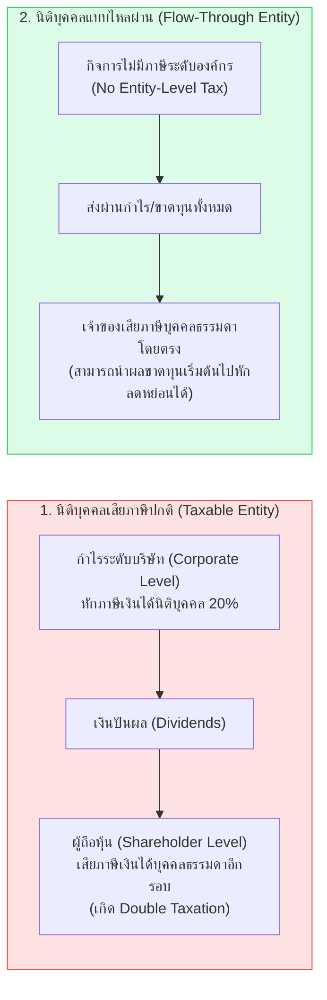
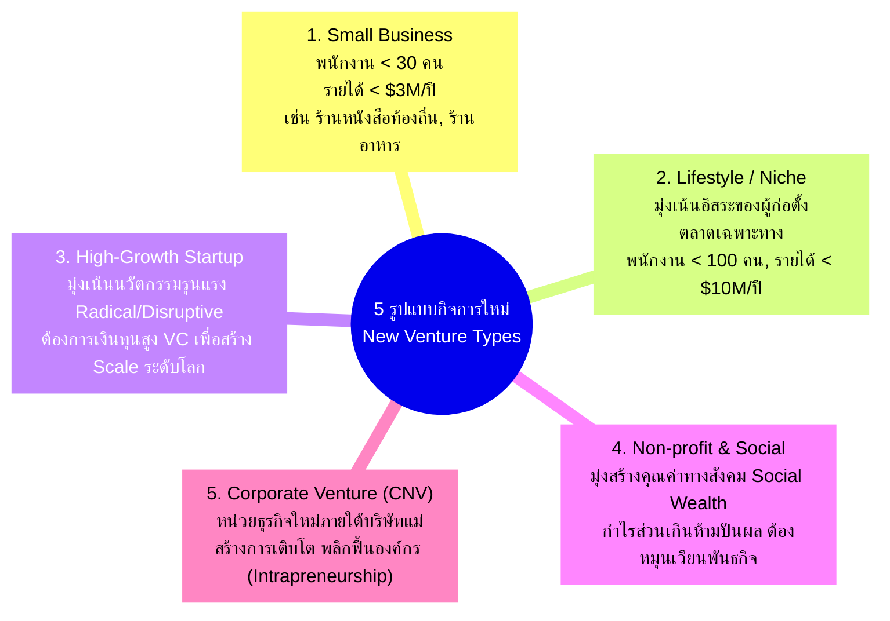
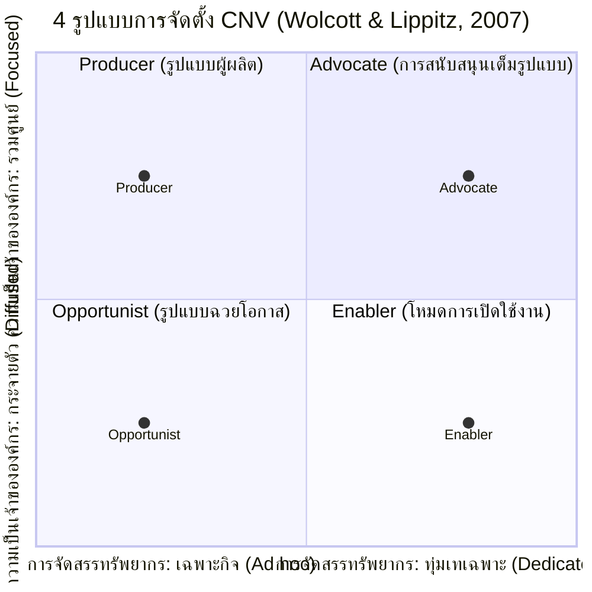
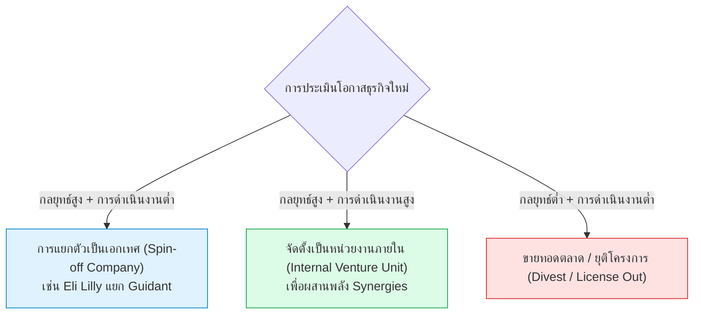
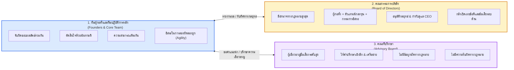
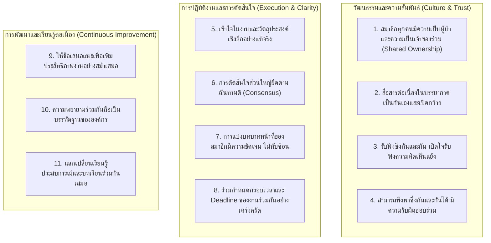
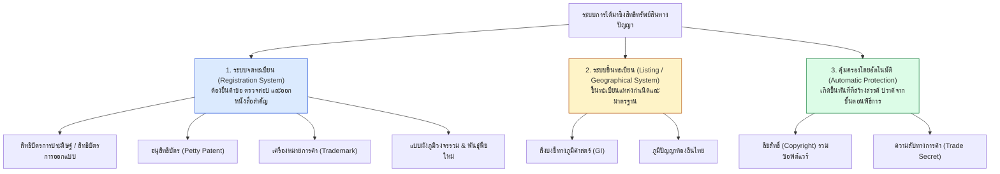
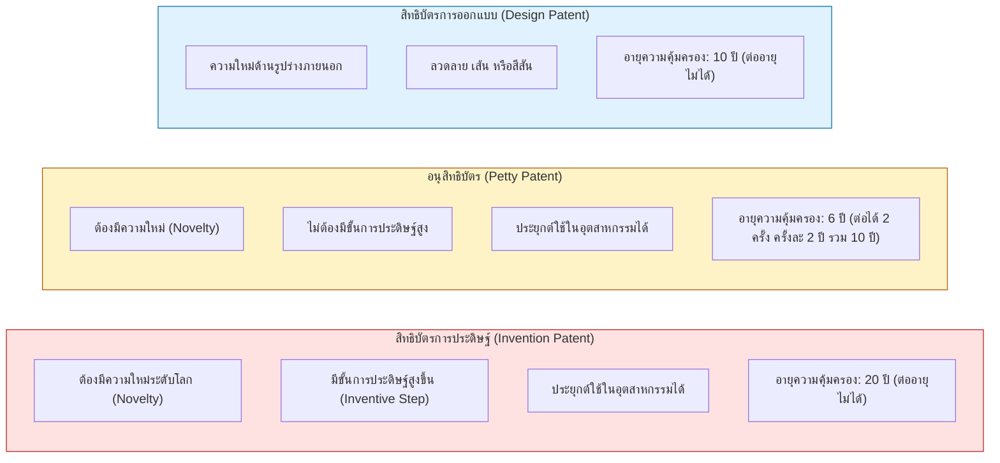
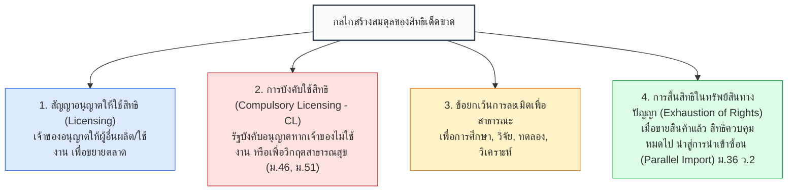

---
tags:
  - entrepreneurship
  - business-models
  - intellectual-property
  - corporate-new-venture
  - new-venture-team
  - legal-structures
  - patents
  - copyright
  - trademark
  - trade-secret
  - lecture-10
created: 2026-09-25
updated: 2026-09-25
lecture: 10
type: lecture
---

# Lecture 10: รูปแบบธุรกิจและกฎหมายทรัพย์สินทางปัญญา - Mega Guide

> [!SUMMARY] ภาพรวมบทเรียน (Executive Summary)
> บทเรียนนี้ว่าด้วยการวางรากฐานเชิงสถาบันของกิจการใหม่ (New Ventures) เพื่อความยั่งยืนและการเติบโตในระยะยาว ประกอบด้วย 4 เสาหลักสำคัญ:
> 1. **[[#สไลด์ที่ 1-7: รูปแบบองค์กรสำหรับกิจการใหม่]]** - การเลือกรูปแบบทางกฎหมาย (Legal Structure), การวิเคราะห์ภาษี (Taxable Entity vs. Flow-Through Entity), และ 5 รูปแบบธุรกิจ (Small Business, Lifestyle, High-Growth, Non-profit, Corporate Venture)
> 2. **[[#สไลด์ที่ 8-11: การร่วมลงทุนใหม่ขององค์กร (Corporate New Venture - CNV)]]** - กลยุทธ์ผู้ประกอบการภายใน (Intrapreneurship), 4 โมเดลการจัดตั้ง (Wolcott & Lippitz), และการก้าวข้าม "ภาวะกลืนไม่เข้าคายไม่ออกของผู้สร้างนวัตกรรม" (Innovator's Dilemma)
> 3. **[[#สไลด์ที่ 12-18: โครงสร้างทีมผู้ประกอบการใหม่ (The Dream Team Architecture)]]** - การผสานทักษะเสริม (Complementary Capabilities), สถาปัตยกรรม 3 เสาหลัก (Founders, Board of Directors, Advisory Board), และ 11 คุณลักษณะของทีมงานที่มีประสิทธิภาพสูง
> 4. **[[#สไลด์ที่ 19-33: กฎหมายและการบริหารจัดการทรัพย์สินทางปัญญา (Intellectual Property - IP)]]** - ระบบการคุ้มครองตามกฎหมายไทย 7 ฉบับและข้อตกลง TRIPS, การเจาะลึกสิทธิบัตร, อนุสิทธิบัตร, ลิขสิทธิ์, เครื่องหมายการค้า, ความลับทางการค้า, บทลงโทษ และกลไกสมดุลสิทธิเด็ดขาด (Compulsory Licensing & Exhaustion of Rights)

```mermaid
flowchart TD
    ROOT["บทที่ 10: รูปแบบธุรกิจและกฎหมายทรัพย์สินทางปัญญา"] --> M1["1. รูปแบบองค์กรสำหรับกิจการใหม่<br/>(Legal & Business Structures)"]
    ROOT --> M2["2. การร่วมลงทุนใหม่ขององค์กร<br/>(Corporate New Venture - CNV)"]
    ROOT --> M3["3. โครงสร้างทีมผู้ประกอบการใหม่<br/>(The Dream Team Architecture)"]
    ROOT --> M4["4. กฎหมายทรัพย์สินทางปัญญา<br/>(Intellectual Property - IP Law)"]

    M1 --> M1_1["Tax Structure: Taxable vs Flow-through"]
    M1 --> M1_2["Legal Types: Sole Prop, Partnership, LLC, C-Corp"]
    M1 --> M1_3["5 Business Venture Types"]

    M2 --> M2_1["4 Models: Opportunist, Enabler, Producer, Advocate"]
    M2 --> M2_2["Spin-off vs Internal Unit"]
    M2 --> M2_3["Innovator's Dilemma & Solution"]

    M3 --> M3_1["Founders & Core Team (Agility)"]
    M3 --> M3_2["Board of Directors (Governance & Fiduciary)"]
    M3 --> M3_3["Advisory Board (Strategic Insight)"]
    M3 --> M3_4["11 Team Effectiveness Characteristics"]

    M4 --> M4_1["ระบบคุ้มครอง: จดทะเบียน, ขึ้นทะเบียน, อัตโนมัติ"]
    M4 --> M4_2["ลิขสิทธิ์ (Copyright) & Fair Use"]
    M4 --> M4_3["ทรัพย์สินอุตสาหกรรม: สิทธิบัตร, เครื่องหมายการค้า, ความลับทางการค้า"]
    M4 --> M4_4["กลไกสมดุล: Licensing, Compulsory Licensing, Doha 2001"]

    style ROOT fill:#1e3a8a,stroke:#3b82f6,stroke-width:2px,color:#ffffff
    style M1 fill:#f0fdf4,stroke:#16a34a,stroke-width:1.5px
    style M2 fill:#fef3c7,stroke:#d97706,stroke-width:1.5px
    style M3 fill:#eff6ff,stroke:#2563eb,stroke-width:1.5px
    style M4 fill:#fdf2f8,stroke:#db2777,stroke-width:1.5px
```

---

# ส่วนที่ 1: รูปแบบองค์กรสำหรับกิจการใหม่ (Organizational Forms for New Ventures)

---

### สไลด์ที่ 1: หน้าปกบทเรียน
*📄 สไลด์ที่ 1 จาก 33*

- **วิชา:** 080203914 ผู้ประกอบการนวัตกรรม (Innovative Technopreneurs)
- **หน่วยงาน:** คณะเทคโนโลยีและการจัดการอุตสาหกรรม มหาวิทยาลัยเทคโนโลยีพระจอมเกล้าพระนครเหนือ (มจพ.)
- **ภาคการศึกษา:** ภาคเรียนที่ 1 ปีการศึกษา 2569
- **หัวข้อประจำบท:** บทที่ 10 รูปแบบธุรกิจและกฎหมายทรัพย์สินทางปัญญา (Business Models and Intellectual Property Law)

---

### สไลด์ที่ 2: เนื้อหาของบท (Course Outline)
*📄 สไลด์ที่ 2 จาก 33*

โครงสร้างการเรียนรู้แบ่งออกเป็น 4 ส่วนหลักตามลำดับความสำคัญเชิงกลยุทธ์:
1. **รูปแบบองค์กรสำหรับกิจการใหม่ (Organizational Forms):** รูปแบบทางกฎหมาย (Legal Entities) และรูปแบบธุรกิจ (Business Forms)
2. **การร่วมลงทุนใหม่ขององค์กร (Corporate New Venture - CNV):** การสร้างนวัตกรรมภายในองค์กรใหญ่และการบริหารแบบ Intrapreneurship
3. **โครงสร้างทีมผู้ประกอบการใหม่ (New Venture Team Structure):** การจัดผังอำนาจและการแบ่งบทบาทระหว่างผู้ก่อตั้ง, คณะกรรมการ และที่ปรึกษา
4. **กฎหมายทรัพย์สินทางปัญญา (Intellectual Property Law):** กรอบกฎหมายคุ้มครองผลงานสร้างสรรค์ นวัตกรรมเทคโนโลยี และตราสินค้า

---

### สไลด์ที่ 3: บทนำรูปแบบองค์กรสำหรับกิจการใหม่ (Introduction to Organizational Forms)
*📄 สไลด์ที่ 3 จาก 33*

> [!DEFINITION] การเลือกรูปแบบองค์กร (Organizational Choice)
> รูปแบบทางกฎหมายและโครงสร้างองค์กรของกิจการใหม่มีความหลากหลายตามปัจจัยด้านบริบท กฎหมาย ภาษี และวัฒนธรรมทางธุรกิจ การเลือกโครงสร้างที่ถูกต้องเปรียบเสมือนการวางเสาเข็มให้กับตัวแบบธุรกิจที่ได้ศึกษาใน [[Lecture 3 - วิสัยทัศน์ พันธกิจ และตัวแบบธุรกิจ]]

- **ความหลากหลายตามบริบท:** กิจการใหม่ไม่สามารถใช้แม่แบบเดียวกันได้ทั้งหมด ต้องพิจารณาขนาด, เป้าหมาย, ความต้องการเงินทุน และระดับความเสี่ยง
- **ขอบเขตตั้งแต่เล็กสู่ใหญ่:** มีตั้งแต่ธุรกิจขนาดย่อม (Small Business), กิจการเพื่อสังคม (Social Enterprise), ไปจนถึงการร่วมลงทุนภายในองค์กรขนาดใหญ่ (Corporate New Venture หรือ CNV) ซึ่งเป็นเครื่องยนต์สร้างการเติบโตต่อเนื่อง
- **ความท้าทายหลัก:** การสร้างนวัตกรรมในองค์กรเดิมมักถูกฉุดรั้งด้วย *"ภาวะที่กลืนไม่เข้าคายไม่ออกของผู้สร้างนวัตกรรม" (Innovator’s Dilemma)* ดังนั้นการรักษาสมดุลระหว่างความเป็นอิสระ (Autonomy) กับการเข้าถึงทรัพยากรของบริษัทแม่ (Resource Leverage) จึงเป็นปัจจัยชี้ขาด

---

### สไลด์ที่ 4: รูปแบบทางกฎหมายสำหรับกิจการใหม่ (Legal Forms: Tax Architecture)
*📄 สไลด์ที่ 4 จาก 33*

> [!IMPORTANT] เข็มทิศเชิงกลยุทธ์ด้านกฎหมายและภาษี
> การเลือกรูปแบบทางกฎหมายสำหรับกิจการใหม่เป็น "เข็มทิศเชิงกลยุทธ์" ที่กำหนดภาระภาษี, ขอบเขตความรับผิดชอบต่อหนี้สิน (Liability), และขีดความสามารถในการระดมทุนในอนาคต หากเลือกผิดพลาดตั้งแต่เริ่มต้น อาจทำให้ไม่สามารถดึงดูดเงินลงทุนจาก Venture Capital (VC) หรืออาจนำไปสู่การสูญเสียทรัพย์สินส่วนบุคคลของเจ้าของ

ตามประมวลกฎหมายแพ่งและพาณิชย์และประมวลรัษฎากร โครงสร้างภาษีของนิติบุคคลจำแนกออกเป็น 2 รูปแบบหลัก:

1. **นิติบุคคลที่ต้องเสียภาษีปกติ (Taxable Entity):**
   - บริษัทถูกมองว่าเป็น "บุคคลต่างหาก" แยกขาดจากเจ้าของอย่างเด็ดขาด
   - กำไรสุทธิของบริษัทถูกหักภาษีเงินได้นิติบุคคลในอัตราขององค์กร
   - เมื่อแจกจ่ายผลกำไรเป็นเงินปันผล (Dividends) ไปยังผู้ถือหุ้น ผู้ถือหุ้นจะต้องเสียภาษีเงินได้บุคคลธรรมดาอีกครั้ง นำไปสู่สภาวะ **"ภาษีซ้ำซ้อน" (Double Taxation)**
2. **นิติบุคคลที่ไหลผ่าน (Flow-through Entity หรือ Entity แบบส่งผ่าน):**
   - กิจการไม่มีภาระภาษีในระดับองค์กร
   - ผลกำไรหรือผลขาดทุนสุทธิทั้งหมดจะไหลผ่าน (Flow-through) ไปยังเจ้าของโดยตรง เพื่อนำไปคำนวณรวมในฐานภาษีเงินได้บุคคลธรรมดา
   - **ข้อได้เปรียบสำคัญ:** ปราศจากปัญหาภาษีซ้ำซ้อน และในระยะเริ่มต้นที่ธุรกิจมักประสบผลขาดทุน (Burn Rate) เจ้าของสามารถนำผลขาดทุนนี้ไปหักลบกับรายได้พึงประเมินจากแหล่งอื่นเพื่อลดภาระภาษีรวมได้

---

### สไลด์ที่ 5: การตัดสินใจเลือกรูปแบบทางกฎหมาย (Legal Entity Comparison)
*📄 สไลด์ที่ 5 จาก 33*

ตารางเปรียบเทียบรูปแบบทางกฎหมาย 4 โครงสร้างหลักตามการดำเนินงาน, ภาระภาษี และการระดมทุน:

| รูปแบบทางกฎหมาย | โครงสร้างภาษี | ความรับผิดชอบต่อหนี้สิน (Liability) | การระดมทุนและการถ่ายโอนหุ้น | ความเหมาะสมสำหรับสตาร์ทอัพ |
|:---|:---:|:---|:---|:---|
| **1. เจ้าของคนเดียว (Sole Proprietorship)** | Flow-through | **ไม่จำกัด (Unlimited)** เจ้าของต้องรับผิดชอบหนี้สินด้วยสินทรัพย์ส่วนบุคคลทั้งหมด | ทำไม่ได้ กิจการผูกติดกับตัวบุคคล | เหมาะกับร้านค้าขนาดเล็กมาก ไม่เหมาะกับเทคโนโลยีสตาร์ทอัพ |
| **2. ห้างหุ้นส่วน (Partnership)** *(สามัญ / นิติบุคคล)* | Flow-through | ผู้เป็นหุ้นส่วนไม่จำกัดความรับผิดต้องรับผิดชอบร่วมกันในหนี้สินทั้งหมด | มีข้อจำกัดสูงเรื่องจำนวนและประเภทของผู้ถือหุ้น | เหมาะกับธุรกิจวิชาชีพเฉพาะ (กฎหมาย, บัญชี) ไม่เหมาะกับการระดมทุน VC |
| **3. บริษัทจำกัดความรับผิด (LLC / บริษัทจำกัด)** | Flow-through หรือ นิติบุคคล | **จำกัดความรับผิด (Limited)** ไม่เกินจำนวนเงินค่าหุ้นที่ยังส่งใช้ไม่ครบ | ยืดหยุ่น ถ่ายโอนหุ้นได้ตามข้อบังคับบริษัท | **เหมาะสมอย่างยิ่ง** สำหรับธุรกิจระยะเริ่มต้น ป้องกันสินทรัพย์ส่วนตัว |
| **4. บริษัทมหาชน / C-Corporation** | Taxable Entity (Double Taxation) | **จำกัดความรับผิด (Limited)** ผู้ถือหุ้นรับผิดชอบไม่เกินมูลค่าหุ้น | **คล่องตัวสูงสุด** ออกหุ้นหลายชั้น (Preferred/Common Stock) ดึงดูด VC/IPO | เหมาะกับกิจการที่ต้องการ Scale สู่ระดับมหาชนและระดมทุนสถาบัน |

---

### สไลด์ที่ 6: รูปแบบธุรกิจสำหรับกิจการใหม่ 5 ประเภท (5 Types of New Ventures)
*📄 สไลด์ที่ 6 จาก 33*

การจำแนกประเภทกิจการช่วยให้นักนวัตกรรมกำหนดกลยุทธ์การบริหารและการจัดการทรัพย์สินทางปัญญา (IP Strategy) ได้อย่างแม่นยำ:

---

### สไลด์ที่ 7: องค์กรไม่แสวงหากำไรและกิจการเพื่อสังคม (Non-profit & Social Enterprise)
*📄 สไลด์ที่ 7 จาก 33*

> [!INFO] การสร้างความมั่งคั่งทางสังคม (Social Wealth Creation)
> องค์กรไม่แสวงหากำไรและกิจการเพื่อสังคมมีเป้าหมายหลักในการแก้ไขปัญหาเชิงโครงสร้างของสังคมและสิ่งแวดล้อม โดยใช้กลไกการตลาดและการบริหารธุรกิจมาขับเคลื่อนให้เกิดความยั่งยืนทางการเงิน

- **นิยามเชิงปฏิบัติการ:** องค์กรไม่แสวงหากำไรสามารถสร้างผลกำไรหรือส่วนเกินทางการเงิน (Financial Surplus) ได้ตามกฎหมาย แต่ **ห้ามนำผลกำไรนั้นไปแจกจ่ายให้แก่ผู้ถือหุ้นหรือผู้ก่อตั้ง** ต้องนำเงินหมุนเวียนกลับไปใช้เพื่อพันธกิจขององค์กรเท่านั้น
- **ผู้ประกอบการเพื่อสังคม (Social Technopreneurs):** ผู้ที่มองเห็นโอกาสในการสร้างประโยชน์ต่อสังคมควบคู่กับคุณค่าทางเศรษฐกิจ โดยมุ่งเน้นการขยายผลในระดับกว้าง (Scalability)
- **กรณีศึกษาความสำเร็จระดับโลก:**
  1. `Kiva.org`: แพลตฟอร์มการเงินชุมชนแบบ Peer-to-Peer Microfinance ทางออนไลน์ ช่วยให้ผู้คนทั่วโลกปล่อยกู้เงินดอกเบี้ย 0% แก่ผู้ประกอบการรายย่อยในประเทศกำลังพัฒนา
  2. `Google.org`: หน่วยงานด้านการกุศลและนวัตกรรมสังคมของ Google ที่นำพลังเทคโนโลยีและ AI มาแก้ปัญหาวิกฤตสภาพภูมิอากาศและความยากจน
  3. `Trees, Water & People (TWP)`: องค์กรพัฒนาเทคโนโลยีเตาเผาชีวมวลประหยัดพลังงานและการฟื้นฟูป่าไม้ร่วมกับชนพื้นเมืองในอเมริกากลาง
  4. `Aurolab` (ก่อตั้งโดย David Green): โรงงานผลิตเลนส์แก้วตาเทียมและอุปกรณ์ผ่าตัดต้อกระจกในอินเดีย ลดต้นทุนการผลิตเลนส์จากชิ้นละหลายร้อยดอลลาร์เหลือเพียงไม่กี่ดอลลาร์ ทำให้คนยากจนนับล้านคนได้รับการผ่าตัดรักษาตาบอด

---

# ส่วนที่ 2: การร่วมลงทุนใหม่ขององค์กร (Corporate New Venture - CNV)

---

### สไลด์ที่ 8: นิยามและ 4 โมเดลของ CNV (Intrapreneurship Models)
*📄 สไลด์ที่ 8 จาก 33*

> [!DEFINITION] Corporate New Venture (CNV) & Intrapreneurship
> การร่วมลงทุนใหม่ขององค์กร คือ การนำทรัพยากร สินทรัพย์ ความรู้ และชื่อเสียงของบริษัทเดิมมาใช้ในการบ่มเพาะและสร้างสรรค์ธุรกิจใหม่ เพื่อสร้าง New S-Curve ให้แก่องค์กร

#### จุดแข็งและจุดอ่อนของ CNV
- **จุดแข็ง (Strengths):** ความพร้อมด้านเงินทุนมหาศาล, บุคลากรที่มีความเชี่ยวชาญสูง, เครือข่ายคู่ค้าและซัพพลายเออร์ที่เหนียวแน่น, สิทธิบัตรและเทคโนโลยีเดิม, ตลอดจนความน่าเชื่อถือของแบรนด์แม่
- **จุดอ่อน (Weaknesses):** ขั้นตอนการทำงานที่ติดหล่มระบบราชการ (Bureaucracy), ความเฉื่อยชาและความไม่ยืดหยุ่น, ข้อจำกัดด้านงบประมาณที่ต้องแข่งขันกับธุรกิจหลัก, และการควบคุมที่เข้มงวดเกินไปจากผู้บริหารระดับสูง

#### 4 รูปแบบการเริ่มต้นธุรกิจขององค์กร (The 4 Models of Corporate Entrepreneurship - Wolcott & Lippitz)

1. **รูปแบบฉวยโอกาส (Opportunist Model):** ไม่มีงบประมาณเฉพาะเจาะจงและไม่มีหน่วยงานรับผิดชอบโดยตรง ความสำเร็จพึ่งพา "แชมป์โครงการ" (Project Champions) ที่ทุ่มเททำงานนอกเวลาเพื่อผลักดันแนวคิด
2. **โหมดการเปิดใช้งาน (Enabler Model):** บริษัทจัดสรรเงินทุนสนับสนุนและกระบวนการคัดกรองไว้ให้ หากพนักงานคนใดมีไอเดียนวัตกรรมที่ผ่านเกณฑ์ จะได้รับทรัพยากรไปทดลองดำเนินงาน (เช่น โครงการบ่มเพาะไอเดียภายใน)
3. **รูปแบบผู้ผลิต (Producer Model):** องค์กรจัดตั้งหน่วยงานนวัตกรรมหรือศูนย์วิจัยเฉพาะด้านขึ้นมา พร้อมจัดสรรงบประมาณเบื้องต้นเพื่อเฟ้นหาและพัฒนาธุรกิจใหม่โดยตรง
4. **รูปแบบการสนับสนุนเต็มรูปแบบ (Advocate Model):** บริษัทแม่ทำหน้าที่เป็นเจ้าของและผู้สนับสนุนเชิงยุทธศาสตร์เต็มรูปแบบ จัดตั้งเป็นหน่วยธุรกิจเฉพาะที่มีเป้าหมายชัดเจนในการขยายผลเชิงพาณิชย์

---

### สไลด์ที่ 9: กลยุทธ์การจัดการและกระบวนการจัดตั้ง CNV (Management Strategy)
*📄 สไลด์ที่ 9 จาก 33*

การบริหารจัดการธุรกิจใหม่ต้องมีความแตกต่างจากการบริหารธุรกิจหลัก (Core Business) โดยพิจารณาจาก 2 มิติยุทธศาสตร์:
- **ความสำคัญเชิงกลยุทธ์ (Strategic Importance):** กิจการใหม่นี้มีความจำเป็นต่ออนาคตของบริษัทแม่มากน้อยเพียงใด
- **ความเกี่ยวข้องในการดำเนินงาน (Operational Relatedness):** กิจการใหม่ต้องพึ่งพากระบวนการผลิต ลูกค้า หรือเทคโนโลยีเดิมของบริษัทแม่มากน้อยเพียงใด

#### หลักปฏิบัติที่ดีที่สุดในการบริหาร CNV (Best Practices)
1. **Shielding:** ปกป้องธุรกิจใหม่จากแรงกดดันด้านผลกำไรระยะสั้นของบริษัทแม่
2. **Portfolio Management:** บริหารความเสี่ยงแบบพอร์ตโฟลิโอ ยอมรับการล้มเหลวของโครงการย่อยเพื่อหาผู้ชนะเพียงไม่กี่ราย
3. **Milestone-based Governance:** ปล่อยเงินทุนเป็นระยะตามความสำเร็จของเหตุการณ์สำคัญ (Milestones) แทนการทุ่มงบประมาณก้อนใหญ่ล่วงหน้า
4. **Early Failure Learning:** ถอดบทเรียนจากความล้มเหลวแต่เนิ่นๆ (Fail Fast, Learn Faster) เพื่อปรับทิศทางกลยุทธ์

---

### สไลด์ที่ 10: สิ่งจูงใจและบทบาทของแชมป์ (Champions & Incentives)
*📄 สไลด์ที่ 10 จาก 33*

> [!TIP] กลไกการขับเคลื่อนผู้ประกอบการภายใน (Intrapreneurship Catalysts)
> การสร้างนวัตกรรมภายในองค์กรจะเกิดขึ้นไม่ได้หากปราศจาก "ผู้นำที่กล้าเสี่ยง" และ "ระบบผลตอบแทนที่จูงใจ"

- **บทบาทของแชมป์โครงการ (The Champion):**
  - คือผู้บริหารระดับสูงที่มีบารมีและวิสัยทัศน์กว้างไกล
  - ทำหน้าที่เป็น "เกราะกำบัง" ปกป้องทีมงานใหม่จากแรงต้านและวัฒนธรรมเดิมขององค์กร
  - ช่วยปลดล็อกและจัดหาทรัพยากรข้ามสายงาน พร้อมทั้งสร้างวัฒนธรรมที่ยอมรับความผิดพลาดจากการทดลอง
- **โครงสร้างแรงจูงใจสำหรับพนักงานนวัตกร:**
  - **ความเป็นอิสระในการทำงาน (Autonomy):** ตัวอย่างคลาสสิกคือนโยบายเวลาว่าง 15% ของ 3M (และนโยบาย 20% Time ของ Google) ที่อนุญาตให้วิศวกรนำเวลาทำงานไปคิดค้นโครงการส่วนตัวที่ตนสนใจ
  - **ผลตอบแทนทางการเงินและสถานะ:** โบนัสพิเศษตามผลงาน (Phantom Stock), สิทธิการถือหุ้นในบริษัทลูกที่ Spin-off, หรือการเลื่อนตำแหน่งสู่ระดับบริหารสายธุรกิจใหม่
  - **วัฒนธรรมองค์กร:** การยกย่องความล้มเหลวที่เกิดจากการทดลองอย่างชาญฉลาด (Intelligent Failure)

---

### สไลด์ที่ 11: ภาวะที่กลืนไม่เข้าคายไม่ออกของผู้สร้างนวัตกรรม (Innovator's Dilemma)
*📄 สไลด์ที่ 11 จาก 33*

> [!WARNING] กับดักแห่งความสำเร็จ (The Incumbent's Trap)
> ทฤษฎีของ Clayton M. Christensen ชี้ให้เห็นว่าบริษัทชั้นนำระดับโลกที่บริหารงานอย่างยอดเยี่ยมมักพ่ายแพ้ต่อ "นวัตกรรมก่อกวน" (Disruptive Innovation) เพราะทำตามหลักการบริหารแบบดั้งเดิมอย่างเคร่งครัดเกินไป

#### สาเหตุ 3 ประการของ Innovator's Dilemma
1. **การยึดติดกับลูกค้าเดิม (Customer Lock-in):** ลูกค้าปัจจุบันที่มีกำลังซื้อสูงมักเรียกร้องการปรับปรุงสินค้าเดิมทีละน้อย (Sustaining Innovation) และปฏิเสธเทคโนโลยีใหม่ที่ยังมีประสิทธิภาพต่ำในระยะแรก จนกระทั่งเทคโนโลยีนั้นพัฒนาจนแซงหน้า
2. **ความกลัวการกินกันเอง (Cannibalization Fear):** ผู้บริหารมักปฏิเสธผลิตภัณฑ์ใหม่อย่างไม่รู้ตัว เพราะกลัวว่าผลิตภัณฑ์ใหม่จะเข้ามาทำลายยอดขายและกำไรของผลิตภัณฑ์หลักที่กำลังทำเงิน
3. **ความเฉื่อยชาขององค์กร (Organizational Inertia):** โครงสร้างต้นทุน วัฒนธรรม และระบบวัดผลเคพีไอแบบเดิมกลายเป็นกำแพงขัดขวางการเปลี่ยนแปลง

#### ทางออกเชิงยุทธศาสตร์ (The Strategic Solution)
บริษัทเทคโนโลยีชั้นนำอย่าง **Apple, IBM, หรือ Novartis** รับมือกับปัญหานี้ด้วยการ **แยกหน่วยธุรกิจใหม่ออกไปตั้งเป็นเอกเทศอย่างสิ้นเชิง** ให้มีโครงสร้างการตัดสินใจ วัฒนธรรมองค์กร และโมเดลรายได้เป็นของตนเอง เพื่อให้สามารถล่าสังหารธุรกิจเดิมของตนเองได้อย่างอิสระก่อนที่จะถูกคู่แข่งภายนอกเข้ามาทำลายล้าง

---

# ส่วนที่ 3: โครงสร้างทีมผู้ประกอบการใหม่ (New Venture Team)

---

### สไลด์ที่ 12: การสร้างทีมผู้ประกอบการใหม่ (Founding Team Genesis)
*📄 สไลด์ที่ 12 จาก 33*

- **จุดเริ่มต้น:** การสร้างธุรกิจใหม่มักเริ่มต้นจากบุคคลเพียง 1 หรือ 2 คนที่มองเห็นโอกาสและช่องว่างทางการตลาด จากนั้นจึงพัฒนาแนวคิดธุรกิจ (Business Idea) และวิสัยทัศน์ร่วมกัน
- **ความจำเป็นในการสร้างทีม:** เมื่อขอบเขตงานขยายตัว จะเห็นได้ชัดเจนทันทีว่าผู้ก่อตั้งคนเดียวไม่สามารถรอบรู้ทุกด้าน จำเป็นต้องรวบรวมบุคคลที่มีขีดความสามารถหลากหลายมาจัดตั้งเป็น **"ทีมผู้นำ" (Leadership Team)**
- **นิยามของทีมผู้นำ:** คือกลุ่มบุคคลขนาดกะทัดรัดที่มี **ทักษะเสริมซึ่งกันและกัน (Complementary Skills)** มีความผูกพันและมุ่งมั่นต่อเป้าหมาย วัตถุประสงค์ และแนวทางการดำเนินงานร่วมกัน พร้อมทั้งแบกรับความรับผิดชอบต่อผลลัพธ์ร่วมกัน (Mutual Accountability)

---

### สไลด์ที่ 13: รูปแบบทีมและการรวมขีดความสามารถ (Team Architecture & Synergy)
*📄 สไลด์ที่ 13 จาก 33*

- **ทีมขนาดเล็กแต่ทรงพลัง:** ในอุตสาหกรรมนวัตกรรมที่มีความผันผวนสูง ทีมขนาดกะทัดรัดที่มีความเชี่ยวชาญเฉพาะทางสูงจะมีความเร็ว (Speed) และความยืดหยุ่น (Agility) เหนือกว่าองค์กรเทอะทะ
- **คุณลักษณะของผู้ก่อตั้ง (Founders' Traits):** ต้องแสดงให้เห็นถึงความมุ่งมั่น วิสัยทัศน์ที่ชัดเจน เข้าใจกลไกเศรษฐกิจในระยะยาว ขับเคลื่อนการตัดสินใจด้วยข้อมูลและองค์ความรู้จริง
- **ข้อได้เปรียบของการผสานพลัง (Diversity Advantage):** ดึงดูดผู้คนที่มีภูมิหลัง บุคลิกภาพ และความถนัดที่แตกต่างกันมารวมพลัง ช่วยให้การสื่อสารและการแก้ไขปัญหาหน้างานทำได้อย่างรอบด้านและรวดเร็ว

---

### สไลด์ที่ 14: ความท้าทายและการบริหารจัดการทีมใหม่ (New Venture Dynamics)
*📄 สไลด์ที่ 14 จาก 33*

1. **การสร้างสมดุลเชิงพลวัต:** ทีมต้องรักษาสมดุลระหว่าง "ความต้องการในการเปลี่ยนแปลงอย่างรวดเร็ว" กับ "ประสิทธิภาพและความตรงต่อเวลาในการส่งมอบงาน"
2. **การเข้าถึงแหล่งทุนภายนอก:** สมาชิกในทีมอย่างน้อยหนึ่งคนต้องมีทักษะและสายสัมพันธ์ในการเข้าถึงแหล่งเงินทุน (Fundraising Capability) ไม่ว่าจะเป็น Angel Investors, VC หรือทุนสนับสนุนภาครัฐ
3. **วัฒนธรรมความคิดเชิงรุก (Proactive Culture):** หลีกเลี่ยงการทำงานตามกรอบระเบียบราชการ สมาชิกทุกคนต้องกล้าทดลองสิ่งที่อาจล้มเหลว กล้าชี้ข้อบกพร่อง และเปิดใจยอมรับข้อผิดพลาดร่วมกัน
4. **ความไว้วางใจและการตั้งคำถาม (Trust & Candid Communication):** มีการประชุมแลกเปลี่ยนมุมมองอย่างสม่ำเสมอ การสร้างนวัตกรรมเกิดขึ้นจากการตั้งคำถามเชิงลึกบนพื้นฐานของความไว้เนื้อเชื่อใจ

---

### สไลด์ที่ 15: สถาปัตยกรรมเครือข่ายทีมผู้ประกอบการ (The Dream Team Architecture)
*📄 สไลด์ที่ 15 จาก 33 (แผนภาพสถาปัตยกรรม)*

แผนภาพจำลองความสัมพันธ์และการแบ่งแยกอำนาจ 3 เสาหลักขององค์กรธุรกิจนวัตกรรม:

---

### สไลด์ที่ 16: คณะกรรมการบริษัท (Board of Directors: Governance & Fiduciary Duty)
*📄 สไลด์ที่ 16 จาก 33*

> [!IMPORTANT] อำนาจและหน้าที่ตามกฎหมายของคณะกรรมการ (Fiduciary Duty)
> คณะกรรมการบริษัทจัดตั้งขึ้นตามกฎหมาย มีหน้าที่ปกป้องผลประโยชน์สูงสุดขององค์กรและผู้ถือหุ้นทั้งหมด (Duty of Care & Duty of Loyalty)

- **องค์ประกอบที่เหมาะสม:**
  - ในระยะเริ่มต้น: กรรมการ 3 คนประกอบด้วยผู้ก่อตั้งและตัวแทนนักลงทุนหลัก
  - ในระยะขยายกิจการ: กรรมการ 5 คน ประกอบด้วยผู้บริหารภายใน 2 คน, ตัวแทนนักลงทุน VC 2 คน, และ **กรรมการอิสระภายนอก 1 คน** เพื่อถ่วงดุลอำนาจ
- **อำนาจหน้าที่หลัก:**
  - สรรหา แต่งตั้ง ประเมินผล และถอดถอนประธานเจ้าหน้าที่บริหาร (CEO)
  - อนุมัติกฎบัตรองค์กร, แผนกลยุทธ์ประจำปี, งบประมาณ และการทำธุรกรรมการเงินกับธนาคาร
  - รับรองรายงานทางการเงินประจำปีต่อผู้ถือหุ้น
- **คุณสมบัติสำคัญ:** ต้องเป็นผู้ทรงคุณวุฒิที่เข้าใจอุตสาหกรรม เชี่ยวชาญด้านการเงิน บัญชี การตลาด และที่สำคัญที่สุดคือ **ต้องกล้าเปิดเผยทั้งข้อดีและข้อเสียของการตัดสินใจสำคัญทุกครั้ง** โดยไม่เกรงใจฝ่ายจัดการ

---

### สไลด์ที่ 17: กระบวนการของคณะกรรมการและคณะที่ปรึกษา (Board Process & Advisory Board)
*📄 สไลด์ที่ 17 จาก 33*

#### การเปรียบเทียบ คณะกรรมการบริษัท (BOD) vs คณะที่ปรึกษา (Advisory Board)

| มิติการเปรียบเทียบ | คณะกรรมการบริษัท (Board of Directors) | คณะที่ปรึกษา (Advisory Board) |
|:---|:---|:---|
| **สถานะทางกฎหมาย** | จัดตั้งตามกฎหมาย มีผลผูกพันองค์กร | จัดตั้งตามความสมัครใจ ไม่มีผลผูกพันทางกฎหมาย |
| **ความรับผิดชอบต่อหนี้สิน** | ต้องรับผิดชอบทางกฎหมายหากปฏิบัติหน้าที่บกพร่อง | **ไม่มีความรับผิดชอบทางกฎหมายใดๆ** |
| **ขอบเขตอำนาจ** | มีสิทธิออกเสียงโหวต อนุมัติงบ และแต่งตั้ง/ปลด CEO | ให้คำแนะนำเชิงลึก เปิดประตูสู่เครือข่ายพันธมิตร |
| **ค่าตอบแทน** | ค่าเบี้ยประชุมและหุ้น/Options ตามสัญญากรรมการ | หุ้นลมส่วนน้อย (Advisory Shares 0.1-0.5%) หรือเกียรติยศ |

#### กระบวนการทำงานที่มีประสิทธิภาพของบอร์ด
1. **Constructive Conflict:** ร่วมถกเถียงและท้าทายความคิดกับ CEO อย่างสร้างสรรค์
2. **Avoid Destructive Conflict:** ปราศจากความขัดแย้งส่วนตัวหรือการเมืองในองค์กร
3. **Strategic Elevation:** โฟกัสในระดับยุทธศาสตร์ภาพใหญ่ หลีกเลี่ยงการลงไปจัดการแบบยิบย่อย (No Micromanagement)
4. **Holistic Decision-making:** ตัดสินใจบนฐานข้อมูลและการประเมินความเสี่ยงรอบด้าน

---

### สไลด์ที่ 18: 11 คุณลักษณะของทีมงานที่มีประสิทธิภาพสูง (Effective Team Characteristics)
*📄 สไลด์ที่ 18 จาก 33*

---

# ส่วนที่ 4: กฎหมายและการบริหารทรัพย์สินทางปัญญา (Intellectual Property Law)

---

### สไลด์ที่ 19: ภาพรวมและปรัชญาของทรัพย์สินทางปัญญา (Philosophy of Intellectual Property)
*📄 สไลด์ที่ 19 จาก 33*

> [!DEFINITION] ทรัพย์สินทางปัญญา (Intellectual Property - IP)
> ผลผลิตอันเกิดจากสติปัญญา ความคิดสร้างสรรค์ และความชำนาญของมนุษย์ ทั้งในรูปแบบที่จับต้องได้และจับต้องไม่ได้ โดยกฎหมายให้การคุ้มครองในลักษณะ **"สิทธิเด็ดขาด" (Exclusive Right)** เพื่อตอบแทนผู้ประดิษฐ์คิดค้นและสร้างแรงจูงใจในการพัฒนานวัตกรรมใหม่แก่สังคม

#### 3 เสาหลักเชิงปรัชญาของกฎหมายทรัพย์สินทางปัญญา
1. **สิทธิผูกขาดชั่วคราว (Exclusive Right):** เจ้าของสิทธิมีอำนาจแต่เพียงผู้เดียวในการแสวงหาประโยชน์เชิงพาณิชย์ในช่วงระยะเวลาที่กฎหมายกำหนด
2. **สิทธิทางดินแดน (Territorial Right):** ความคุ้มครองมีผลบังคับเฉพาะภายในอาณาเขตของประเทศที่ได้รับการจดทะเบียนหรือให้การรับรองเท่านั้น
3. **การสร้างจุดสมดุลเชิงสังคม (Social Balance):** กฎหมายต้องถ่วงดุลระหว่าง "ผลประโยชน์ของผู้คิดค้น" กับ "ประโยชน์สาธารณะและการเข้าถึงความรู้ของสังคม" ผ่านกลไกการเปิดเผยสาระสำคัญของสิ่งประดิษฐ์และข้อยกเว้นทางกฎหมาย โดยมีองค์การทรัพย์สินทางปัญญาโลก (WIPO) และองค์การการค้าโลก (WTO ผ่านความตกลง TRIPS) เป็นผู้กำหนดมาตรฐานสากล

---

### สไลด์ที่ 20: 4 ลักษณะเฉพาะทางกฎหมายของทรัพย์สินทางปัญญา (Legal Characteristics)
*📄 สไลด์ที่ 20 จาก 33*

1. **สิทธิไม่มีรูปร่าง (Intangible Right):** เป็นสิทธิเหนือความคิดสร้างสรรค์ที่จับต้องไม่ได้ แยกต่างหากจากกรรมสิทธิ์ในวัตถุทางกายภาพ
   - *ตัวอย่างคลาสสิก:* นาย ข. ซื้อแว่นตาที่มีการจดสิทธิบัตรมา 1 อัน นาย ข. มีกรรมสิทธิ์ในแว่นตาอันนั้น สามารถสวมใส่หรือขายต่อได้ แต่ **นาย ข. ไม่มีสิทธิในการผลิตแว่นตาเลียนแบบขึ้นมาใหม่เพื่อขาย** เพราะสิทธิในการผลิตเป็นของเจ้าของสิทธิบัตร
2. **สิทธิในทางปฏิเสธ (Negative Right):** คือสิทธิในการ "สั่งห้าม" (Right to Exclude) มิให้บุคคลอื่นกระทำการทำซ้ำ ดัดแปลง นำออกขาย หรือใช้ประโยชน์จากผลงานสร้างสรรค์โดยไม่ได้รับอนุญาต
3. **ไม่อาจครอบครองปรปักษ์ได้:** เนื่องจากไม่มีรูปร่างทางกายภาพ จึงไม่สามารถใช้หลักกฎหมายเรื่องการครอบครองปรปักษ์เหมือนอสังหาริมทรัพย์ได้
4. **สิทธิทางดินแดน (Territoriality):** การได้สิทธิบัตรในประเทศไทย ไม่ได้คุ้มครองในสหรัฐอเมริกาหรือญี่ปุ่น หากต้องการคุ้มครองในต่างประเทศ ต้องยื่นจดทะเบียนในแต่ละประเทศหรือผ่านระบบสนธิสัญญาความร่วมมือด้านสิทธิบัตร (PCT)

---

### สไลด์ที่ 21: กฎหมายไทยที่เกี่ยวข้อง 7 ฉบับ (Thai IP Statutory Framework)
*📄 สไลด์ที่ 21 จาก 33*

กรอบกฎหมายหลักในการคุ้มครองทรัพย์สินทางปัญญาของประเทศไทยประกอบด้วยพระราชบัญญัติ 7 ฉบับ:
1. **พ.ร.บ. สิทธิบัตร พ.ศ. 2522** (และฉบับแก้ไขเพิ่มเติม ฉบับที่ 2 พ.ศ. 2535 และฉบับที่ 3 พ.ศ. 2542)
2. **พ.ร.บ. เครื่องหมายการค้า พ.ศ. 2534** (และฉบับแก้ไขเพิ่มเติม ฉบับที่ 2 พ.ศ. 2543 และฉบับที่ 3 พ.ศ. 2559)
3. **พ.ร.บ. ลิขสิทธิ์ พ.ศ. 2537** (และฉบับแก้ไขเพิ่มเติม พ.ศ. 2558 และฉบับที่ 5 พ.ศ. 2565)
4. **พ.ร.บ. คุ้มครองแบบของผังภูมิวงจรรวม พ.ศ. 2543**
5. **พ.ร.บ. ความลับทางการค้า พ.ศ. 2545** (และฉบับแก้ไขเพิ่มเติม ฉบับที่ 2 พ.ศ. 2558)
6. **พ.ร.บ. คุ้มครองสิ่งบ่งชี้ทางภูมิศาสตร์ พ.ศ. 2546**
7. **พ.ร.บ. การผลิตผลิตภัณฑ์ซีดี พ.ศ. 2548**

---

### สไลด์ที่ 22: การจำแนกระบบการคุ้มครองทรัพย์สินทางปัญญา (Acquisition of Rights)
*📄 สไลด์ที่ 22 จาก 33*

กฎหมายไทยแบ่งวิธีการได้มาซึ่งความคุ้มครองออกเป็น 3 ระบบหลัก:

---

### สไลด์ที่ 23: ลิขสิทธิ์ (Copyright: Scope & Expression of Idea)
*📄 สไลด์ที่ 23 จาก 33*

> [!DEFINITION] หลักการแสดงออกซึ่งความคิด (Expression of Idea)
> ลิขสิทธิ์คุ้มครองเฉพาะ **"รูปแบบการแสดงออกซึ่งความคิด"** ไม่คุ้มครองตัวความคิด (Idea), ขั้นตอน, กรรมวิธี, ระบบ, วิธีการใช้หรือการทำงาน, หลักการ หรือทฤษฎีทางวิทยาศาสตร์หรือคณิตศาสตร์

#### ประเภทของงานอันมีลิขสิทธิ์ตามกฎหมายไทย (9 ประเภท)
1. **วรรณกรรม (Literary Works):** งานนิพนธ์ หนังสือ จุลสาร สิ่งเขียน สิ่งพิมพ์ และที่สำคัญที่สุดคือ **"โปรแกรมคอมพิวเตอร์" (ซอร์สโค้ดและโค้ดคำสั่ง)**
2. **นาฏกรรม:** ท่าเต้น ละครใบ้
3. **ศิลปกรรม:** จิตรกรรม ประติมากรรม ภาพพิมพ์ สถาปัตยกรรม ภาพถ่าย ภาพประกอบ
4. **ดนตรีกรรม:** ทำนอง เนื้อร้อง โน้ตเพลง
5. **โสตทัศนวัสดุ:** แผ่นวิดีโอที่มีทั้งภาพและเสียง
6. **ภาพยนตร์:** งานภาพยนตร์
7. **สิ่งบันทึกเสียง:** แถบบันทึกเสียง เทป แผ่นซีดีเพลง
8. **งานแพร่เสียงแพร่ภาพ:** การกระจายเสียงวิทยุและโทรทัศน์
9. **สิทธิของนักแสดง:** การแสดงของนักแสดง

---

### สไลด์ที่ 24: เงื่อนไขการคุ้มครองลิขสิทธิ์และหลักการ Fair Use (Copyright Duration & Fair Use)
*📄 สไลด์ที่ 24 จาก 33*

- **ลักษณะการคุ้มครอง:** ได้รับความคุ้มครอง **ทันทีที่สร้างสรรค์ผลงานเสร็จสิ้น** โดยไม่ต้องผ่านการจดทะเบียนหรือขั้นตอนทางราชการใดๆ (No Formality Required)
- **ระยะเวลาการคุ้มครอง (Duration):**
  - **งานทั่วไป (วรรณกรรม, ดนตรี, ซอฟต์แวร์):** ตลอดอายุของผู้สร้างสรรค์ และคุ้มครองต่อไปอีก **50 ปีนับแต่ผู้สร้างสรรค์เสียชีวิต** (กรณีสร้างสรรค์ร่วม นับจากผู้สร้างสรรค์คนสุดท้ายเสียชีวิต)
  - **นิติบุคคล / นามแฝง:** คุ้มครอง **50 ปีนับแต่ได้สร้างสรรค์งานขึ้น** (หรือนับแต่โฆษณาครั้งแรก)
  - **งานภาพถ่าย โสตทัศนวัสดุ ภาพยนตร์:** คุ้มครอง **50 ปีนับแต่สร้างสรรค์**
  - **งานศิลปะประยุกต์ (Applied Art):** คุ้มครอง **25 ปีนับแต่สร้างสรรค์**

#### ข้อยกเว้นการละเมิดลิขสิทธิ์ (Fair Use Doctrine)
การกระทำต่อผลงานมีลิขสิทธิ์จะไม่ถือเป็นการละเมิด หากเข้าเงื่อนไข 2 ประการหลัก:
1. **ไม่ขัดต่อการแสวงหาประโยชน์ตามปกติ** ของเจ้าของลิขสิทธิ์
2. **ไม่กระทบกระเทือนถึงสิทธิอันชอบด้วยกฎหมาย** ของเจ้าของลิขสิทธิ์เกินสมควร

*ตัวอย่างการใช้งานที่เข้าข่ายข้อยกเว้น:*
- วิจัยหรือศึกษางานนั้น โดยมิใช่การกระทำเพื่อหากำไร
- ใช้เพื่อประโยชน์ของตนเองและบุคคลในครอบครัว
- ติชม วิจารณ์ หรือแนะนำผลงาน โดยมีการรับรู้ถึงความเป็นเจ้าของลิขสิทธิ์ (ให้เครดิตอ้างอิง)
- ทำซ้ำโดยบรรณารักษ์ของห้องสมุดเพื่อใช้ในการเก็บรักษาหรือการศึกษา

---

### สไลด์ที่ 25: ทรัพย์สินทางอุตสาหกรรม (Industrial Property Overview)
*📄 สไลด์ที่ 25 จาก 33*

ความคิดสร้างสรรค์ของมนุษย์ที่เกี่ยวข้องกับสินค้าอุตสาหกรรม กรรมวิธีการผลิต และการพาณิชย์:

| ประเภททรัพย์สินอุตสาหกรรม | รายละเอียดความคุ้มครอง | ตัวอย่างในโลกความจริง |
|:---|:---|:---|
| **สิทธิบัตรการประดิษฐ์** | องค์ประกอบ กลไก โครงสร้าง หรือกรรมวิธีผลิตที่มีความใหม่และขั้นการประดิษฐ์สูงขึ้น | ยารักษาโรคชนิดใหม่, อัลกอริทึมฮาร์ดแวร์เฉพาะ |
| **อนุสิทธิบัตร** | การประดิษฐ์ที่มีการปรับปรุงเทคโนโลยีไม่ซับซ้อนมาก (ไม่มีขั้นการประดิษฐ์สูง) | เครื่องปอกเปลือกผลไม้อัตโนมัติ, บรรจุภัณฑ์ล็อกพิเศษ |
| **สิทธิบัตรการออกแบบ** | รูปร่างลักษณะภายนอก รูปทรง ลวดลาย หรือคู่สีของผลิตภัณฑ์ | รูปร่างขวดโค้ก, ดีไซน์บอดี้สมาร์ทโฟน iPhone |
| **เครื่องหมายการค้า** | สัญลักษณ์ โลโก้ ชื่อ แบรนด์ เสียง กลิ่น ที่ใช้จำแนกสินค้าและบริการ | โลโก้ Apple, เครื่องหมายการค้า Smart Queue Food |
| **ความลับทางการค้า** | ข้อมูลธุรกิจที่เก็บรักษาเป็นความลับ มีมูลค่าเชิงพาณิชย์เพราะความเป็นความลับ | สูตรหัวเชื้อ Coca-Cola, สูตรไก่ทอด KFC |
| **สิ่งบ่งชี้ทางภูมิศาสตร์ (GI)** | สัญลักษณ์บ่งบอกแหล่งกำเนิดสินค้าที่มีชื่อเสียงและคุณภาพเฉพาะถิ่น | ข้าวหอมมะลิทุ่งกุลาร้องไห้, กาแฟดอยช้าง |
| **แบบผังภูมิวงจรรวม** | การจัดวางตำแหน่งและการเชื่อมต่อของวงจรไมโครชิปบนแผ่นเซมิคอนดักเตอร์ | ผังวงจรประมวลผล Apple Silicon M-Series |

---

### สไลด์ที่ 26: สิทธิบัตรและอนุสิทธิบัตร (Patents vs. Petty Patents)
*📄 สไลด์ที่ 26 จาก 33*

> [!DEFINITION] สิทธิบัตร (Patent)
> หนังสือสำคัญที่รัฐออกให้เพื่อคุ้มครองการประดิษฐ์หรือการออกแบบผลิตภัณฑ์ที่มีคุณสมบัติตรงตามที่กฎหมายกำหนด โดยมอบสิทธิเด็ดขาดในการผลิต นำเข้า และจำหน่ายให้แก่ผู้ทรงสิทธิ

> [!WARNING] กฎข้อห้ามยื่นซ้ำซ้อน (Non-Double Patenting Rule)
> ผู้ประดิษฐ์ไม่สามารถขอรับความคุ้มครองทั้ง "สิทธิบัตรการประดิษฐ์" และ "อนุสิทธิบัตร" สำหรับการประดิษฐ์สิ่งเดียวกันพร้อมกันได้ ต้องเลือกอย่างใดอย่างหนึ่งเท่านั้น

---

### สไลด์ที่ 27: เกณฑ์ความใหม่และสิ่งที่ไม่คุ้มครอง (Novelty Criteria & Patent Exclusions)
*📄 สไลด์ที่ 27 จาก 33*

#### 1. เกณฑ์การพิจารณาความใหม่ (Absolute Worldwide Novelty)
- **ต้องใหม่ทั่วโลก:** ไม่เคยมีการเปิดเผยสาระสำคัญ ไม่เคยมีการใช้งานอย่างแพร่หลาย และไม่เคยมีการตีพิมพ์เผยแพร่ที่ใดในโลกก่อนวันยื่นคำขอ
- **เงื่อนไขห้ามเปิดเผย (No Prior Disclosure):** ห้ามนำออกขาย ห้ามสาธิตต่อสาธารณะ หรือห้ามตีพิมพ์ผลงานวิจัยก่อนวันยื่นคำขอรับสิทธิบัตร มิฉะนั้นจะถือว่าสิ่งประดิษฐ์นั้นหมดความใหม่ทันที
- **ข้อยกเว้นการแสดงงานของรัฐ (Grace Period / Priority Date):** หากเป็นการแสดงผลงานในงานนิทรรศการที่รัฐบาลจัดหรือรับรอง ผู้ประดิษฐ์ต้องยื่นคำขอรับสิทธิบัตร **ภายใน 12 เดือน** นับแต่วันจัดแสดงงานนั้น เพื่อใช้สิทธิ Claim Priority Date

#### 2. สิ่งที่ไม่ได้รับความคุ้มครองตามกฎหมายสิทธิบัตรไทย (ม.9 พ.ร.บ.สิทธิบัตร)
1. จุลินทรีย์และส่วนประกอบส่วนใดส่วนหนึ่งของจุลินทรีย์ที่มีอยู่ตามธรรมชาติ พืช และสัตว์
2. กฎเกณฑ์และทฤษฎีทางวิทยาศาสตร์และคณิตศาสตร์
3. ระบบข้อมูลสำหรับการทำงานของเครื่องคอมพิวเตอร์ (Computer Programs / Software Algorithm เพียวๆ ไม่สามารถจดสิทธิบัตรได้โดยตรงในไทย แต่คุ้มครองผ่านลิขสิทธิ์)
4. วิธีการบำบัดรักษา วินิจฉัย หรือการผ่าตัดโรคในมนุษย์หรือสัตว์
5. สิ่งประดิษฐ์ที่ขัดต่อความสงบเรียบร้อย ศีลธรรมอันดี หรือสุขอนามัยของประชาชน

---

### สไลด์ที่ 28: เครื่องหมายการค้า (Trademarks & Brand Identity)
*📄 สไลด์ที่ 28 จาก 33*

> [!DEFINITION] เครื่องหมายการค้า (Trademark)
> ภาพถ่าย ภาพวาด ภาพประดิษฐ์ ตรา ชื่อ คำ ข้อความ ตัวหนังสือ ตัวเลข ลายมือชื่อ กลุ่มของสี รูปร่างหรือรูปทรงของวัตถุ เสียง หรือสิ่งเหล่านี้รวมกัน ที่นำมาใช้กับสินค้าหรือบริการเพื่อแสดงว่าสินค้าของตน **แตกต่างจากสินค้าของผู้อื่น**

#### 4 ประเภทของเครื่องหมายตามกฎหมายไทย
1. **เครื่องหมายการค้า (Trademark):** ใช้กำกับกับ "สินค้า" เพื่อแสดงความแตกต่าง (เช่น แบรนด์ Apple บนโทรศัพท์มือถือ, มาม่า บนบะหมี่กึ่งสำเร็จรูป)
2. **เครื่องหมายบริการ (Service Mark):** ใช้กับ "งานบริการ" (เช่น แบรนด์ธนาคารกสิกรไทย, บริการ Smart Queue Food สำหรับการจัดคิวในศูนย์อาหาร)
3. **เครื่องหมายรับรอง (Certification Mark):** ใช้รับรองแหล่งกำเนิด ส่วนประกอบ คุณภาพ หรือความปลอดภัย (เช่น เครื่องหมายเชลล์ชวนชิม, เครื่องหมายฮาลาล, เครื่องหมาย มอก.)
4. **เครื่องหมายร่วม (Collective Mark):** ใช้โดยกลุ่ม สมาคม สหกรณ์ หรือสถาบันร่วมกัน (เช่น เครื่องหมายสมาคมปูนซีเมนต์ไทย, เครื่องหมายกลุ่มเกษตรกรอินทรีย์)

- **อายุการคุ้มครอง:** **10 ปี** นับจากวันยื่นคำขอ และสามารถยื่นขอต่ออายุได้ไม่จำกัดจำนวนครั้ง คราวละ 10 ปี (คุ้มครองได้ตลอดไปตราบเท่าที่มีการต่ออายุ)

---

### สไลด์ที่ 29: ความลับทางการค้า (Trade Secrets: Protection & Reverse Engineering)
*📄 สไลด์ที่ 29 จาก 33*

> [!DEFINITION] ความลับทางการค้า (Trade Secret)
> ข้อมูลการค้าที่ยังไม่รู้จักกันทั่วไปในกลุ่มคนที่ปกติคุ้นเคยกับข้อมูลดังกล่าว มีประโยชน์เชิงพาณิชย์เนื่องจากความเป็นความลับ และผู้ควบคุมข้อมูลความลับได้ดำเนินมาตรการที่เหมาะสมตามสมควรเพื่อรักษาข้อมูลนั้นไว้เป็นความลับ

- **ลักษณะการคุ้มครอง:** ได้รับความคุ้มครอง **โดยอัตโนมัติทันทีที่ครบเงื่อนไข 3 ประการ** โดยไม่ต้องนำไปจดทะเบียนต่อทางราชการ
- **อายุความคุ้มครอง:** **ไม่มีกำหนดเวลา** (คุ้มครองตราบเท่าที่ข้อมูลนั้นยังคงสภาพเป็นความลับอยู่)
- **กรณีศึกษาความสำเร็จ:**
  - *สูตรน้ำเชื่อม Coca-Cola:* ถูกเก็บรักษาในตู้นิรภัยที่ธนาคารแอตแลนตา มีผู้รู้สูตรสมบูรณ์เพียงไม่กี่คนในโลก
  - *สูตรเครื่องเทศ 11 ชนิดของ KFC:* แยกกระบวนการผลิตเครื่องเทศออกเป็น 2 โรงงาน เพื่อไม่ให้โรงงานใดโรงงานหนึ่งล่วงรู้สูตรผสมทั้งหมด
- **ข้อยกเว้นสำคัญตามกฎหมาย (Reverse Engineering):**
  - การทำ **วิศวกรรมย้อนกลับ (Reverse Engineering)** จากผลิตภัณฑ์ที่จัดซื้อมาโดยสุจริตในท้องตลาด แล้วนำมาแกะรอยสูตรหรือกลไก **ไม่ถือเป็นการละเมิดความลับทางการค้า** เว้นแต่คู่สัญญาจะมีข้อตกลงห้ามกระทำไว้ชัดเจนในสัญญาอนุญาต (License Agreement)

---

### สไลด์ที่ 30: บทกำหนดโทษและการละเมิดสิทธิ (Infringement & Penalties)
*📄 สไลด์ที่ 30 จาก 33*

กฎหมายกำหนดบทลงโทษที่รุนแรงทั้งความรับผิดทางแพ่ง (ชดใช้ค่าเสียหายตามจริงบวกค่าเสียหายเชิงลงโทษ) และโทษทางอาญา:

| ประเภทการละเมิดสิทธิ | โทษจำคุกสูงสุด | โทษปรับสูงสุด | บทบัญญัติกฎหมาย |
|:---|:---:|:---:|:---|
| **สิทธิบัตร / อนุสิทธิบัตร (การประดิษฐ์)** | ไม่เกิน 2 ปี | ไม่เกิน 400,000 บาท | หรือทั้งจำทั้งปรับ |
| **อนุสิทธิบัตร (ทั่วไป)** | ไม่เกิน 1 ปี | ไม่เกิน 200,000 บาท | หรือทั้งจำทั้งปรับ |
| **ลิขสิทธิ์ (เพื่อการค้า)** | 6 เดือน ถึง 4 ปี | 100,000 ถึง 800,000 บาท | หรือทั้งจำทั้งปรับ |
| **ปลอมเครื่องหมายการค้า (Counterfeiting)** | **ไม่เกิน 4 ปี** | **ไม่เกิน 400,000 บาท** | หรือทั้งจำทั้งปรับ (โทษหนักสุด) |
| **เลียนเครื่องหมายการค้า (Imitation)** | ไม่เกิน 2 ปี | ไม่เกิน 200,000 บาท | หรือทั้งจำทั้งปรับ |
| **ความลับทางการค้า (จงใจเปิดเผย/ขโมย)** | ไม่เกิน 1 ปี | ไม่เกิน 200,000 บาท | หรือทั้งจำทั้งปรับ |

> [!WARNING] ความรับผิดของนิติบุคคลและกรรมการผู้จัดการ
> ในกรณีที่นิติบุคคลเป็นผู้กระทำความผิด กรรมการผู้มีอำนาจลงนาม ผู้จัดการ หรือผู้แทนของนิติบุคคลนั้น **จะต้องร่วมรับโทษทางอาญาเป็นการส่วนตัวด้วย** เว้นแต่จะพิสูจน์ได้ว่าตนมิได้มีส่วนรู้เห็นหรือยินยอมในการกระทำความผิดนั้น

---

### สไลด์ที่ 31: กลไกการสร้างสมดุลของสิทธิเด็ดขาด (Balance of Exclusive Rights)
*📄 สไลด์ที่ 31 จาก 33*

เพื่อป้องกันไม่ให้สิทธิผูกขาดของทรัพย์สินทางปัญญากลายเป็นเครื่องมือทำลายกลไกการแข่งขันเสรีหรือทำร้ายสุขอนามัยของประชาชน กฎหมายจึงสร้าง 4 กลไกถ่วงดุล:

---

### สไลด์ที่ 32: ประเด็นความท้าทายของประเทศกำลังพัฒนาและคำประกาศโดฮา (Doha Declaration 2001)
*📄 สไลด์ที่ 32 จาก 33*

- **บริบทประวัติศาสตร์:** ในอดีตประเทศกำลังพัฒนาคัดค้านการนำเรื่อง IP มารวมในข้อตกลงการค้าของ WTO (TRIPS Agreement) เพราะเกรงว่าจะเกิดการผูกขาดด้านยาและเทคโนโลยีจากประเทศร่ำรวย
- **จุดเปลี่ยนสำคัญ - คำประกาศโดฮา (Doha Declaration on TRIPS and Public Health, 2001):**
  - ประชาคมโลกยอมรับร่วมกันว่า ข้อตกลง TRIPS จะต้องได้รับการตีความในลักษณะที่ **สนับสนุนสิทธิของประเทศสมาชิกในการปกป้องสุขอนามัยของประชาชน และส่งเสริมการเข้าถึงยาที่จำเป็นสำหรับทุกคน**
  - รับรองสิทธิของประเทศกำลังพัฒนาในการประกาศใช้ **Compulsory Licensing (CL)** และการอนุญาตให้นำเข้ายาจำเป็นแบบคู่ขนาน (Parallel Importation) เพื่อแก้ไขวิกฤตการณ์ด้านสาธารณสุข เช่น โรคเอดส์ วัณโรค และมาลาเรีย

---

### สไลด์ที่ 33: บรรณานุกรมและแหล่งอ้างอิงเชิงวิชาการ (References)
*📄 สไลด์ที่ 33 จาก 33*

#### แหล่งข้อมูลทางกฎหมายและระเบียบปฏิบัติภาครัฐ
- ศูนย์ทรัพย์สินทางปัญญา มหาวิทยาลัยสงขลานครินทร์ (IPOPSU). *กฎหมายทรัพย์สินทางปัญญาเบื้องต้น (patent_law.pdf).*
- กรมทรัพย์สินทางปัญญา กระทรวงพาณิชย์. *พระราชบัญญัติสิทธิบัตร พ.ศ. 2522 (และฉบับที่ 3 พ.ศ. 2542).*
- กรมทรัพย์สินทางปัญญา กระทรวงพาณิชย์. *พระราชบัญญัติเครื่องหมายการค้า พ.ศ. 2534 (และฉบับที่ 3 พ.ศ. 2559).*
- กรมทรัพย์สินทางปัญญา กระทรวงพาณิชย์. *พระราชบัญญัติลิขสิทธิ์ พ.ศ. 2537 (และฉบับแก้ไขเพิ่มเติม).*
- กรมทรัพย์สินทางปัญญา กระทรวงพาณิชย์. *พระราชบัญญัติความลับทางการค้า พ.ศ. 2545 (และฉบับที่ 2 พ.ศ. 2558).*

#### แหล่งข้อมูลเชิงกลยุทธ์และทฤษฎีธุรกิจระดับโลก
- Bagley, C. E., & Dauchy, C. E. (2007). *The Entrepreneur's Guide to Business Law* (3rd ed.). Mason, OH: Thomson West.
- Christensen, C. M. (1997). *The Innovator's Dilemma: When New Technologies Cause Great Firms to Fail*. Boston: Harvard Business School Press.
- Moore, G. A. (2004). *Dealing with Darwin: How Great Companies Innovate at Every Phase of Their Evolution*. New York: Portfolio.
- Wolcott, R. C., & Lippitz, M. J. (2007). The Four Models of Corporate Entrepreneurship. *MIT Sloan Management Review*, 48(1), 75-82.
- Dorf, R. C., & Byers, T. H. (2011). *Technology Ventures: From Idea to Enterprise*. New York: McGraw-Hill.

---
*ลิงก์เชื่อมโยงที่เกี่ยวข้อง: [[Innovative Technopreneurs Index]] | [[Progress Checklist]] | [[Lecture 3 - วิสัยทัศน์ พันธกิจ และตัวแบบธุรกิจ]] | [[Lecture 5 - กลยุทธ์ด้านนวัตกรรมและเทคโนโลยี]] | [[Final Project Report and Presentation Guide]]*
