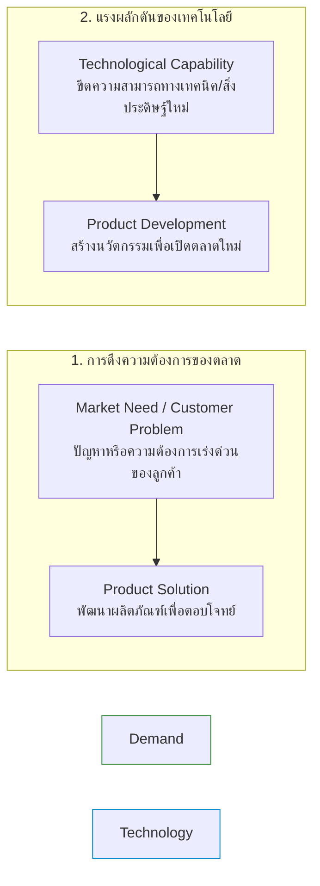
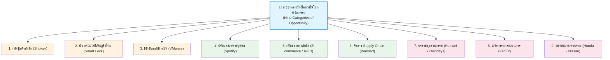
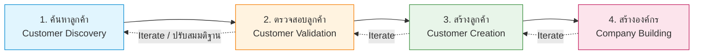
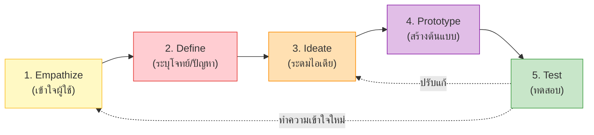
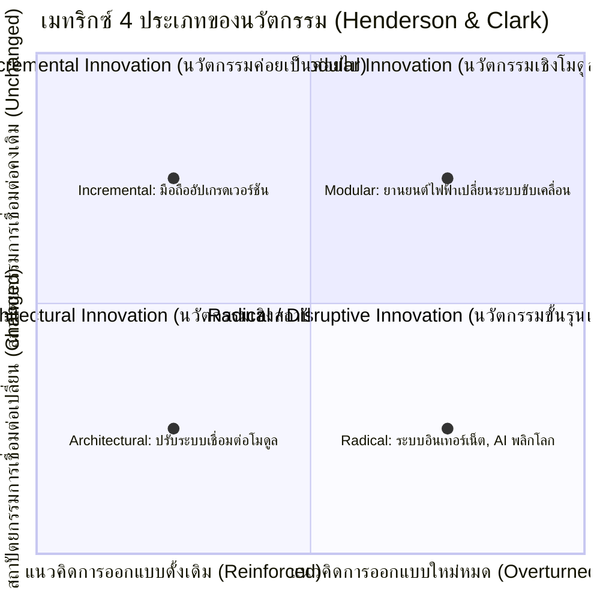
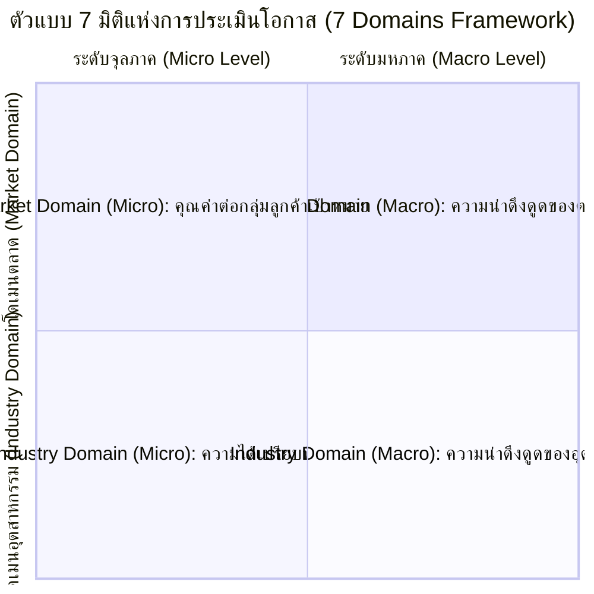

---
tags:
  - entrepreneurship
  - opportunity
  - innovation
  - design-thinking
  - customer-development
  - lecture-2
created: 2026-08-18
updated: 2026-08-18
lecture: 2
type: lecture
---

# Lecture 2: โอกาสและการประกอบการนวัตกรรม - Mega Guide

> [!SUMMARY] ภาพรวมบทเรียน
> บทเรียนนี้ครอบคลุมการค้นพบ การสร้าง การตรวจสอบ และการประเมินโอกาสทางธุรกิจในโลกนวัตกรรม ประกอบด้วย 5 หัวข้อสำคัญ:
> 1. [[#1. โอกาสใหม่ในโลกนวัตกรรมและแรงขับเคลื่อน]] - PESTEL, วัฒนธรรมองค์กร, และ Demand Pull vs Technology Push
> 2. [[#2. เก้าช่องทางสร้างโอกาสในโลกนวัตกรรม]] - Nine Categories of Opportunity พร้อมกรณีศึกษาจริงทุกมิติ
> 3. [[#3. แนวคิดการพัฒนาลูกค้าและการมีส่วนร่วมในตลาด]] - กระบวนการ Customer Development 4 ขั้นตอน, ข้อมูลปฐมภูมิ/ทุติยภูมิ, โฟกัสกรุ๊ป, 10 เคล็ดลับการสัมภาษณ์ลูกค้า และการสังเกตการณ์
> 4. [[#4. การคิดเชิงออกแบบและประเภทของนวัตกรรม]] - Design Thinking 5 ขั้นตอน (IDEO) และ Henderson & Clark Innovation Matrix 4 ประเภท
> 5. [[#5. การประเมินโอกาสและการตัดสินใจ]] - คุณลักษณะ 5 ประการ, หลักการเลือกโอกาสที่ดี, 5 ขั้นตอนประเมินโอกาส และตัวแบบเกณฑ์ 7 ประการ (7 Domains Model)

```mermaid
flowchart TD
    A[โอกาสในโลกนวัตกรรม<br/>Innovative Opportunity] --> B[แหล่งกำเนิดโอกาส]
    A --> C[9 ช่องทางสร้างโอกาส]
    A --> D[การพัฒนาลูกค้า & Design Thinking]
    A --> E[การจำแนก & การประเมินโอกาส]

    B --> B1["PESTEL Analysis"]
    B --> B2["Demand Pull (แรงดึงตลาด)"]
    B --> B3["Technology Push (แรงผลักเทคโน)"]

    C --> C1[1. เพิ่มมูลค่าสินค้า Shokay]
    C --> C2[2. ประยุกต์เทคโนโลยีเดิมสู่ใหม่ Smart Lock]
    C --> C3[3. สร้างตลาดมวลชน VMware]
    C --> C4[4. ปรับแต่งเฉพาะบุคคล Spotify]
    C --> C5[5. เพิ่มการเข้าถึง E-Commerce/RFID]
    C --> C6[6. จัดการ Supply Chain Walmart]
    C --> C7[7. บรรจบอุตสาหกรรม Smart Glasses]
    C --> C8[8. นวัตกรรมกระบวนการ FedEx]
    C --> C9[9. ขยายขนาด/ควบรวม Honda-Nissan]

    D --> D1["Customer Development 4 ขั้น<br/>(Steve Blank)"]
    D --> D2["Design Thinking 5 ขั้น<br/>(IDEO / HBR 2008)"]

    E --> E1["4 Innovation Types<br/>(Henderson & Clark)"]
    E --> E2["7 Domains Assessment Model<br/>(John Mullins)"]

    style A fill:#e1f5fe,stroke:#0288d1,stroke-width:2px
    style B fill:#fff3e0,stroke:#f57c00
    style C fill:#f3e5f5,stroke:#7b1fa2
    style D fill:#c8e6c9,stroke:#388e3c
    style E fill:#ffcdd2,stroke:#d32f2f
```

---

# 1. โอกาสใหม่ในโลกนวัตกรรมและแรงขับเคลื่อน

*📄 Slides 4-8*

## 1.1 การวิเคราะห์สภาพแวดล้อมระดับมหภาค (PESTEL Framework)
โอกาสใหม่ในโลกนวัตกรรมเกิดจากสภาพแวดล้อมภายนอกที่ผลักดันให้เกิดพฤติกรรมและความต้องการใหม่ของผู้บริโภค:
- **P (Political):** นโยบายรัฐ กฎหมายส่งเสริมสตาร์ทอัพ ความสัมพันธ์ระหว่างประเทศ
- **E (Economic):** อัตราเงินเฟ้อ กำลังซื้อ การเติบโตของเศรษฐกิจดิจิทัล
- **S (Social & Cultural):** สังคมผู้สูงอายุ วิถีชีวิตในเมือง ความตระหนักด้านสุขภาพ
- **T (Technological):** อินเทอร์เน็ตความเร็วสูง AI คลาวด์คอมพิวติ้ง พลังงานสะอาด
- **E (Environmental):** การเปลี่ยนแปลงสภาพภูมิอากาศ ความยั่งยืน การลดมลพิษ
- **L (Legal):** กฎหมายคุ้มครองข้อมูลส่วนบุคคล (PDPA) สิทธิบัตรและลิขสิทธิ์

## 1.2 วัฒนธรรมองค์กรที่ส่งเสริมการสร้างโอกาส
1. **วัฒนธรรมเปิดกว้าง (Open Culture):** เปิดโอกาสให้พนักงานเสนอความคิดเห็นโดยไม่ถูกตัดสิน
2. **การเรียนรู้และพัฒนาทักษะใหม่อย่างต่อเนื่อง (Continuous Learning):** Reskill & Upskill
3. **การทดลองและการปรับตัวอย่างรวดเร็ว (Experimentation & Agility):** Fail Fast, Learn Faster

## 1.3 สองแรงขับเคลื่อนสำคัญ: Demand Pull vs Technology Push

| ปัจจัย | Demand Pull (แรงดึงตลาด) | Technology Push (แรงผลักเทคโนโลยี) |
|---|---|---|
| **จุดเริ่มต้น** | ปัญหาของผู้บริโภค หรือความต้องการที่ยังไม่ได้รับการตอบสนอง | งานวิจัย สิ่งประดิษฐ์ หรือความก้าวหน้าทางวิทยาศาสตร์ |
| **เทคนิคที่ใช้** | การวิจัยตลาด, Design Thinking, การสัมภาษณ์ลูกค้า | การวิจัยและพัฒนา (R&D), การจดสิทธิบัตร |
| **ความเสี่ยง** | คู่แข่งอาจเข้าสู่ตลาดได้ง่ายหากไม่มีเทคโนโลยีปกป้อง | เสี่ยงสร้างสิ่งที่ไม่มีใครต้องการ (Technology in search of a problem) |
| **ตัวอย่าง** | ยารักษาโรคที่ระบาด, แอปส่งอาหาร delivery | การคิดค้นเลเซอร์, หน้าจอสัมผัส, เทคโนโลยี 5G |

## 1.4 ลูกบาศก์สามมิติแห่งโอกาสใหม่ (3D Opportunity Cube)
โอกาสทางธุรกิจที่ยอดเยี่ยมเกิดจากการเชื่อมโยง 3 แกน:
1. **กลุ่มลูกค้า (Customer Segments):** ผู้ใช้คือใคร มี Pain Point อะไร
2. **เทคโนโลยีและสมรรถนะ (Technologies & Competencies):** ใช้เทคนิคอะไรในการแก้ไข
3. **การประยุกต์ใช้งาน/โซลูชัน (Applications & Solutions):** ผลิตภัณฑ์หรือบริการที่ส่งมอบ

---

# 2. เก้าช่องทางสร้างโอกาสในโลกนวัตกรรม

*📄 Slides 9-18*

> [!INFO] ตาราง 9 ช่องทางสร้างโอกาส (Nine Categories of Opportunity)
> อ้างอิงจาก Dorf & Byers (*Technology Ventures: From Idea to Enterprise*)

### รายละเอียดและกรณีศึกษาของทั้ง 9 ช่องทาง
1. **การเพิ่มมูลค่าของผลิตภัณฑ์หรือบริการ (Increasing Value):**
   - *นิยาม:* เพิ่มประสิทธิภาพ คุณภาพ ความหรูหรา หรือการเข้าถึงที่เหนือกว่าของเดิม
   - *กรณีศึกษา:* **Shokay** แบรนด์สังคมที่นำขนจามรี (Yak) จากผู้เลี้ยงที่ยากจนในทิเบตมาแปรรูปเป็นผ้าพันคอระดับหรูหรา นุ่มนวล ใช้งานได้จริงและสร้างรายได้ให้ชุมชน
2. **การประยุกต์ใช้วิธีการหรือเทคโนโลยีที่มีอยู่ใหม่ (New Applications of Existing Tech):**
   - *นิยาม:* นำเทคโนโลยีที่มีอยู่แล้วในอุตสาหกรรมหนึ่งมาแก้ปัญหาในอีกอุตสาหกรรมหนึ่ง
   - *กรณีศึกษา:* แถบแม่เหล็กบัตรเครดิต (Magstripe) ในทศวรรษ 1960 ถูกนำมาประยุกต์เป็นระบบ **Keycard บัตรเปิดประตูห้องพักโรงแรม** และพัฒนาสู่ Smart Lock บลูทูธ/Zigbee
3. **การสร้างตลาดมวลชน / ขยายตลาด (Creating Mass Markets):**
   - *นิยาม:* นำเทคโนโลยีเฉพาะกลุ่มมาขยายให้ใช้งานได้ในวงกว้าง
   - *กรณีศึกษา:* **VMware** นำเทคโนโลยี Virtualization จำลอง Server และ OS ช่วยให้นักพัฒนาและองค์กรทั่วโลกทดสอบระบบได้ประหยัดและรวดเร็ว
4. **การปรับแต่งสำหรับบุคคล (Customization for Individuals):**
   - *นิยาม:* การใช้ซอฟต์แวร์/ข้อมูลปรับสินค้าให้ตรงกับความต้องการเฉพาะบุคคล (Personalization)
   - *กรณีศึกษา:* **Spotify** แพลตฟอร์มสตรีมมิ่งที่ใช้ Machine Learning แนะนำเพลง จัด Playlist ประจำวันตามรสนิยม และเชื่อมต่อกับอุปกรณ์ได้ทุกที่
5. **การเพิ่มช่องทางการเข้าถึง (Increasing Reach):**
   - *นิยาม:* ขยายขอบเขตทางภูมิศาสตร์และเวลาด้วยอินเทอร์เน็ตและระบบเครือข่าย
   - *กรณีศึกษา:* E-Commerce & Online Marketplace ผสานเทคโนโลยี **RFID Tag** ช่วยตรวจสอบสต็อกและติดตามสินค้าข้ามทวีปได้แบบเรียลไทม์
6. **การจัดการห่วงโซ่อุปทาน (Managing the Supply Chain):**
   - *นิยาม:* ปรับปรุงเครือข่ายความสัมพันธ์ตั้งแต่จัดหาวัตถุดิบ ผลิต จนถึงส่งมอบเพื่อลดต้นทุนและของเสีย
   - *กรณีศึกษา:* **Walmart** เชื่อมโยงระบบฐานข้อมูลสต็อกทุกสาขาเข้ากับระบบโลจิสติกส์ส่วนกลาง ทำให้สินค้าหมุนเวียนเร็ว ลดต้นทุนคงคลังได้อย่างมหาศาล
7. **การบรรจบกันของอุตสาหกรรม (Convergence of Industries):**
   - *นิยาม:* การหลอมรวมข้ามสายระหว่างสองอุตสาหกรรมเพื่อสร้างผลิตภัณฑ์สายพันธุ์ใหม่
   - *กรณีศึกษา:* **Huawei x OWNDAYS** ร่วมกันเปิดตัวแว่นตาอัจฉริยะ (Smart Audio Glasses) ที่รวมแว่นสายตาเข้ากับหูฟังบลูทูธและไมโครโฟน
8. **นวัตกรรมด้านกระบวนการ (Process Innovation):**
   - *นิยาม:* การคิดค้นและนำเทคโนโลยีมาปรับเปลี่ยนวิธีการผลิตและการส่งมอบ
   - *กรณีศึกษา:* **FedEx** ปฏิวัติวงการขนส่งด่วนด้วยระบบขนส่งทางอากาศแบบ Hub-and-Spoke และระบบติดตามพัสดุคอมพิวเตอร์ข้ามคืน
9. **การเพิ่มขนาดของบริษัท / การควบรวมกิจการ (Increasing Scale / Mergers):**
   - *นิยาม:* การรวมกิจการเพื่อสร้างอำนาจต่อรองและการประหยัดต่อขนาด (Economies of Scale)
   - *กรณีศึกษา:* การเจรจาควบรวมกิจการระหว่าง **Honda และ Nissan** ในปี 2568-2569 เพื่อตั้ง Holding Company สู้ศึกยานยนต์ไฟฟ้า (EV) กับ Tesla และค่ายรถยนต์จีน

---

# 3. แนวคิดการพัฒนาลูกค้าและการมีส่วนร่วมในตลาด

*📄 Slides 19-25*

## 3.1 กระบวนการพัฒนาลูกค้า 4 ขั้นตอน (Customer Development Process โดย Steve Blank)

1. **Customer Discovery (การค้นหาลูกค้า):** ระบุกลุ่มเป้าหมาย ทดสอบว่าปัญหาที่เลือกมีความสำคัญจริงหรือไม่ และพวกเขาเห็นคุณค่าของแนวทางแก้ปัญหาหรือไม่
2. **Customer Validation (การตรวจสอบลูกค้า):** สร้างกระบวนการขายซ้ำๆ เพื่อทดสอบว่าลูกค้ายอมจ่ายเงินจริงหรือไม่ หากไม่สำเร็จต้องทำ **Iteration / Reconsider** เพื่อปรับสมมติฐาน
3. **Customer Creation (การสร้างลูกค้า):** ต่อยอดจากยอดขายกลุ่มแรก สร้างอุปสงค์ (User Demand) ขยายฐานผู้ใช้งาน
4. **Company Building (การสร้างบริษัท):** ปรับเปลี่ยนจากการเป็นทีมค้นหา/ทดลอง สู่การจัดโครงสร้างองค์กร แผนกขาย และการตลาดอย่างเป็นทางการ

## 3.2 ข้อมูลปฐมภูมิ vs ข้อมูลทุติยภูมิ (Primary vs Secondary Data)

| ประเภทข้อมูล | นิยาม | วิธีการจัดเก็บ | ข้อดี / ข้อจำกัด |
|---|---|---|---|
| **ข้อมูลปฐมภูมิ (Primary Data)** | ข้อมูลที่เก็บรวบรวมโดยตรงจากกลุ่มเป้าหมายเพื่อตอบโจทย์วิจัยเฉพาะ | - Focus Group - Customer Interview - Observation (การสังเกต) - Design Thinking | **ข้อดี:** แม่นยำ สดใหม่ ตรงประเด็น **ข้อจำกัด:** เสียเวลาและค่าใช้จ่ายสูง |
| **ข้อมูลทุติยภูมิ (Secondary Data)** | ข้อมูลที่มีผู้อื่นรวบรวมและวิเคราะห์ไว้แล้ว นำมาใช้งานต่อ | - รายงานสถิติภาครัฐ - ผลวิเคราะห์ตลาดอุตสาหกรรม - Web Analytics / ข้อมูลวิจัยตีพิมพ์ | **ข้อดี:** รวดเร็ว ประหยัด **ข้อจำกัด:** อาจไม่ตรงความต้องการเฉพาะ หรือล้าสมัย |

## 3.3 การจัดสนทนากลุ่ม (Focus Group) และ 10 เคล็ดลับการสัมภาษณ์ลูกค้า

> [!TIP] 10 เคล็ดลับในการสัมภาษณ์ลูกค้าเชิงลึก (In-depth Customer Interview)
> 1. **รู้เป้าหมายและคำถามล่วงหน้า:** วางโครงสร้างประเด็นที่ต้องการทดสอบ
> 2. **คัดเลือกบุคคลที่ตรงกับกลุ่มเป้าหมายจริง:** อย่าสัมภาษณ์ใครก็ได้
> 3. **ใช้คำถามปลายเปิด (Open-ended Questions):** หลีกเลี่ยงคำถามที่ตอบเพียง ใช่/ไม่ใช่
> 4. **กระตุ้นความจริงใจ:** บอกผู้ให้สัมภาษณ์ว่ายินดีรับฟังคำติชมและข้อเท็จจริงที่เจ็บปวด
> 5. **เน้น "ฟัง" มากกว่า "พูด" (Listen > Talk):** ไม่ต้องขายไอเดีย ให้ฟังปัญหาของเขา
> 6. **ห้ามชักจูงหรือบังคับคำตอบ:** ปล่อยให้ผู้ตอบแสดงความคิดเห็นอิสระ
> 7. **ถามคำถามติดตามผล (Follow-up "Why?"):** เจาะลึกถึงสาเหตุที่แท้จริง
> 8. **ทบทวนความเข้าใจ (Paraphrase):** ทวนสิ่งที่ได้ยินกลับไปเพื่อให้แน่ใจว่าเข้าใจตรงกัน
> 9. **ขอคำแนะนำถึงลูกค้ารายอื่น (Referrals):** ขยายเครือข่ายผู้ให้สัมภาษณ์
> 10. **บันทึกผลทันทีหลังการสัมภาษณ์:** ป้องกันการลืมและตกหล่นข้อมูลเชิงลึก

## 3.4 การสังเกตการณ์เชิงพฤติกรรม (Observational Research)
> *"นวัตกรรมเริ่มต้นด้วยสายตา" (Innovation begins with an eye - Leon Segal, IDEO)*

**กรณีศึกษา Kaiser Permanente (Brown, 2008):**
- **ปัญหา:** พยาบาลเปลี่ยนกะเวรใช้เวลานาน ข้อมูลสำคัญของผู้ป่วยตกหล่นระหว่างส่งเวร
- **การสังเกต:** ทีมวิจัยลงพื้นที่สังเกตพฤติกรรมจริงในโรงพยาบาล 4 แห่ง พบว่าไม่มีแบบฟอร์มที่เป็นมาตรฐาน พยาบาลเขียนโน้ตกระจัดกระจาย
- **ผลลัพธ์:** ออกแบบระบบการส่งเวรใหม่แบบมาตรฐาน ย่นเวลาส่งเวร เพิ่มเวลาดูแลผู้ป่วย และลดข้อผิดพลาดทางการแพทย์

---

# 4. การคิดเชิงออกแบบและประเภทของนวัตกรรม

*📄 Slides 26-31*

## 4.1 กระบวนการคิดเชิงออกแบบ (Design Thinking 5 ขั้นตอน - IDEO & HBR 2008)

1. **Empathize (เอาใจใส่/ทำความเข้าใจ):** สัมภาษณ์ สังเกต ถามว่า "ทำไม" เพื่อเข้าใจความรู้สึก พฤติกรรม และ Pain Point ของผู้ใช้อย่างลึกซึ้ง
2. **Define (กำหนดกรอบโจทย์):** สรุปปัญหาที่แท้จริงของผู้ใช้ว่า "ผู้ใช้คือใคร และเขาต้องการอะไรเพราะอะไร"
3. **Ideate (ระดมความคิด):** ระดมสมองหาทางเลือกที่หลากหลาย ไม่ตัดสินไอเดีย เน้นปริมาณความคิดสร้างสรรค์
4. **Prototype (สร้างแบบจำลองต้นแบบ):** สร้างชิ้นงานจำลองอย่างรวดเร็วและเรียบง่าย เพื่อจับต้องได้
5. **Test (ทดสอบกับผู้ใช้จริง):** นำต้นแบบไปให้กลุ่มเป้าหมายทดสอบเพื่อรับ Feedback และปรับปรุงซ้ำ

---

## 4.2 สี่ประเภทของนวัตกรรม (Henderson & Clark Innovation Matrix)

| ประเภทนวัตกรรม | นิยาม | ลักษณะทางโครงสร้าง | ตัวอย่าง |
|---|---|---|---|
| **1. Incremental Innovation** *(ค่อยเป็นค่อยไป)* | ปรับปรุงผลิตภัณฑ์เดิมให้เร็วขึ้น ดีขึ้น ถูกลง ("Faster, Better, Cheaper") | องค์ประกอบเดิม + สถาปัตยกรรมเดิม | สมาร์ทโฟนรุ่นใหม่ที่อัปเกรดกล้องหรือ CPU |
| **2. Architectural Innovation** *(เชิงสถาปัตยกรรม/ต่อยอด)* | เปลี่ยนวิธีการเชื่อมต่อหรือจัดวางโมดูลใหม่ โดยใช้ชิ้นส่วนเดิม | องค์ประกอบเดิม + สถาปัตยกรรมใหม่ | การจัดเรียงเครื่องยนต์และระบบส่งกำลังแบบใหม่ในห้องเครื่อง |
| **3. Modular Innovation** *(เชิงโมดูล/องค์ประกอบ)* | เปลี่ยนชิ้นส่วนหรือโมดูลภายในใหม่ทั้งหมด แต่การเชื่อมต่อภายนอกยังคงเดิม | องค์ประกอบใหม่ + สถาปัตยกรรมเดิม | รถยนต์ที่เปลี่ยนเครื่องยนต์สันดาปเป็นมอเตอร์ไฟฟ้าและแบตเตอรี่ |
| **4. Radical / Disruptive Innovation** *(ขั้นรุนแรง / พลิกโฉม)* | สร้างสรรค์ทั้งโมดูลใหม่และสถาปัตยกรรมใหม่ ทำลายโครงสร้างตลาดเดิม ("Brave New World") | องค์ประกอบใหม่ + สถาปัตยกรรมใหม่ | เครือข่ายอินเทอร์เน็ต, การพิมพ์แบบ 3 มิติ, ระบบคอมพิวเตอร์ควอนตัม |

---

# 5. การประเมินโอกาสและการตัดสินใจ

*📄 Slides 35-41*

## 5.1 คุณลักษณะ 5 ประการของโอกาสที่น่าดึงดูด (5 Characteristics of an Attractive Opportunity)
1. **ทันเวลา (Timely):** ตอบสนองต่อปัญหาหรือความต้องการของผู้บริโภคในปัจจุบัน
2. **แก้ไขได้ (Solvable):** สามารถแก้ปัญหาได้จริงในอนาคตอันใกล้ด้วยทรัพยากรและเทคโนโลยีที่เข้าถึงได้
3. **สำคัญ (Important):** ลูกค้าตระหนักว่าปัญหานี้สร้างความเดือดร้อนจริงและต้องการทางออกอย่างเร่งด่วน
4. **มีกำไร (Profitable):** ลูกค้ายินดีจ่ายเงินซื้อโซลูชัน และสร้างผลตอบแทนที่คุ้มค่าแก่ธุรกิจ
5. **บริบทเอื้ออำนวย (Favorable Context):** สภาพแวดล้อมทางกฎหมาย อุตสาหกรรม และสังคมเปิดรับ

## 5.2 กระบวนการ 5 ขั้นตอนพื้นฐานในการประเมินโอกาส (5-Step Evaluation Process)
1. **Capabilities (ความสามารถ):** โอกาสนี้สอดคล้องกับทักษะ ประสบการณ์ และความรู้ของทีมงานหรือไม่?
2. **Novelty (ความแปลกใหม่):** โซลูชันมีคุณสมบัติที่แตกต่าง มีกรรมสิทธิ์ หรือมีเอกลักษณ์จนลูกค้ายอมจ่ายพรีเมียมหรือไม่?
3. **Resources (ทรัพยากร):** ทีมงานสามารถระดมทุน ทรัพยากรบุคคล และสินทรัพย์ที่จำเป็นได้หรือไม่?
4. **Return (ผลตอบแทน):** ผลิตและดำเนินงานได้ในต้นทุนที่สร้างผลกำไรคุ้มกับความเสี่ยงหรือไม่?
5. **Commitment (ความมุ่งมั่น):** สมาชิกทีมมีความหลงใหลและพร้อมทุ่มเทให้กับธุรกิจนี้หรือไม่?

## 5.3 ตัวแบบหลักเกณฑ์ 7 ประการในการพิจารณาความน่าดึงดูดของโอกาส (7 Domains Model โดย John Mullins)

> [!NOTE] 3 โดเมนและ 7 มิติ
> - **Market Domain (ตลาด):**
>   1. *Macro:* ขนาดและอัตราการเติบโตของตลาดโดยรวม (Market Attractiveness)
>   2. *Micro:* คุณค่าเฉพาะที่ส่งมอบให้กลุ่มลูกค้าเป้าหมาย (Target Segment Benefits)
> - **Industry Domain (อุตสาหกรรม):**
>   3. *Macro:* โครงสร้างการแข่งขันและอัตรากำไรของอุตสาหกรรม (Industry Attractiveness)
>   4. *Micro:* ความได้เปรียบทางการแข่งขันที่ยั่งยืนและลอกเลียนแบบยาก (Sustainable Advantage)
> - **Team Domain (ทีมผู้ก่อตั้ง - แกนกลาง):**
>   5. *Mission & Aspirations:* วิสัยทัศน์ ความมุ่งมั่น และระดับการยอมรับความเสี่ยง (Propensity for Risk)
>   6. *Ability to Execute:* ความสามารถในการปฏิบัติการตามปัจจัยแห่งความสำเร็จ (Critical Success Factors)
>   7. *Connectedness:* ความเชื่อมโยงในห่วงโซ่คุณค่า (Connection up & down the value chain)

---

# 📝 สรุปสาระสำคัญประจำบท (Chapter Takeaway)
- โอกาสทางธุรกิจที่ดีมักซ่อนอยู่ในปัญหาที่ซับซ้อน และเกิดจากการประสานระหว่าง **Demand Pull** และ **Technology Push**
- มี **9 ช่องทาง** ในการสร้างโอกาสนวัตกรรม ตั้งแต่การเพิ่มมูลค่า การประยุกต์เทคโนโลยี ไปจนถึงการควบรวมกิจการ
- กระบวนการค้นหาและพัฒนาลูกค้า (Steve Blank) และ **Design Thinking** (IDEO) เป็นหัวใจสำคัญในการตรวจสอบความต้องการที่แท้จริง
- การประเมินโอกาสต้องดูให้ครบทั้ง **5 คุณลักษณะ**, **ความพร้อมของทีม**, และ **แบบจำลอง 7 Domains** ก่อนตัดสินใจลงทุน
