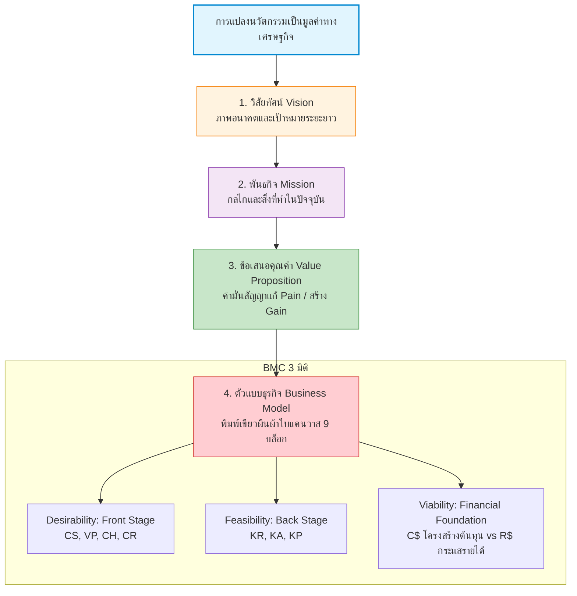
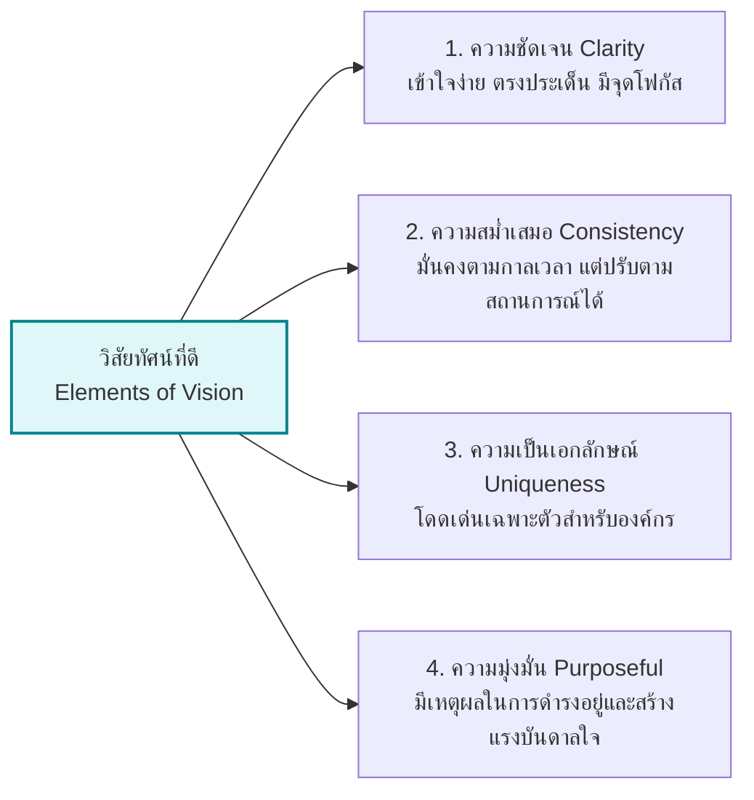
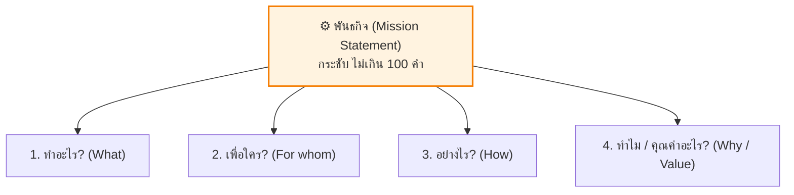
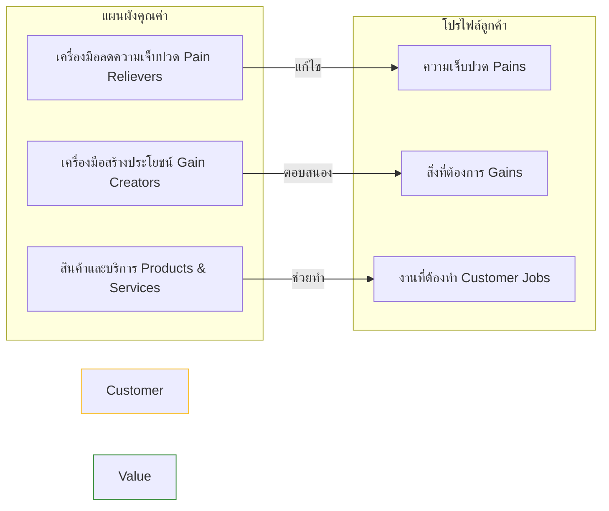
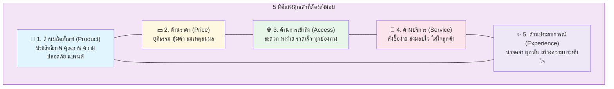
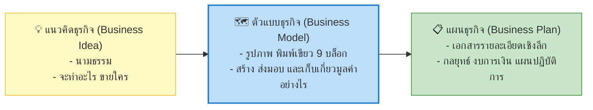
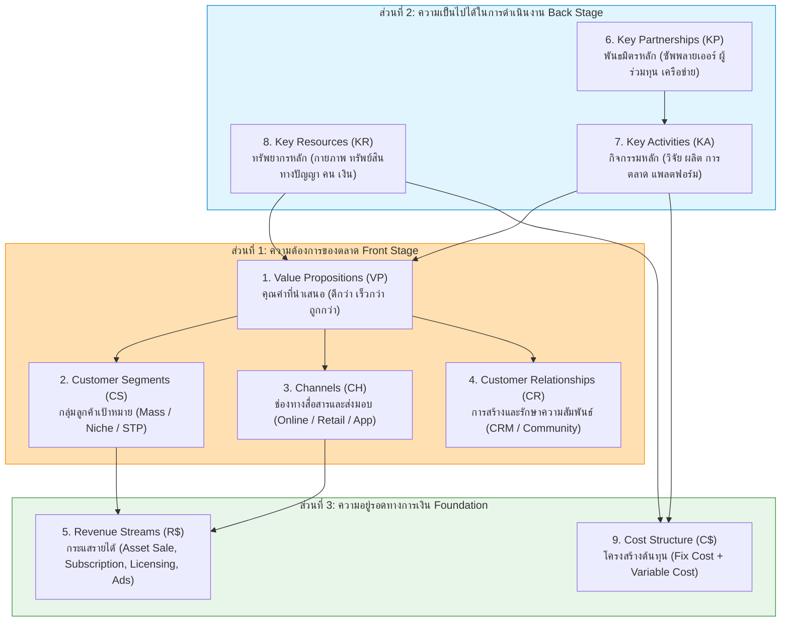
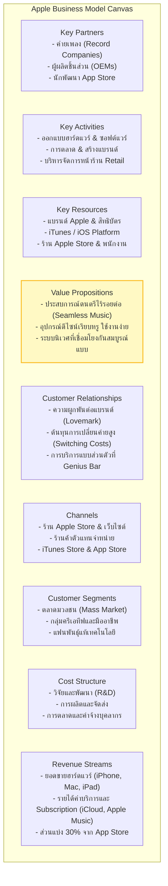
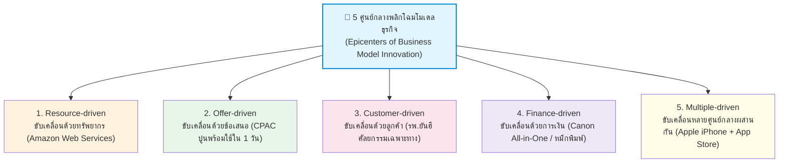

---
tags:
  - entrepreneurship
  - vision
  - mission
  - value-proposition
  - business-model
  - bmc
  - lean-canvas
  - lecture-3
created: 2026-08-18
updated: 2026-08-18
lecture: 3
type: lecture
---

# Lecture 3: วิสัยทัศน์ พันธกิจ และตัวแบบธุรกิจ - Mega Guide

> [!SUMMARY] ภาพรวมบทเรียน
> บทเรียนนี้ครอบคลุมการเปลี่ยนวิสัยทัศน์และนวัตกรรมให้กลายเป็นพิมพ์เขียวทางธุรกิจที่สร้างรายได้ ประกอบด้วย 4 หัวข้อหลัก:
> 1. [[#1. การกำหนดวิสัยทัศน์ที่ทรงพลัง]] - นิยาม 4 องค์ประกอบของวิสัยทัศน์ และกรณีศึกษาตัวอย่าง
> 2. [[#2. การเขียนพันธกิจที่ชัดเจน]] - 4 คำถามหลัก (What, For Whom, How, Why), กฎไม่เกิน 100 คำ, ตารางเปรียบเทียบ Vision vs Mission, กรณีศึกษา eBay และ Genentech
> 3. [[#3. การนำเสนอคุณค่า]] - Value Proposition Design, Pain Relievers, Gain Creators, คุณค่า 5 มิติ (Product, Price, Access, Service, Experience)
> 4. [[#4. ตัวแบบธุรกิจและผืนผ้าใบแคนวาส]] - เปรียบเทียบ Idea vs Plan vs Model, เจาะลึก 9 องค์ประกอบของ Business Model Canvas (Desirability, Feasibility, Viability), กรณีศึกษา Apple Ecosystem, 5 ศูนย์กลางพลิกโฉมโมเดลธุรกิจ (Epicenters) และกระบวนการออกแบบธุรกิจแบบวนซ้ำ

---

# 1. การกำหนดวิสัยทัศน์ที่ทรงพลัง (Creating a Vision)

*📄 Slides 4-11*

## 1.1 นิยามและความสำคัญของวิสัยทัศน์
> [!DEFINITION] วิสัยทัศน์ (Vision)
> แผนภาพอนาคตที่เต็มไปด้วยจินตนาการ เป็นการแถลงการณ์เป้าหมายระยะยาวที่มองไปข้างหน้า ซึ่งเกิดจากการวิเคราะห์สภาพแวดล้อมภายนอก (โอกาสและภัยคุกคาม) และศักยภาพภายใน (จุดแข็งและจุดอ่อน) เพื่อกำหนดทิศทางที่ชัดเจนและสร้างแรงบันดาลใจให้กับผู้มีส่วนได้ส่วนเสีย

## 1.2 สี่องค์ประกอบหลักของวิสัยทัศน์ที่ดี (Table 3.1 Elements of a Vision)

## 1.3 ตัวอย่างคำแถลงวิสัยทัศน์ในอุตสาหกรรมต่างๆ
- **บริษัทเทคโนโลยี:** *"เป็นผู้นำด้านนวัตกรรม AI ที่ขับเคลื่อนการเปลี่ยนแปลงเชิงบวกให้กับชีวิตประจำวันของผู้คนทั่วโลก"*
- **ร้านกาแฟ:** *"สร้างสรรค์ประสบการณ์กาแฟที่ดีที่สุดผ่านการเชื่อมโยงผู้คน ชุมชน และความยั่งยืน"*
- **บริษัทผลิตรถยนต์:** *"เป็นผู้ขับเคลื่อนอนาคตแห่งการเดินทางที่ปลอดภัย ยั่งยืน และชาญฉลาด"*
- **ธนาคาร:** *"เป็นธนาคารที่ลูกค้าไว้วางใจที่สุดในการสร้างความมั่งคั่งและอนาคตทางการเงินที่ดีกว่า"*
- **บริษัทอุปกรณ์ชีวการแพทย์ (Table 3.2):** *"เรามุ่งมั่นที่จะรักษาและปรับปรุงชีวิตของผู้คนผ่านนวัตกรรมของอุปกรณ์ชีวการแพทย์ พร้อมสนับสนุน ฝึกอบรม และสร้างแรงบันดาลใจให้พนักงาน เพื่อปลดปล่อยความคิดสร้างสรรค์ เป้าหมายของเราคือการเป็นผู้นำในอุตสาหกรรมและเป็นที่รู้จักทั่วโลกในด้านอุปกรณ์ที่ช่วยรักษาและยืดอายุขัย"*
- **Healtheon (ปัจจุบันคือ WebMD):** นำเสนอวิสัยทัศน์เชื่อมโยง 4 แกน: แพทย์ (Doctors), โรงพยาบาล (Providers & Hospitals), ผู้จ่ายเงิน (Payers) และผู้บริโภค (Consumers) ผ่านระบบธุรกรรมและข้อมูลสุขภาพออนไลน์

---

# 2. การเขียนพันธกิจที่ชัดเจน (Writing a Mission Statement)

*📄 Slides 12-17*

## 2.1 นิยามและหลักการเขียนพันธกิจ
> [!DEFINITION] พันธกิจ (Mission)
> งานหรือกลไกที่ธุรกิจต้องทำในปัจจุบัน เพื่อขับเคลื่อนองค์กรไปสู่เป้าหมายที่กำหนดไว้ในวิสัยทัศน์ เป็นคำอธิบายถึงเหตุผลของการมีอยู่ขององค์กร (Reason for Being)

### กฎและโครงสร้าง 4 คำถามหลัก
- **กฎความยาว:** ควรเป็นประโยคหรือย่อหน้าที่กระชับ ชัดเจน **มีความยาวไม่เกิน 100 คำ**
- **4 คำถามที่ต้องตอบให้ได้:**
  1. **What do we do?** — กิจการจะทำอะไร?
  2. **For whom do we do it?** — กิจการทำกิจกรรมนั้นๆ เพื่อใคร?
  3. **How do we do it?** — กิจการดำเนินงานอย่างไร?
  4. **Why do we do it? / What value do we create?** — ทำไมต้องทำสิ่งนั้น และสร้างคุณค่าอะไร?

## 2.2 กรณีศึกษาคำแถลงพันธกิจจริง
- **eBay (ตาราง 3.4):** *"เราช่วยให้ผู้คนซื้อขายอะไรก็ได้บนโลกนี้ eBay ก่อตั้งขึ้นด้วยความเชื่อว่าโดยพื้นฐานแล้วผู้คนเป็นคนดี เราเชื่อว่าลูกค้าทุกคนสมควรได้รับการปฏิบัติด้วยความเคารพ เราจะปรับปรุงประสบการณ์การซื้อขายออนไลน์ของทุกคนต่อไป ไม่ว่าจะเป็นนักสะสม ผู้ค้า หรือผู้แสวงหาสินค้าที่ไม่เหมือนใคร..."*
- **Genentech (ตาราง 3.5):** *"ภารกิจของเราคือการเป็นบริษัทเทคโนโลยีชีวภาพชั้นนำ โดยใช้ข้อมูลทางพันธุกรรมของมนุษย์ในการค้นพบ พัฒนา ผลิต และจำหน่ายผลิตภัณฑ์บำบัดทางชีวภาพที่ตอบสนองความต้องการทางการแพทย์ที่สำคัญที่ยังไม่ได้รับการตอบสนอง เรามุ่งมั่นในมาตรฐานระดับสูงของความซื่อสัตย์เพื่อเอื้อประโยชน์สูงสุดแก่ผู้ป่วยและสังคม..."*

## 2.3 ตารางเปรียบเทียบ วิสัยทัศน์ (Vision) vs พันธกิจ (Mission)

| มิติ | วิสัยทัศน์ (Vision) 🔭 | พันธกิจ (Mission) ⚙️ |
|---|---|---|
| **กรอบเวลา (Timeframe)** | ภาพอนาคต (Future) | ปัจจุบัน (Present) |
| **ลักษณะ (Nature)** | เต็มไปด้วยจินตนาการ (Imagination & Aspiration) | กระบวนการปฏิบัติการจริง (Execution & Operation) |
| **เป้าหมาย (Goal)** | แผนระยะยาวและภาพที่อยากจะเป็น (Where we want to be) | วิธีการและสิ่งที่ทำอยู่เพื่อไปสู่เป้าหมาย (What we do today) |
| **บทบาทต่อทีม** | จุดประกายแรงบันดาลใจและทิศทางร่วม | กำหนดแนวทางปฏิบัติงานและการจัดสรรทรัพยากร |

---

# 3. การนำเสนอคุณค่า (Value Proposition)

*📄 Slides 18-23*

## 3.1 นิยามของข้อเสนอคุณค่า (Value Proposition: VP)
> [!DEFINITION] ข้อเสนอคุณค่า (Value Proposition)
> คำมั่นสัญญาที่ธุรกิจมอบให้แก่ลูกค้า ระบุชัดเจนว่าลูกค้าจะได้รับประโยชน์อะไร และทำไมจึงต้องเลือกสินค้าหรือบริการนี้แทนที่จะเลือกของคู่แข่ง

### องค์ประกอบของการนำเสนอคุณค่าที่ดี
- **Target Customer Segment:** ลูกค้าเป้าหมายที่แท้จริงคือใคร
- **Customer Pains & Pain Relievers:** ปัญหา ความยุ่งยาก ความเสี่ยงของลูกค้า และวิธีที่เราช่วยบรรเทา
- **Customer Gains & Gain Creators:** สิ่งที่ลูกค้าคาดหวัง และสิ่งที่เราช่วยยกระดับความพึงพอใจ
- **Differentiators:** สิ่งที่ทำให้เราโดดเด่น เหนือกว่า และลอกเลียนแบบได้ยาก

## 3.2 ห้ามิติของคุณค่าที่องค์กรต้องส่งมอบ (5 Value Dimensions)

| มิติของคุณค่า | คำอธิบายและองค์ประกอบ | ตัวอย่างบริษัทเด่น |
|---|---|---|
| **1. ด้านผลิตภัณฑ์ (Product)** | ประสิทธิภาพ คุณภาพ ฟังก์ชัน ความปลอดภัย แบรนด์ | **Volvo** (ความปลอดภัยเข็มขัดนิรภัย 3 จุด), **Apple** (นวัตกรรมและดีไซน์) |
| **2. ด้านราคา (Price)** | ยุติธรรม สมเหตุสมผล คุ้มค่า ประหยัด | **Walmart** (Everyday Low Price), **Southwest Airlines** |
| **3. ด้านการเข้าถึง (Access)** | สะดวก หาง่าย เชื่อมต่อรวดเร็ว ทุกที่ทุกเวลา | **Amazon.com** (เว็บไซต์ค้นหาง่าย ส่งถึงบ้าน), **7-Eleven** |
| **4. ด้านบริการ (Service)** | สั่งซื้อง่าย ส่งมอบไว ช่วยเหลือรวดเร็วและเป็นมิตร | **Dell** (บริการแก้ปัญหาคอมพิวเตอร์), **Home Depot** |
| **5. ด้านประสบการณ์ (Experience)** | สร้างความประทับใจ ความผูกพัน อารมณ์ร่วม | **Starbucks** (บรรยากาศ Third Place), **Disney World**, **Harley-Davidson** |

---

# 4. ตัวแบบธุรกิจและผืนผ้าใบแคนวาส (Business Model Canvas)

*📄 Slides 24-55*

## 4.1 เปรียบเทียบ Business Idea vs Business Model vs Business Plan

## 4.2 เครื่องมือสำคัญในการพัฒนาตัวแบบธุรกิจ
1. **Business Model Canvas (BMC):** เฟรมเวิร์ก 9 องค์ประกอบบนหน้าเดียว โดย Alexander Osterwalder
2. **Lean Canvas:** ดัดแปลงโดย Ash Maurya เน้นที่ Problem, Solution, Key Metrics, Unfair Advantage สำหรับสตาร์ทอัพ
3. **Value Proposition Canvas:** เจาะลึกความสอดคล้องระหว่าง Customer Profile และ Value Map

---

## 4.3 เจาะลึก 9 องค์ประกอบของ Business Model Canvas (BMC)
BMC แบ่งออกเป็น 3 ส่วนหลักตามเกณฑ์การประเมินธุรกิจ:

> [!IMPORTANT] กฎเหล็กแห่งความอยู่รอดทางธุรกิจ
> **Revenue Streams (R$) > Cost Structure (C$)** กิจการจึงจะสามารถทำกำไร เติบโต และขยายขนาดได้อย่างยั่งยืน

---

## 4.4 กรณีศึกษาตัวแบบธุรกิจ Apple Ecosystem

---

## 4.5 ห้าจุดศูนย์กลางการพลิกโฉมโมเดลธุรกิจ (Epicenters of Business Model Innovation)
นวัตกรรมโมเดลธุรกิจสามารถเริ่มต้นการเปลี่ยนแปลงจากบล็อกใดก็ได้ ซึ่งจะส่งผลสะเทือนต่อบล็อกอื่นๆ ทั้งระบบ:

1. **Resource-driven (ขับเคลื่อนด้วยทรัพยากร):** เริ่มจากโครงสร้างพื้นฐานเดิม เช่น Amazon มี Server ขนาดใหญ่ จึงเปิดให้เช่า Cloud (AWS)
2. **Offer-driven (ขับเคลื่อนด้วยข้อเสนอใหม่):** สร้างคุณค่าใหม่ เช่น CPAC ส่งคอนกรีตผสมเสร็จปริมาณน้อยถึงไซต์งานภายใน 24 ชม.
3. **Customer-driven (ขับเคลื่อนด้วยความต้องการลูกค้า):** ปรับตามปัญหาลูกค้า เช่น รพ.ยันฮี ปรับรูปแบบบริการศัลยกรรมความงามแบบครบวงจร
4. **Finance-driven (ขับเคลื่อนด้วยกลไกการเงิน/ราคา):** ปรับโครงสร้างรายได้ เช่น Canon ขายเครื่องพิมพ์ราคาประหยัดแล้วเก็บเกี่ยวจากตลับหมึก
5. **Multiple-driven (ขับเคลื่อนหลายศูนย์กลางร่วมกัน):** ผสมผสานหลายบล็อก เช่น Apple เชื่อมโยง Hardware + Software + Store + Content

---

# 📝 สรุปสาระสำคัญประจำบท (Chapter Takeaway)
- การสร้างธุรกิจนวัตกรรมต้องแปลงจาก **Vision (อนาคต)** สู่ **Mission (ปัจจุบัน)** สู่ **Value Proposition (คุณค่าที่แตกต่าง)** และแสดงผลบน **Business Model Canvas (พิมพ์เขียว 9 บล็อก)**
- คุณค่าที่ส่งมอบต้องครอบคลุมทั้ง **Product, Price, Access, Service, Experience**
- ความอยู่รอดของธุรกิจขึ้นอยู่กับสมดุล **Desirability (ตลาดต้องการ), Feasibility (ทำได้จริง), และ Viability (รายได้มากกว่าต้นทุน)**
- นวัตกรรมโมเดลธุรกิจสามารถเริ่มต้นได้จาก **5 ศูนย์กลาง (Epicenters)** และต้องทดสอบปรับปรุงแบบวนซ้ำ (Iterative Process) อยู่เสมอ
