---
tags:
  - entrepreneurship
  - strategy
  - competitive-strategy
  - core-competencies
  - swot
  - six-forces
  - value-network
  - lecture-4
created: 2026-08-18
updated: 2026-08-18
lecture: 4
type: lecture
---

# Lecture 4: กลยุทธ์การแข่งขันสำหรับผู้ประกอบการนวัตกรรม - Mega Guide

> [!SUMMARY] ภาพรวมบทเรียน
> บทเรียนนี้ครอบคลุมการวางกลยุทธ์การแข่งขันในตลาดที่มีความผันผวนและพลวัตสูง ประกอบด้วย 9 หัวข้อหลัก:
> 1. [[#1. นิยามและกระบวนการพัฒนากลยุทธ์]] - 8 ขั้นตอนการพัฒนากลยุทธ์, การมองโอกาสเปรียบเสมือน "พอร์ตของกัปตันเรือ"
> 2. [[#2. เครื่องยนต์กลยุทธ์แบบไดนามิก]] - 6 คำถามชี้ชะตากลยุทธ์ที่มีผลกำไร (Dynamic Strategy Engine)
> 3. [[#3. สมรรถนะหลักของกิจการ]] - ทรัพยากร + ทักษะ = สมรรถนะที่ยากจะเลียนแบบ (กรณีศึกษา Intel, 3M, Honda, Google)
> 4. [[#4. การวิเคราะห์อุตสาหกรรมและบริบททางธุรกิจ]] - 4 ขั้นตอนวงจรชีวิตอุตสาหกรรม และแบบจำลองหกแรง (Six Forces Model)
> 5. [[#5. การวิเคราะห์ SWOT เชิงกลยุทธ์]] - การจับคู่ภายในและภายนอก (กรณีศึกษา Amgen)
> 6. [[#6. ลูกบาศก์แห่งโอกาส 3 มิติและการจับคู่ความเร็วของตลาด]] - Opportunity Cube (ความเสี่ยงสูงสุด vs ปลอดภัยสุด) และ 3 กลยุทธ์ตามความเร็วตลาด (Position, Resources, Emergent)
> 7. [[#7. ป้อมปราการต้านคู่แข่ง]] - 6 อุปสรรคในการเข้าสู่ตลาด (Barriers to Entry)
> 8. [[#8. พีระมิดแห่งการสร้างมูลค่าและความได้เปรียบที่ยั่งยืน]] - Value Creation Pyramid และ 10 มิติแห่งความได้เปรียบ
> 9. [[#9. เครือข่ายคุณค่า พันธมิตร และความรับผิดชอบต่อสังคม]] - Co-opetition, สเปกตรัมพันธมิตร 6 ระดับ, Triple Bottom Line และ Social Virtue Matrix

```mermaid
flowchart TD
    A[กลยุทธ์การแข่งขัน<br/>Competitive Strategy] --> B[กระบวนการสร้างกลยุทธ์ 8 ขั้น]
    A --> C[การวิเคราะห์บริบท & อุตสาหกรรม]
    A --> D[การสร้างความได้เปรียบที่ยั่งยืน]
    A --> E[พันธมิตร & ความรับผิดชอบต่อสังคม]

    B --> B1["Dynamic Strategy Engine<br/>(6 คำถามชี้ชะตากำไร)"]
    B --> B2["Core Competencies<br/>(สมรรถนะหลัก 4 ยักษ์ใหญ่)"]

    C --> C1["Six Forces Model (พลังทั้งหก)"]
    C --> C2["SWOT Strategic Matching (Amgen)"]
    C --> C3["3D Opportunity Cube (ลดความเสี่ยง)"]
    C --> C4["Market Speed Match (3 แนวทาง)"]

    D --> D1["6 Barriers to Entry (ป้อมปราการ)"]
    D --> D2["Value Creation Pyramid (พีระมิดคุณค่า)"]
    D --> D3["10 Dimensions of Advantage"]

    E --> E1["Value Network & Co-opetition"]
    E --> E2["Strategic Alliances Spectrum (6 ระดับ)"]
    E --> E3["Social Virtue Matrix & 3 ทุน"]

    style A fill:#e1f5fe,stroke:#0288d1,stroke-width:2px
    style B fill:#fff3e0,stroke:#f57c00
    style C fill:#f3e5f5,stroke:#7b1fa2
    style D fill:#c8e6c9,stroke:#388e3c
    style E fill:#ffcdd2,stroke:#d32f2f
```

---

# 1. นิยามและกระบวนการพัฒนากลยุทธ์ (Strategy Process)

*📄 Slides 4-6*

## 1.1 นิยามของกลยุทธ์ในบริบทผู้ประกอบการนวัตกรรม
> [!DEFINITION] กลยุทธ์ (Strategy)
> แผนงานที่เรียบง่ายและชัดเจน เพื่อให้กิจการบรรลุภารกิจและเป้าหมาย โดยสอดคล้องกับโอกาสทางธุรกิจ จุดแข็ง และขีดความสามารถขององค์กร เพื่อสร้าง **"ความได้เปรียบทางการแข่งขันที่ยั่งยืน (Sustainable Competitive Advantage)"**
> 
> *สาระสำคัญของกลยุทธ์คือการตัดสินใจเลือกอย่างชัดเจนว่า "จะทำอะไร และจะไม่ทำอะไร" (Choosing what to do and what NOT to do - Magretta, 2002)*

## 1.2 แปดขั้นตอนในการพัฒนากลยุทธ์ (Table 4.1 Strategy Development Process)

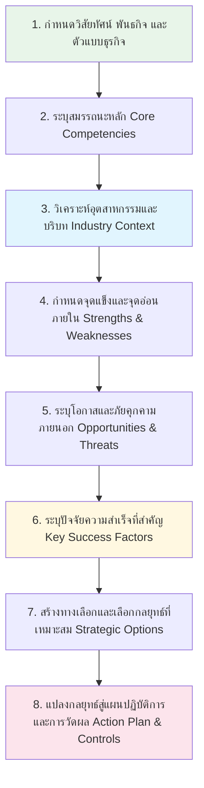

---

# 2. เครื่องยนต์กลยุทธ์แบบไดนามิก (Dynamic Strategy Engine)

*📄 Slides 7-15*

## 2.1 ทำไมต้องเป็นกลยุทธ์แบบไดนามิก (Dynamic Approach)?
ในสภาวะแวดล้อมทางเทคโนโลยีที่มีความผันผวนสูง อุตสาหกรรมไม่เคยหยุดนิ่ง เส้นแบ่งระหว่างคู่แข่ง คู่ค้า และซัพพลายเออร์มีความคลุมเครือ กลยุทธ์จึงไม่สามารถเป็นเส้นตรงที่ตายตัวได้ แต่ต้องเป็น **"เครื่องยนต์ที่ปรับตัวอย่างต่อเนื่อง (Dynamic Engine)"**

## 2.2 หกคำถามชี้ชะตาเพื่อสร้างกลยุทธ์ที่มีผลกำไร (Figure 4.2)

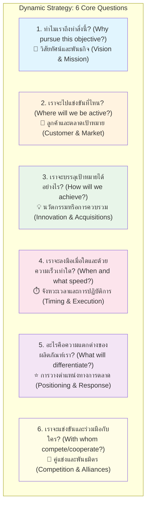

### กรณีศึกษาการปรับกลยุทธ์: GE Aircraft Engines (GEAE)
- **สถานการณ์:** ตลาดเครื่องยนต์เครื่องบินเผชิญการแข่งขันรุนแรง วงจรชีวิตสินค้าสั้นลง กำไรจากการขายเครื่องยนต์ลดลง
- **การปรับกลยุทธ์:** GEAE เปลี่ยนทิศทางจากผู้ผลิตเครื่องยนต์อย่างเดียว มาเป็นผู้ให้บริการซ่อมบำรุงและบริการหลังการขาย (After-sales Service & Maintenance)
- **ผลลัพธ์:** สร้างรายได้จากภาคบริการสูงถึง 19 พันล้านดอลลาร์ จากรายได้รวม 30.5 พันล้านดอลลาร์ (ปี 2018)

---

# 3. สมรรถนะหลักของกิจการ (Core Competencies)

*📄 Slides 16-18*

> [!DEFINITION] สมรรถนะหลัก (Core Competencies)
> ผลรวมของการเรียนรู้ร่วมกันในองค์กร ทักษะเฉพาะของพนักงาน และความสามารถในการบูรณาการความเชี่ยวชาญเข้ากับทรัพยากร เพื่อส่งมอบคุณค่าที่โดดเด่น เหนือกว่า และยากที่คู่แข่งจะลอกเลียนแบบได้

$$\text{สมรรถนะหลัก} = \text{ทรัพยากร (Resources)} + \text{การเรียนรู้/ทักษะ (Learning/Skills)}$$

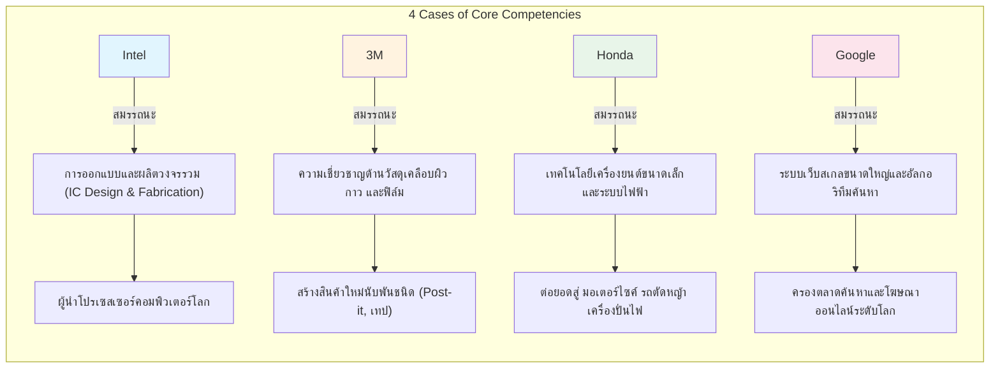

---

# 4. การวิเคราะห์อุตสาหกรรมและบริบททางธุรกิจ

*📄 Slides 19-22*

## 4.1 สี่ขั้นตอนของวงจรชีวิตอุตสาหกรรม (Industry Life Cycle - Table 4.3)

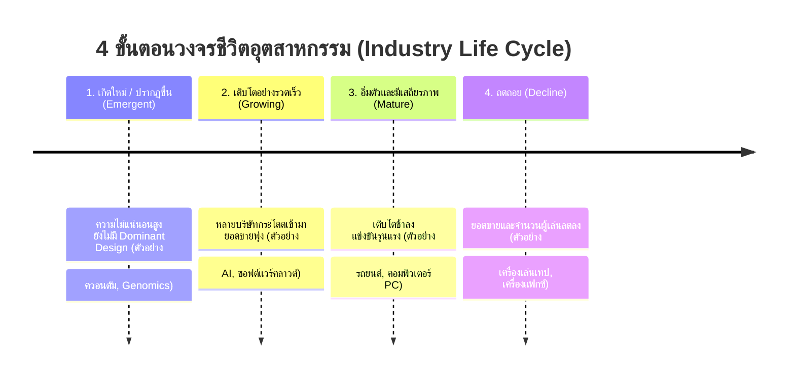

## 4.2 แบบจำลองพลังทั้งหก (Six Forces Model)
พัฒนาต่อยอดจาก Five Forces ของ Michael Porter โดยเพิ่มพลังที่ 6 สำหรับยุคเทคโนโลยี:

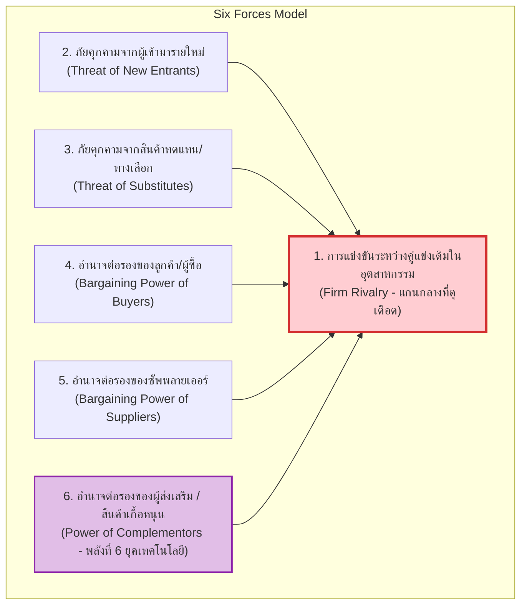

> [!NOTE] Complementors (ผู้ส่งเสริม) คือใคร?
> องค์กรที่ผลิตสินค้าหรือบริการที่ทำให้สินค้าของเรามีมูลค่าเพิ่มขึ้นเมื่อใช้ร่วมกัน เช่น ผู้พัฒนาแอปพลิเคชันบนสมาร์ทโฟน หรือสถานีชาร์จไฟฟ้าสำหรับรถยนต์ EV

---

# 5. การวิเคราะห์ SWOT เชิงกลยุทธ์ (SWOT Strategic Matrix)

*📄 Slides 23-24*

## 5.1 การจับคู่เชิงกลยุทธ์ (Strategic Matching)
การวิเคราะห์ SWOT จะทรงพลังเมื่อนำปัจจัยภายใน (จุดแข็ง/จุดอ่อน) มาจับคู่กับปัจจัยภายนอก (โอกาส/ภัยคุกคาม) เพื่อกำหนดทิศทางปฏิบัติการ:

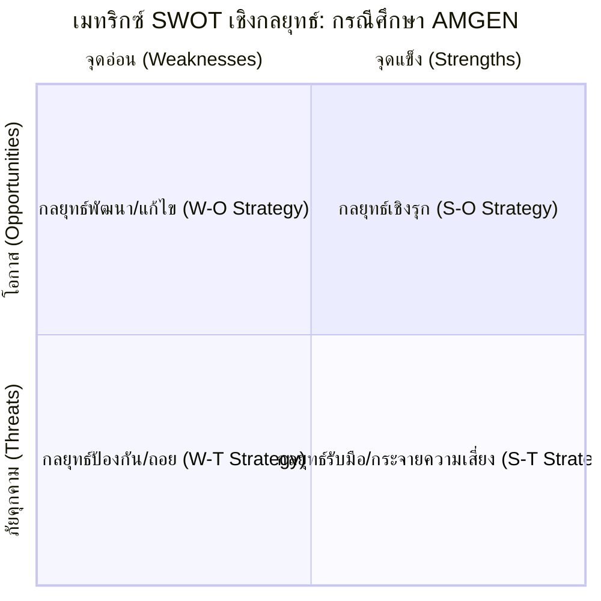

### กรณีศึกษาบริษัทชีวเภสัชภัณฑ์ AMGEN (Table 4.4)
- **จุดแข็ง (Strengths):** ความเชี่ยวชาญการผลิตยาชีวภาพ (โปรตีน/แอนติบอดี) และมีผลิตภัณฑ์อัตรากำไรสูง
- **จุดอ่อน (Weaknesses):** พึ่งพายาไม่กี่ตัว หากไม่พบวิธีรักษาใหม่รายได้อาจลดลง
- **โอกาส (Opportunities):** ขยายตลาดยาเดิมสู่ภูมิภาคใหม่ และจัดสรรงบวิจัยพัฒนายาชีวภาพสูตรใหม่
- **ภัยคุกคาม (Threats):** บริษัทยาขนาดใหญ่กระโดดเข้ามาแข่ง และแรงกดดันด้านการควบคุมราคายา
- **ผลลัพธ์เชิงกลยุทธ์:** ใช้กระแสเงินสดและกำไรสูงจากจุดแข็ง ไปเป็นทุนวิจัยพัฒนาผลิตภัณฑ์ใหม่ เพื่ออุดจุดอ่อนระยะยาว

---

# 6. ลูกบาศก์แห่งโอกาส 3 มิติ และการจับคู่ความเร็วตลาด

*📄 Slides 25-26*

## 6.1 ลูกบาศก์แห่งโอกาส 3 มิติ (3D Opportunity Cube)
ประเมินความเสี่ยงในการเติบโตของธุรกิจผ่าน 3 แกน:
- **แกน X:** ลูกค้า (ปัจจุบัน vs ใหม่)
- **แกน Y:** ผลิตภัณฑ์ (ปัจจุบัน vs ใหม่)
- **แกน Z:** แนวทาง/ช่องทางส่งมอบ (ปัจจุบัน vs ใหม่)

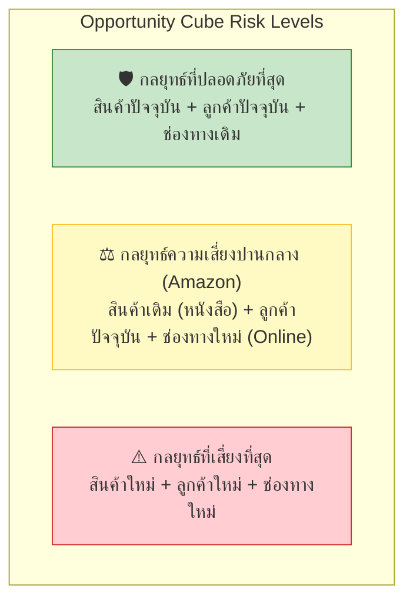

## 6.2 การจับคู่กลยุทธ์ให้สอดคล้องกับความเร็วของตลาด (Table 4.9 & Eisenhardt & Sull, 2001)

| มิติเปรียบเทียบ | 1. ป้องกันตำแหน่ง (Position Defense) 🏰 | 2. ใช้ประโยชน์จากทรัพยากร (Resource Leverage) 📦 | 3. ไล่ล่าโอกาสใหม่ (Emergent Approach) 🚀 |
|---|---|---|---|
| **สภาพตลาดที่เหมาะสม** | เปลี่ยนแปลงช้า ตลาดเข้าใจง่าย (Slow-cycle) | เปลี่ยนแปลงปานกลาง (Standard-cycle) | เปลี่ยนแปลงรวดเร็ว คาดเดาไม่ได้ (Fast-cycle) |
| **คำถามพื้นฐาน** | เราควรอยู่จุดไหน? (*Where should we be?*) | เราควรเป็นอะไร? (*What should we be?*) | ก้าวต่อไปคืออะไร? (*How should we take next step?*) |
| **ขั้นตอนหลัก** | ระบุตลาดที่น่าสนใจ ยึดครอง และสร้างป้อมปราการ | จัดหาทรัพยากรที่มีค่าและเป็นเอกลักษณ์ | เลือกกระบวนการหลัก 1-2 อย่าง ใช้กฎที่ยืดหยุ่นนำทาง |
| **ระยะเวลาความได้เปรียบ** | ค่อนข้างยาวนาน (3-6 ปี) | ค่อนข้างยาวนาน (3-6 ปี) | สั้น (1-3 ปี) ต้องสร้างใหม่อยู่เสมอ |
| **เป้าหมายหลัก** | ความสามารถในการทำกำไร (Profitability) | ครองความเป็นผู้นำระยะยาว (Dominance) | เติบโตเร็วและจับกระแสกำไร (Growth & Profit) |

---

# 7. ป้อมปราการต้านคู่แข่ง: 6 อุปสรรคการเข้าสู่ตลาด

*📄 Slides 27-28*

> [!IMPORTANT] 6 อุปสรรคในการเข้าสู่ตลาด (Barriers to Entry)
> 1. **การประหยัดต่อขนาด (Economies of Scale):** ธุรกิจเดิมผลิตปริมาณมากจนต้นทุนต่อหน่วยต่ำมาก (เช่น อุตสาหกรรมผลิตเครื่องบิน)
> 2. **ความได้เปรียบด้านต้นทุนที่ไม่ขึ้นกับขนาด (Cost Advantages Independent of Scale):** สิทธิบัตร ความรู้เฉพาะตัว ทำเลทอง หรือข้อได้เปรียบจากการเรียนรู้ (Learning Curve)
> 3. **การสร้างความแตกต่างของผลิตภัณฑ์ (Product Differentiation):** ความภักดีต่อแบรนด์ (Brand Loyalty) ที่เหนียวแน่นของลูกค้าเดิม
> 4. **การยับยั้งที่มนุษย์สร้างขึ้น (Deliberate Retaliation / Artificial Barriers):** การตัดราคา การผูกขาดช่องทางจำหน่าย
> 5. **กฎระเบียบและการกำกับดูแลของรัฐบาล (Government Regulation):** ใบอนุญาต สัมปทาน คลื่นความถี่ หรือข้อกำหนดความปลอดภัยเข้มงวด
> 6. **ต้นทุนในการเปลี่ยนยี่ห้อ (Switching Costs):** ค่าใช้จ่าย ความยุ่งยาก หรือข้อมูลที่ลูกค้าต้องเสียหากเปลี่ยนไปใช้ผลิตภัณฑ์ของคู่แข่ง

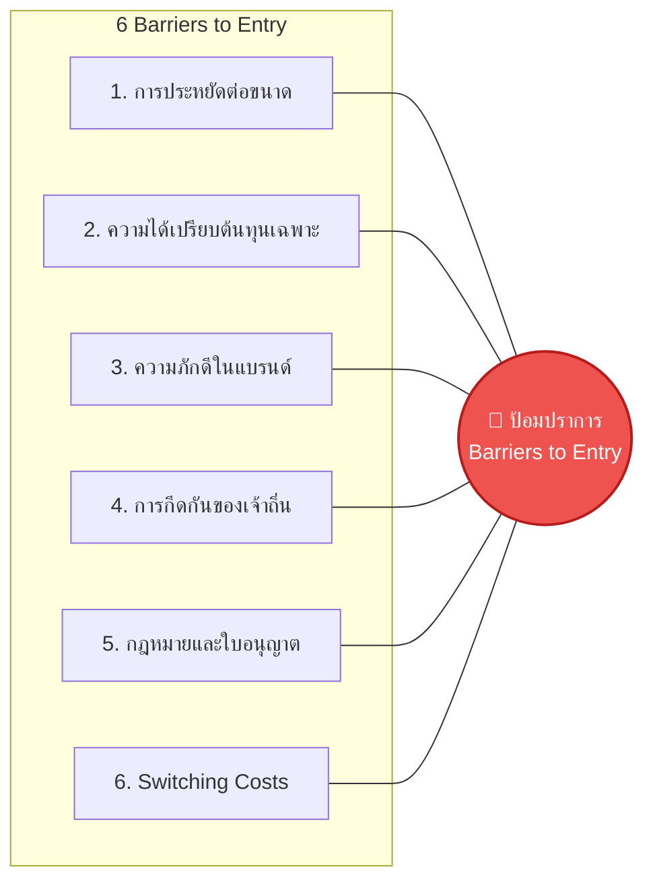

---

# 8. พีระมิดแห่งการสร้างมูลค่าและความได้เปรียบที่ยั่งยืน

*📄 Slides 29-32*

## 8.1 พีระมิดแห่งการสร้างมูลค่า (Value Creation Pyramid - Figure 4.6)

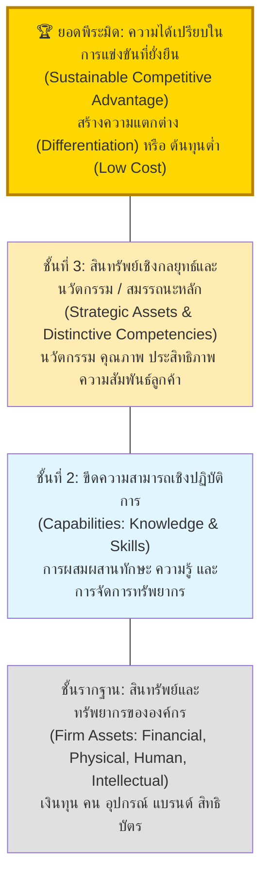

## 8.2 สิบมิติแห่งความได้เปรียบทางการแข่งขัน (10 Dimensions of Competitive Advantage)

| มิติความได้เปรียบ | บริษัทตัวอย่าง | รายละเอียดกลยุทธ์ |
|---|---|---|
| **1. คุณภาพสูง (High Quality)** | **Hewlett-Packard (HP)** | ความแม่นยำและความทนทานของอุปกรณ์ |
| **2. ขนาดเครือข่าย (Network Size)** | **Facebook (Meta)** | ยิ่งมีผู้ใช้มาก คุณค่าของแพลตฟอร์มยิ่งทวีคูณ (Network Effect) |
| **3. ต้นทุนต่ำ (Low Cost)** | **Walmart** | การจัดการระบบโลจิสติกส์และอำนาจต่อรองซื้อสินค้าราคาถูกสุด |
| **4. ดีไซน์และฟังก์ชัน (Design & Function)** | **Google** | หน้าเว็บค้นหาเรียบง่าย ผลลัพธ์เร็วและแม่นยำสูงสุด |
| **5. การแบ่งส่วนตลาด (Segmentation)** | **eBay** | ตลาดประมูลออนไลน์สำหรับสินค้าเฉพาะกลุ่มและของสะสม |
| **6. ความกว้างของสายผลิตภัณฑ์ (Breadth of Line)** | **Amazon.com** | "The Everything Store" มีสินค้าครบทุกหมวดหมู่ |
| **7. นวัตกรรมผลิตภัณฑ์ (Product Innovation)** | **Medtronic** | เครื่องกระตุ้นหัวใจและอุปกรณ์การแพทย์ช่วยชีวิต |
| **8. การขายที่มีประสิทธิภาพ (Effective Sales)** | **Pfizer** | เครือข่ายตัวแทนขายยาและการกระจายสินค้าทางการแพทย์ |
| **9. การเลือกใช้ผลิตภัณฑ์ (Product Selection)** | **Oracle** | ฐานข้อมูลระดับองค์กรที่ครอบคลุมทุกแอปพลิเคชันธุรกิจ |
| **10. ทรัพย์สินทางปัญญา (Intellectual Property)** | **Genentech** | สิทธิบัตรการค้นพบโครงสร้างยีนและชีวเภสัชกรรม |

---

# 9. เครือข่ายคุณค่า พันธมิตร และความรับผิดชอบต่อสังคม

*📄 Slides 33-47*

## 9.1 เครือข่ายคุณค่าและการแข่งขันแบบร่วมมือ (Value Network & Co-opetition)
ธุรกิจไม่ใช่แค่การแข่งขันแบบเอาเป็นเอาตาย แต่คือ **"การแข่งขันแบบมีส่วนร่วม" (Co-opetition = Cooperation + Competition)**

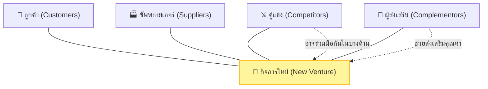

*กรณีศึกษาเครือข่ายคุณค่ามหาวิทยาลัย (Brandenburger & Nalebuff):* มหาวิทยาลัยต้องทำงานร่วมกับโรงเรียนมัธยม (ซัพพลายเออร์นักศึกษา), รัฐบาล/นายจ้าง (ลูกค้า), บริษัทซอฟต์แวร์ (ผู้เสริม), และมหาวิทยาลัยอื่น (คู่แข่งที่ร่วมมือด้านงานวิจัย)

## 9.2 สเปกตรัมของพันธมิตรทางธุรกิจ 6 ระดับ (Strategic Alliances Spectrum)

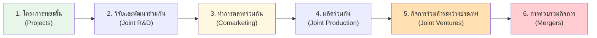

> [!TIP] กฎ 4 ข้อในการบริหารพันธมิตรให้ประสบความสำเร็จ (Table 4.8)
> 1. พัฒนาความสัมพันธ์ในการทำงานที่ชัดเจนตั้งแต่แรก
> 2. กำหนดตัวชี้วัดความก้าวหน้าร่วมกัน
> 3. **ใช้ประโยชน์จากความแตกต่าง แทนที่จะพยายามกำจัดมัน**
> 4. ส่งเสริมการทำงานร่วมกันแบบยืดหยุ่น เหนือกว่ากรอบสัญญาที่เป็นทางการ

## 9.3 คุณภาพชีวิต 3 ทุน และ เมทริกซ์คุณธรรมทางสังคม (Social Virtue Matrix)

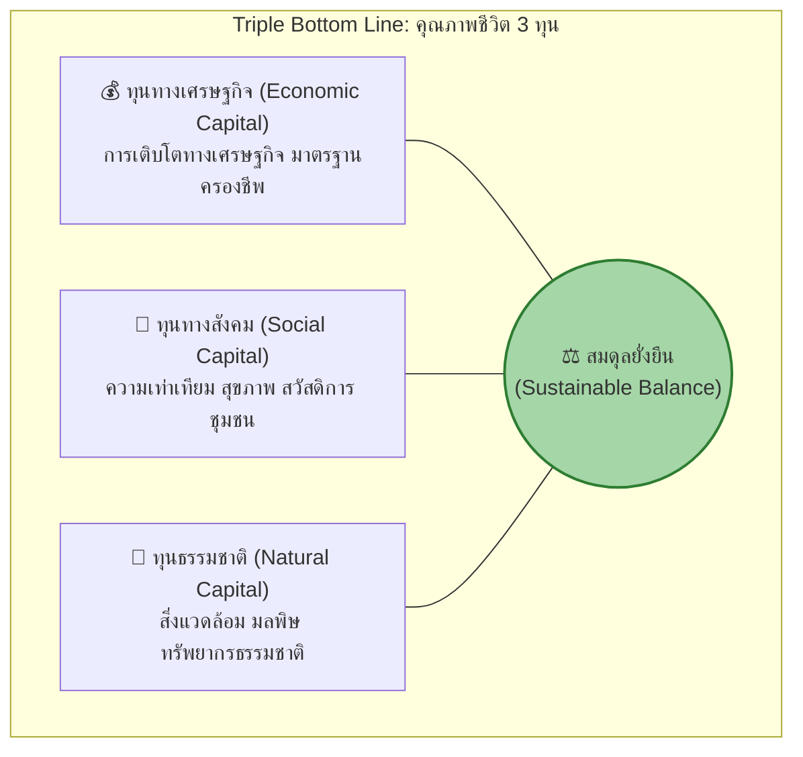

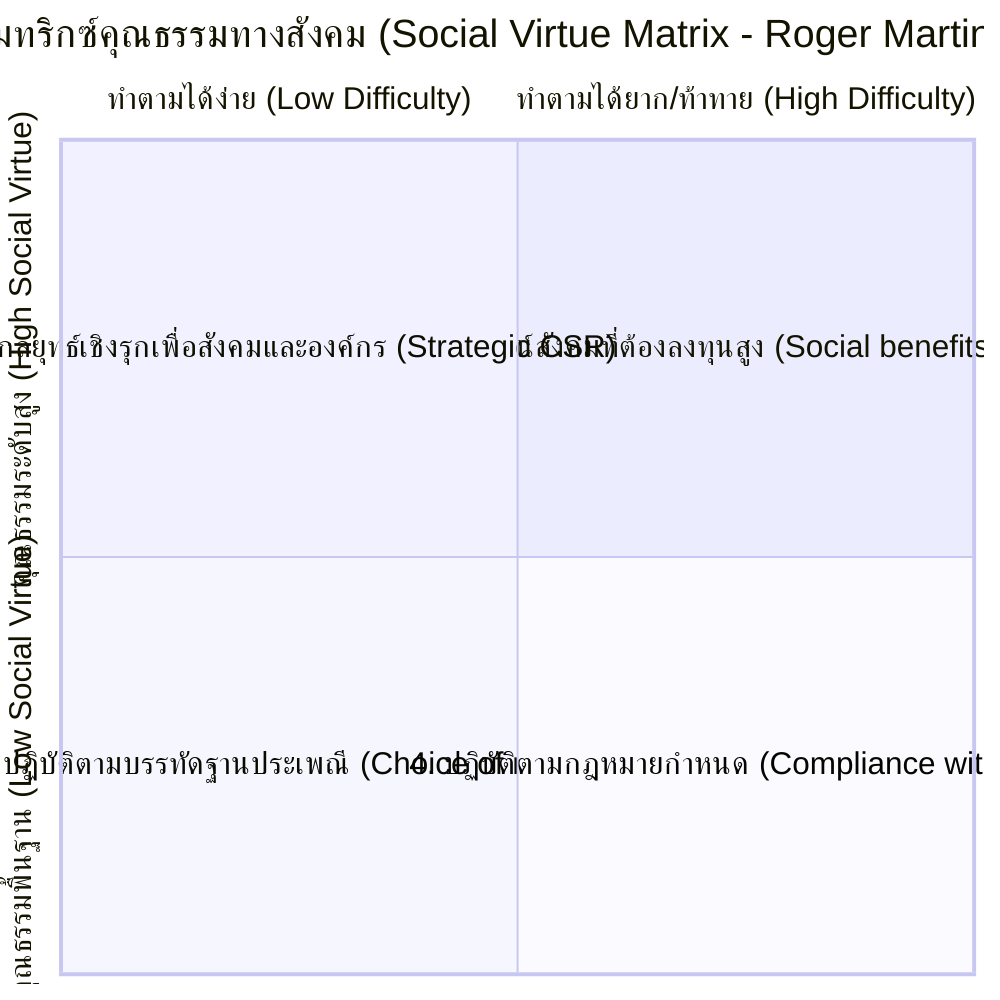

---

# 📝 สรุปสาระสำคัญประจำบท (Chapter Takeaway)
- กลยุทธ์ไม่ใช่แผนงานตายตัว แต่คือ **กระบวนการปรับตัวอย่างต่อเนื่อง (Dynamic Engine)** เพื่อตอบ 6 คำถามสำคัญ
- ความได้เปรียบที่ยั่งยืนสร้างจาก **สมรรถนะหลัก (Core Competencies)** ที่ผสานทรัพยากรและทักษะเฉพาะตัว
- ต้องเข้าใจโครงสร้างอุตสาหกรรมผ่าน **Six Forces Model** และสร้างป้อมปราการด้วย **6 Barriers to Entry**
- ในโลกยุคใหม่ การดำเนินธุรกิจต้องอาศัย **Co-opetition และเครือข่ายพันธมิตร** ควบคู่กับการสร้างสมดุล **3 ทุน (เศรษฐกิจ, สังคม, สิ่งแวดล้อม)**
