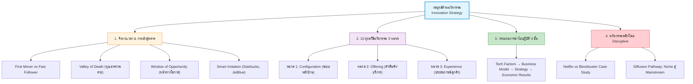
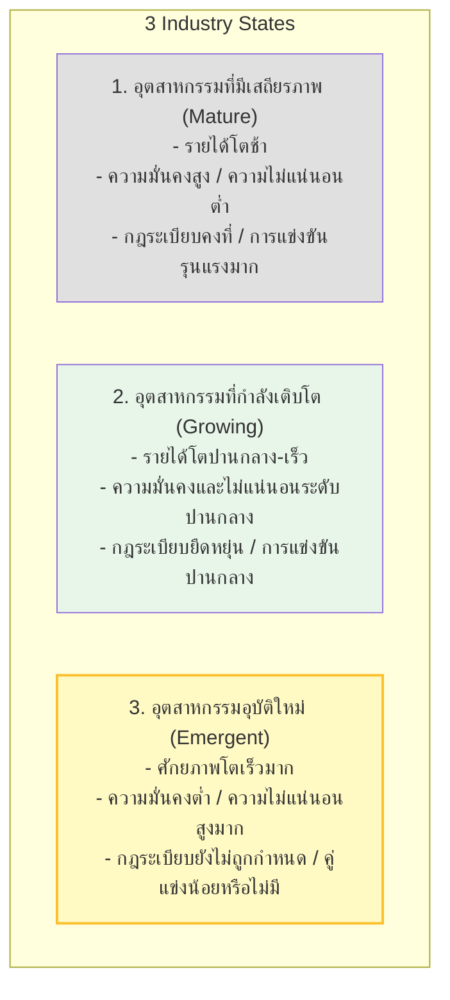
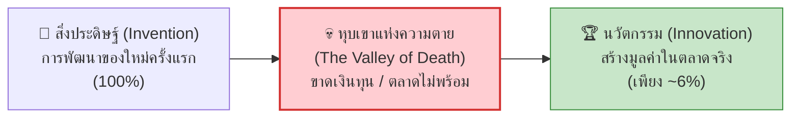
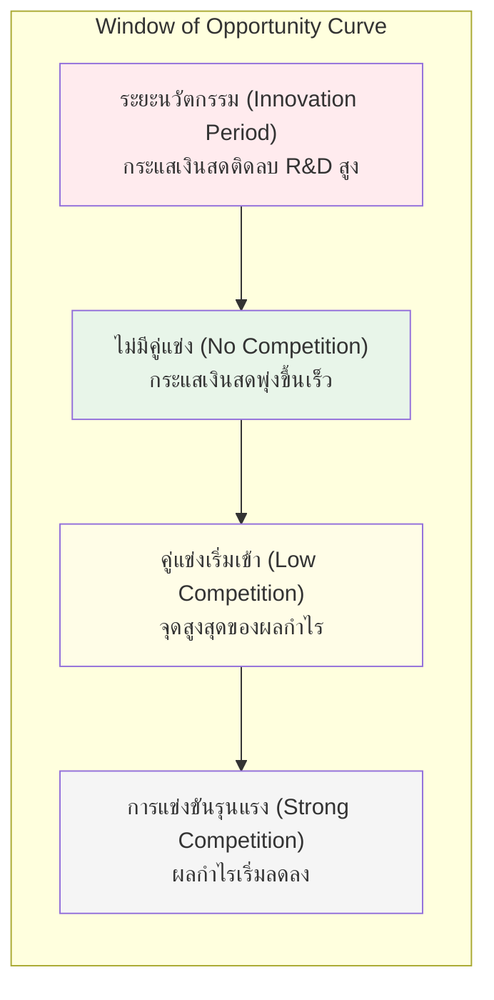
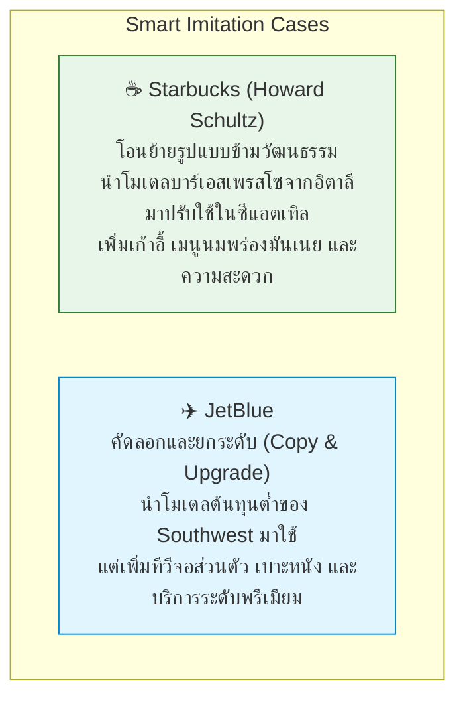
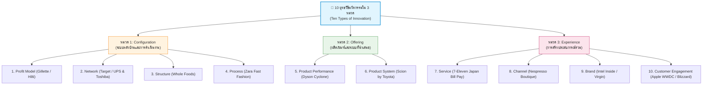
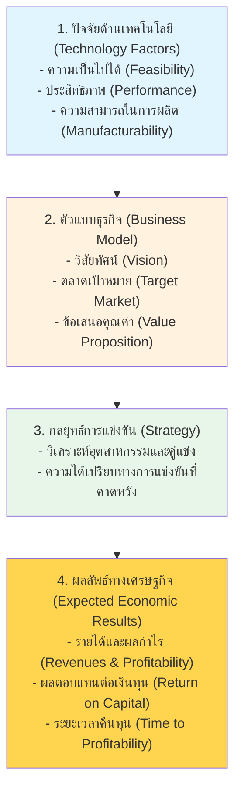
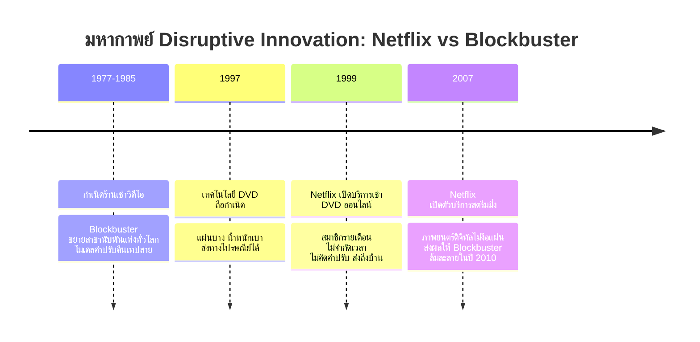

---
tags:
  - entrepreneurship
  - innovation-strategy
  - technology
  - first-mover
  - fast-follower
  - ten-types-of-innovation
  - disruptive-innovation
  - lecture-5
created: 2026-08-18
updated: 2026-08-18
lecture: 5
type: lecture
---

# Lecture 5: กลยุทธ์ด้านนวัตกรรมและเทคโนโลยี - Mega Guide

> [!SUMMARY] ภาพรวมบทเรียน
> บทเรียนนี้ครอบคลุมการกำหนดยุทธวิธีเพื่อนำนวัตกรรมเข้าสู่ตลาด และการบริหารจังหวะเวลา ประกอบด้วย 4 ส่วนหลัก:
> 1. [[#1. การวิเคราะห์ผู้บุกเบิกรายแรก vs ผู้ติดตาม]] - First Mover vs Fast Follower ใน 3 สภาวะอุตสาหกรรม, ข้อได้เปรียบ/เสียเปรียบ, และหุบเขาแห่งความตาย (The Valley of Death)
> 2. [[#2. หน้าต่างแห่งโอกาสและบทเรียนเชิงกลยุทธ์]] - Window of Opportunity, วัฏจักรความเร่งด่วน, กรณีศึกษา Silicon Valley Bank (SVB) และการลอกเลียนแบบอย่างชาญฉลาด (Smart Imitation: Starbucks, JetBlue)
> 3. [[#3. สิบยุทธวิธีนวัตกรรมใน 3 หมวด]] - Ten Types of Innovation (Configuration, Offering, Experience) พร้อมกรณีศึกษาครบ 10 ยุทธวิธี
> 4. [[#4. การนำกลยุทธ์ไปปฏิบัติและนวัตกรรมที่ก่อกวน]] - 4 ขั้นตอนสู่ความสำเร็จ (Technology Factors → Results), ทฤษฎี Disruptive Innovation (กรณีศึกษา Netflix vs Blockbuster) และเส้นทางการแพร่กระจายนวัตกรรม (Innovation Diffusion)

---

# 1. การวิเคราะห์ผู้บุกเบิกรายแรก vs ผู้ติดตาม

*📄 Slides 4-6*

## 1.1 สภาวะของอุตสาหกรรม 3 ประเภท (Table 5.1 & Barney, 2002)

## 1.2 หุบเขาแห่งความตาย (The Valley of Death)
จากสถิติงานวิจัย (Astebro, 1998; Hall & Rosenberg, 2010):
- มีเพียง **~6% ของสิ่งประดิษฐ์ (Inventions)** ที่พัฒนาขึ้นโดยนักประดิษฐ์เท่านั้นที่สามารถข้ามไปสู่ตลาดจนกลายเป็น **นวัตกรรม (Innovations)** ได้สำเร็จ
- **3 ใน 4 ของสิ่งประดิษฐ์** ไม่เคยถูกนำมาใช้ในเชิงพาณิชย์และต้องตายไปใน "หุบเขาแห่งความตาย" เนื่องจากขาดกลยุทธ์ธุรกิจและการสนับสนุนทางการเงินที่เพียงพอ

## 1.3 ข้อได้เปรียบและข้อเสียเปรียบของ First Mover vs Fast Follower

| มิติ | ผู้นำเสนอรายแรก (First Mover) 🥇 | ผู้ติดตามที่รวดเร็ว (Fast Follower) 🥈 |
|---|---|---|
| **ข้อได้เปรียบ** | - กำหนดมาตรฐานอุตสาหกรรมและกฎระเบียบ - ครอบครองทรัพยากรเชิงกลยุทธ์ก่อน - สร้างและปกป้องสิทธิบัตร (IP) - ภาพลักษณ์ความเป็นผู้นำนวัตกรรม | - เรียนรู้จากข้อผิดพลาดของผู้นำ - ต้นทุนวิจัยและให้ความรู้ตลาดต่ำกว่ามาก - ใช้ประโยชน์จากตลาดที่ผู้นำกรุยทางไว้แล้ว - พัฒนาผลิตภัณฑ์ที่สมบูรณ์และตอบโจทย์กว่า |
| **ข้อเสียเปรียบ** | - แบกรับต้นทุน R&D และการให้ความรู้ตลาดสูงลิ่ว - ความไม่แน่นอนในการออกแบบผลิตภัณฑ์สูง - เสี่ยงสร้างสิ่งที่ตลาดไม่ยอมรับ - ลูกค้ามีต้นทุนการเปลี่ยนพฤติกรรมสูง (Switching Costs) | - อาจต้องจ่ายค่าลิขสิทธิ์สิทธิบัตร - แบรนด์อาจไม่เป็นที่จดจำเท่าผู้บุกเบิก - ต้องเผชิญกับป้อมปราการที่ผู้นำสร้างไว้ |

---

# 2. หน้าต่างแห่งโอกาสและบทเรียนเชิงกลยุทธ์

*📄 Slides 7-11*

## 2.1 หน้าต่างแห่งโอกาส (Window of Opportunity) และกระแสเงินสด
หน้าต่างแห่งโอกาสคือช่วงเวลาทองที่เปิดรับนวัตกรรมใหม่ หากเข้าตลาดเร็วเกินไป (Premature) ตลาดอาจยังไม่พร้อม แต่หากเข้าช้าเกินไป (Too Late) ตลาดจะถูกยึดครองโดยคู่แข่ง

## 2.2 วัฏจักรความรู้สึกเร่งด่วน (The Cycle of Urgency)
เมื่อยอดขายตกต่ำหรือเกิดวิกฤต องค์กรจะตื่นตระหนก เร่งรีบสร้างกำลังการผลิตและออกผลิตภัณฑ์ใหม่อย่างลนลาน แต่เมื่อลูกค้าชะลอการตัดสินใจ ยอดขายก็ตกซ้ำอีก เกิดเป็นวงจรอุบาทว์ ดังนั้นการเข้าสู่ตลาดต้องอาศัยการวางแผนเชิงกลยุทธ์ที่รอบคอบ ไม่ใช่ทำด้วยความตื่นตระหนก

## 2.3 กรณีศึกษาจังหวะเวลา: Silicon Valley Bank (SVB - 1983)
- **สถานการณ์:** ต้นทศวรรษ 1980 สหรัฐฯ ยกเลิกกฎระเบียบธนาคาร ขณะที่ Bank of America ยกเลิกการปล่อยกู้แก่บริษัทไฮเทคในซานฟรานซิสโก
- **จังหวะเวลาของ SVB:** ผู้ก่อตั้งมองเห็นช่องว่าง ปลดล็อกบริการทางการเงินเพื่อสตาร์ทอัพเทคโนโลยีโดยเฉพาะ ก่อตั้ง SVB ในปี 1983
- **ผลลัพธ์:** กลายเป็นธนาคารหลักที่หนุนหลังยักษ์ใหญ่ยุคแรก เช่น Cisco, Electronic Arts, Intuit

## 2.4 การลอกเลียนแบบอย่างชาญฉลาด (Smart Imitation)

---

# 3. สิบยุทธวิธีนวัตกรรมใน 3 หมวด (Ten Types of Innovation)

*📄 Slides 12-19*

> [!INFO] กรอบแนวคิด Ten Types of Innovation (Doblin / Keeley et al.)
> นวัตกรรมที่แท้จริงไม่ได้จำกัดอยู่แค่ "ตัวผลิตภัณฑ์" (Product) แต่แบ่งเป็น 3 หมวด 10 ยุทธวิธี:

### เจาะลึกกรณีศึกษาทั้ง 10 ยุทธวิธี
| หมวดหมู่นวัตกรรม | ยุทธวิธี (Tactic) | นิยาม | กรณีศึกษาในสไลด์ |
|---|---|---|---|
| **Configuration** *(ระบบและการจัดการภายใน)* | **1. Profit Model** | วิธีการสร้างรายได้และโมเดลทำเงินใหม่ | **Gillette** (ขายด้ามมีดถูก เก็บกำไรจากใบมีด), **Hilti** (เปลี่ยนจากขายสว่านเป็นเช่าบริการรายเดือน) |
| | **2. Network** | การเชื่อมต่อพันธมิตรเพื่อสร้างคุณค่าร่วม | **Target** (จับมือนักออกแบบแฟชั่นชื่อดัง), **UPS & Toshiba** (ศูนย์ขนส่งทำหน้าที่ซ่อมแล็ปท็อป) |
| | **3. Structure** | จัดระเบียบสินทรัพย์และคนในองค์กรแบบใหม่ | **Whole Foods Market** (กระจายอำนาจให้ทีมสาขาบริหารจัดการและคัดสรรสินค้าเอง) |
| | **4. Process** | กระบวนการดำเนินงานที่เป็นเอกลักษณ์ | **Zara** (บูรณาการดีไซน์ ผลิต และโลจิสติกส์ ส่งเสื้อผ้าแบบใหม่สู่หน้าร้านใน 3 สัปดาห์) |
| **Offering** *(ผลิตภัณฑ์และระบบที่นำเสนอ)* | **5. Product Performance** | ฟังก์ชัน คุณสมบัติ และประสิทธิภาพสินค้าที่เหนือชั้น | **Dyson** (เทคโนโลยีดูดฝุ่นไร้ถุง Dual Cyclone + ดีไซน์กระบอกใสผ่านการทดสอบ 5,000 ต้นแบบ) |
| | **6. Product System** | ระบบผลิตภัณฑ์เสริมและแพลตฟอร์มที่เชื่อมโยงกัน | **Scion (by Toyota)** (แพลตฟอร์มรถยนต์ที่วัยรุ่นปรับแต่งชิ้นส่วนเสริมได้นับร้อยรายการ) |
| **Experience** *(การสร้างประสบการณ์ร่วม)* | **7. Service** | การบริการเสริมที่ยกระดับคุณค่าการใช้งาน | **7-Eleven Japan** (เพิ่มบริการรับชำระบิล ไปรษณีย์ และจุดรับส่งพัสดุในร้านสะดวกซื้อ) |
| | **8. Channel** | ช่องทางการนำส่งผลิตภัณฑ์ถึงมือลูกค้าที่โดดเด่น | **Nespresso** (ร้านบูติกหรูหรา, ระบบสั่งซื้อออนไลน์ตรง, บูรณาการกับโรงแรมห้าดาว) |
| | **9. Brand** | การสื่อสารอัตลักษณ์และคุณค่าที่น่าจดจำ | **Intel** (แคมเปญ "Intel Inside" สร้างแบรนด์ชิ้นส่วนที่มองไม่เห็น), **Virgin** (ขยายแบรนด์สู่สายการบิน ดนตรี รถไฟ อวกาศ) |
| | **10. Customer Engagement** | การสร้างความผูกพันและชุมชนผู้ใช้เชิงลึก | **Apple** (งาน WWDC และระบบนิเวศนักพัฒนา), **Blizzard** (เกม World of Warcraft สร้างคอมมูนิตี้ผู้เล่นทั่วโลก) |

---

# 4. การนำกลยุทธ์ไปปฏิบัติและนวัตกรรมที่ก่อกวน (Disruptive Innovation)

*📄 Slides 20-25*

## 4.1 สี่ขั้นตอนสู่ความสำเร็จของนวัตกรรมเทคโนโลยี (Figure 5.6)

## 4.2 ทฤษฎีนวัตกรรมพลิกโฉม/ก่อกวน (Disruptive Innovation Case Study)

> [!WARNING] บทเรียนจาก Blockbuster vs Netflix
> นวัตกรรมก่อกวน (Disruptive Innovation) มักเริ่มต้นจาก **ตลาดเฉพาะกลุ่ม (Niche) หรือกลุ่มประสิทธิภาพต่ำกว่ามาตรฐานตลาดเดิม** (DVD ทางไปรษณีย์ต้องรอ 1-2 วัน ขณะที่ Blockbuster ได้ดูทันที) แต่เมื่อเทคโนโลยีพัฒนาขึ้นจนถึงจุดตัด (Tipping Point) นวัตกรรมใหม่จะกลืนกินตลาดหลักทั้งหมดอย่างรวดเร็ว

## 4.3 เส้นทางการยอมรับและการแพร่กระจายนวัตกรรม (Innovation Diffusion Pathway)
1. **จุดเริ่มต้น (Niche / Uncertain Market):** แอปพลิเคชันเฉพาะทาง ตลาดไม่แน่นอน ผู้ใช้กลุ่มเล็ก (เช่น เครื่องพิมพ์ 3D MakerBot สำหรับกลุ่มแฮกเกอร์/ห้องแล็บ)
2. **การพัฒนาเทคโนโลยีและราคา (Tech & Cost Improvement):** เทคโนโลยีเสถียรขึ้น ต้นทุนถูกลง ใช้งานง่ายขึ้น
3. **เข้าสู่กระแสหลัก (Mainstream Dominance):** ขยายตัวครอบงำและปฏิวัติโครงสร้างอุตสาหกรรมเดิมอย่างสมบูรณ์

---

# 📝 สรุปสาระสำคัญประจำบท (Chapter Takeaway)
- สิ่งประดิษฐ์ต้องมีกลยุทธ์ธุรกิจจึงจะข้าม **"หุบเขาแห่งความตาย" (Valley of Death)** ไปสู่นวัตกรรมได้
- การเลือกเป็น First Mover หรือ Fast Follower ขึ้นอยู่กับสภาวะอุตสาหกรรม และต้องจับ **Window of Opportunity** ให้แม่นยำ
- นวัตกรรมไม่ได้มีแค่ตัวผลิตภัณฑ์ แต่ครอบคลุม **10 ยุทธวิธีใน 3 หมวด (Configuration, Offering, Experience)**
- ผู้ประกอบการที่ประสบความสำเร็จสูงสุดไม่ใช่คนที่มีเทคโนโลยีดีที่สุด แต่คือผู้ที่พบ **"การประยุกต์ใช้เทคโนโลยีที่ถูกต้อง" (Right Application)**
