---
tags:
  - entrepreneurship
  - product-development
  - innovation-engine
  - team-roles
  - brainstorming
  - modular-design
  - prototyping
  - simulation
  - lecture-6
created: 2026-08-18
updated: 2026-08-18
lecture: 6
type: lecture
---

# Lecture 6: การพัฒนาสินค้าและบริการนวัตกรรม - Mega Guide

> [!SUMMARY] ภาพรวมบทเรียน
> บทเรียนนี้ครอบคลุมกระบวนการเปลี่ยนจินตนาการและความคิดสร้างสรรค์ให้กลายเป็นผลิตภัณฑ์/บริการนวัตกรรมที่ใช้งานได้จริง ประกอบด้วย 5 ส่วนหลัก:
> 1. [[#1. รากฐานของนวัตกรรมและกลไกความคิดสร้างสรรค์]] - จินตนาการ → ความคิดสร้างสรรค์ → สิ่งประดิษฐ์ → นวัตกรรม, ทรัพยากร 6 ประการ, และ Innovation Engine (ปัจจัยภายใน vs ภายนอก)
> 2. [[#2. โครงสร้างทีมและ 10 บทบาทในการสร้างนวัตกรรม]] - 3 กลุ่มบทบาท (การเรียนรู้, การจัดการ, การรังสรรค์ - The Ten Faces of Innovation)
> 3. [[#3. กลยุทธ์การระดมความคิดที่มีประสิทธิภาพ]] - Brainstorming Strategy: แนวทาง 7 ประการ (7 Rights) และกฎข้อควรปฏิบัติ 7 ข้อ
> 4. [[#4. การออกแบบและพัฒนาผลิตภัณฑ์]] - ปรัชญา "Different but Familiar", ท่อส่งกระบวนการออกแบบ A-F, Robust Product, เรดาร์ 5 องค์ประกอบ Usability และสถาปัตยกรรม Modular Design
> 5. [[#5. การสร้างต้นแบบและภาพจำลองเหตุการณ์]] - วงจรพัฒนาต้นแบบแบบวนซ้ำ (Iterative Prototype Loop) และการจำลองสถานการณ์ (Scenario & Simulation Mapping)

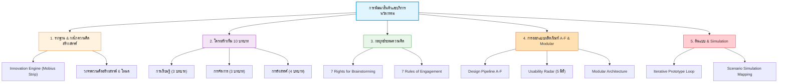

---

# 1. รากฐานของนวัตกรรมและกลไกความคิดสร้างสรรค์

*📄 Slides 4-11*

## 1.1 เส้นทางของนวัตกรรม (The Innovation Continuum)
การพัฒนานวัตกรรมไม่ได้เกิดขึ้นแบบกระโดดข้ามขั้น แต่เป็นกระบวนการต่อเนื่องจากนามธรรมสู่รูปธรรม:

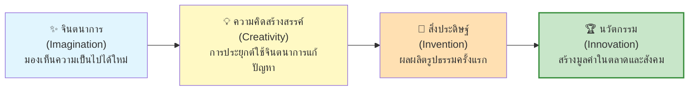

## 1.2 ทรัพยากร 6 ประการสำหรับองค์กรสร้างสรรค์
1. **ความรู้ในศาสตร์และสาขาที่ต้องการ (Knowledge):** รู้ลึกในสาขาของตนและรู้ว่ามีอะไรใหม่ในโลก
2. **ความสามารถในการมองเห็นความเชื่อมโยง (Connecting Dots):** กำหนดปัญหาใหม่ ตลอดจนจินตนาการแนวทางแก้ไขที่เป็นไปได้
3. **การคิดอย่างสร้างสรรค์เกี่ยวกับปัญหาด้วยวิธีการใหม่ๆ (Creative Thinking):** ไม่ยึดติดกรอบเดิม
4. **แรงจูงใจที่จะทำให้เกิดขึ้นจริง (Motivation & Drive):** พลังขับเคลื่อนจากภายใน
5. **บุคลิกภาพที่มุ่งเน้นโอกาส (Opportunity Mindset):** เปิดกว้างต่อความเปลี่ยนแปลง ไม่กลัวความล้มเหลว
6. **ความเข้าใจบริบทและการยอมรับความเสี่ยง (Context & Risk Tolerance):** เข้าใจความเสี่ยงและพร้อมรับความเสี่ยงที่คำนวณแล้ว

## 1.3 กลไกนวัตกรรม (The Innovation Engine - Tina Seelig)
โครงสร้างแบบริบบิ้นเมอบิอุส (Möbius Strip) ที่เชื่อมโยงปัจจัยภายในบุคคลกับปัจจัยภายนอกองค์กร:

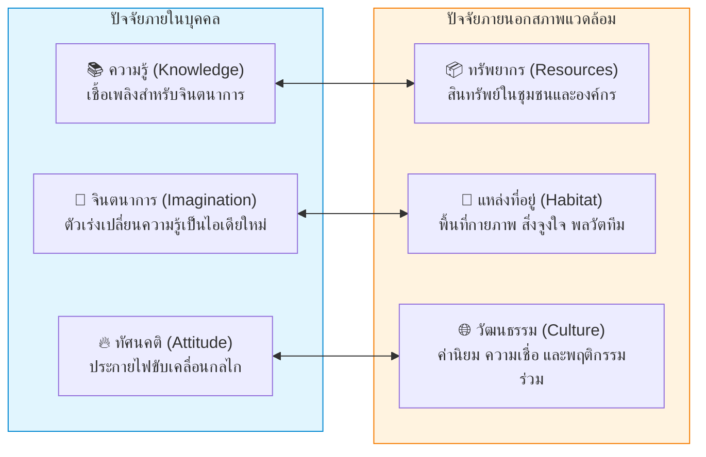

## 1.4 วงจรการเกิดความคิดสร้างสรรค์ 6 โหนด (The Creative Thinking Cycle)

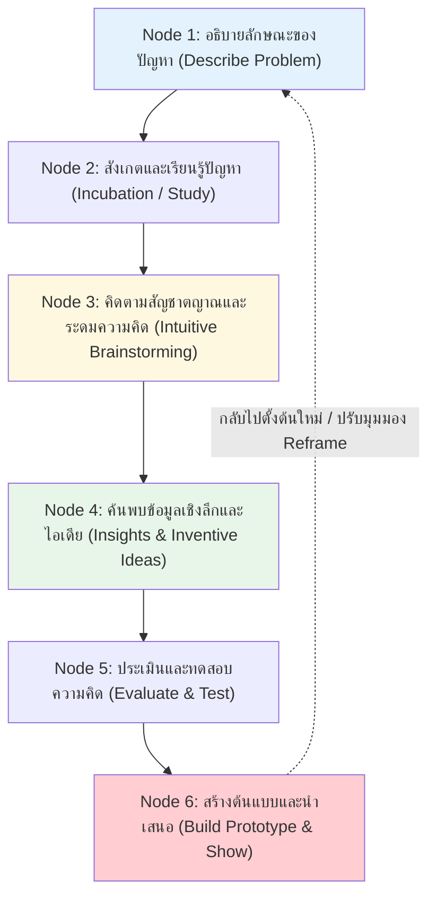

---

# 2. โครงสร้างทีมและ 10 บทบาทในการสร้างนวัตกรรม

*📄 Slides 12-15*

> [!INFO] บทบาท 10 หน้าของนวัตกร (The Ten Faces of Innovation โดย Tom Kelley, IDEO)
> ทีมสร้างนวัตกรรมที่มีประสิทธิภาพสูงสุด ต้องประกอบด้วยบุคลากรที่มีบทบาทหลากหลายใน 3 กลุ่มหลัก:

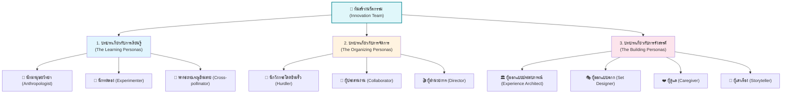

### รายละเอียดหน้าที่ของทั้ง 10 บทบาท
1. **กลุ่มการเรียนรู้ (Learning Roles):**
   - *Anthropologist (นักมานุษยวิทยา):* สังเกตพฤติกรรมมนุษย์แบบไม่ตัดสิน เพื่อเข้าใจความต้องการที่ซ่อนอยู่ (Unarticulated Needs)
   - *Experimenter (นักทดลอง):* สร้างต้นแบบไอเดียใหม่ๆ อย่างรวดเร็วและต่อเนื่อง ทดสอบสมมติฐานผ่านการลงมือทำ
   - *Cross-pollinator (พาหะถ่ายเรณู):* สำรวจอุตสาหกรรมอื่นแล้วหยิบยืมแนวคิดข้ามสายมาประยุกต์ใช้กับโจทย์ของตน
2. **กลุ่มการจัดการ (Organizing Roles):**
   - *Hurdler (นักวิ่งกระโดดข้ามรั้ว):* นักแก้ปัญหาเฉพาะหน้า ไม่ยอมแพ้ต่ออุปสรรค กฎระเบียบ หรือข้อจำกัดงบประมาณ
   - *Collaborator (ผู้ประสานงาน):* เชื่อมโยงคนที่มีความเชี่ยวชาญหลากหลายให้ทำงานร่วมกันอย่างราบรื่น
   - *Director (ผู้อำนวยการ):* รวบรวมทีม กำหนดทิศทางภาพรวม และสร้างแรงบันดาลใจให้ทุกคนมุ่งสู่เป้าหมาย
3. **กลุ่มการรังสรรค์ (Building Roles):**
   - *Experience Architect (ผู้ออกแบบประสบการณ์):* ออกแบบปฏิสัมพันธ์ที่ประทับใจ เกินกว่าฟังก์ชันการใช้งานปกติ
   - *Set Designer (ผู้ออกแบบฉาก):* ปรับแต่งสภาพแวดล้อมทางกายภาพและพื้นที่ทำงานให้กระตุ้นความคิดสร้างสรรค์
   - *Caregiver (ผู้ดูแล):* คาดการณ์ ใส่ใจ และเข้าใจความต้องการด้านอารมณ์ของลูกค้าอย่างลึกซึ้ง
   - *Storyteller (ผู้เล่าเรื่อง):* ถ่ายทอดวิสัยทัศน์และเรื่องราวของผลิตภัณฑ์ให้น่าสนใจ ดึงดูดทั้งนักลงทุนและลูกค้า

---

# 3. กลยุทธ์การระดมความคิดที่มีประสิทธิภาพ (Brainstorming)

*📄 Slides 19-21*

## 3.1 แนวทาง 7 ประการในการตั้งต้นระดมความคิด (The 7 Rights of Brainstorming)
1. **คนที่ถูกต้อง (Right People):** กลุ่มมีความหลากหลาย ขนาดเล็ก (5-8 คน) ปราศจากการเมืองภายใน
2. **ความท้าทายที่ถูกต้อง (Right Challenge):** กำหนดขอบเขตปัญหาอย่างชัดเจน เจาะจง ไม่กว้างเกินไป
3. **กรอบความคิดที่ถูกต้อง (Right Mindset):** มุ่งเน้นการสร้างสรรค์และต่อยอด (Yes, and...) ไม่ใช่วิพากษ์วิจารณ์
4. **ความเห็นอกเห็นใจที่ถูกต้อง (Right Empathy):** ยึดเอาความรู้สึกและ Pain Point ของผู้ใช้เป็นศูนย์กลาง
5. **สิ่งกระตุ้นที่ถูกต้อง (Right Stimulus):** ตั้งคำถามท้าทายสมมติฐานเดิม ใช้การเปรียบเทียบ (Analogies)
6. **การอำนวยความสะดวกที่ถูกต้อง (Right Facilitation):** Facilitator ดึงทุกคนให้มีส่วนร่วม ควบคุมบรรยากาศให้มีพลัง
7. **การติดตามผลที่ถูกต้อง (Right Follow-up):** มีระบบคัดเลือกและนำไอเดียไปพัฒนาสู่การปฏิบัติจริง

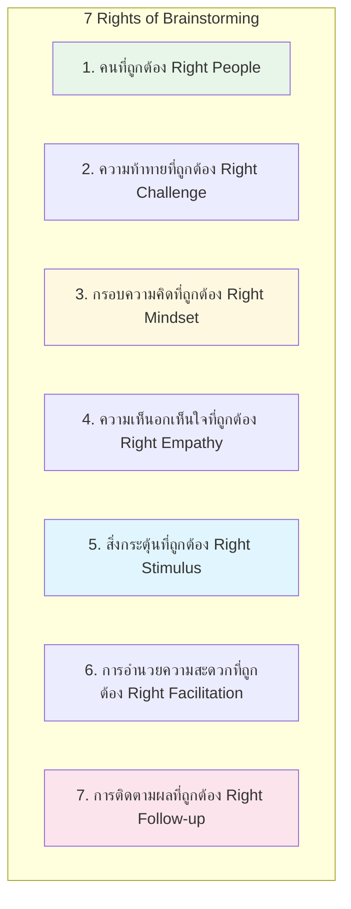

## 3.2 กฎ 7 ข้อควรปฏิบัติในการระดมความคิด (7 Rules of Engagement)
1. **ห้ามตัดสินความคิด (Defer Judgment):** ไม่วิจารณ์หรือปฏิเสธไอเดียของผู้อื่นในระหว่างการระดมสมอง
2. **เก็บเกี่ยวทุกความคิด (Capture Everything):** บันทึกทุกไอเดียแม้จะดูแปลกหรือไม่เกี่ยวข้องในตอนแรก
3. **เปิดรับความคิดสุดโต่ง (Encourage Wild Ideas):** ไอเดียที่หลุดโลกมักนำไปสู่ Breakthrough ข้อมูลเชิงลึกใหม่
4. **สื่อสารทีละคน (One Conversation at a Time):** ตั้งใจฟัง ไม่พูดแทรกหรือคุยแยกกลุ่ม
5. **ต่อยอดแนวคิด (Build on the Ideas of Others):** ใช้ไอเดียเพื่อนเป็นฐานแล้วพัฒนาขยายผลต่อ
6. **ใช้ภาพช่วยคิด (Be Visual):** วาดภาพ ร่างสเก็ตช์ ไดอะแกรม เพื่อให้เห็นภาพตรงกัน
7. **เน้นปริมาณมากกว่าคุณภาพ (Go for Quantity):** ยิ่งมีไอเดียมาก โอกาสค้นพบไอเดียชั้นเลิศยิ่งสูง

---

# 4. การออกแบบและพัฒนาผลิตภัณฑ์

*📄 Slides 22-31*

## 4.1 ปรัชญาการออกแบบผลิตภัณฑ์: "Different but Familiar"
> [!TIP] ปรัชญาแกนกลาง (Core Philosophy)
> ผลิตภัณฑ์ใหม่ต้อง **"ดูแตกต่างจากเดิม (Different) แต่ยังให้ความรู้สึกคุ้นเคย (Familiar)"** เพื่อให้ผู้ใช้ตื่นเต้นกับคุณค่าใหม่ แต่ไม่ต้องเรียนรู้การใช้งานใหม่อย่างยากลำบาก

## 4.2 ท่อส่งกระบวนการออกแบบผลิตภัณฑ์ A-F (Product Design Pipeline A-F)

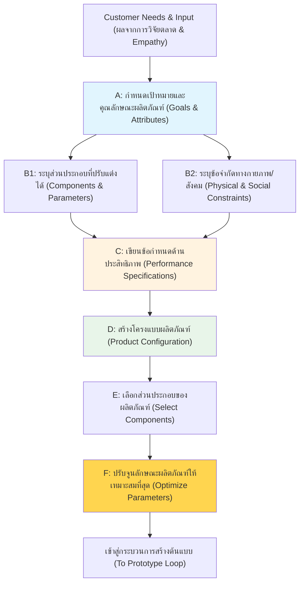

## 4.3 การออกแบบผลิตภัณฑ์ให้ทนทาน (Robust Design & Robust Product)
- **Robust Product (ผลิตภัณฑ์ที่ทนทาน/แข็งแกร่ง):** ผลิตภัณฑ์ที่ไม่ไวต่อการเสื่อมสภาพ การชำรุด การเปลี่ยนแปลงของชิ้นส่วน หรือความผันผวนของสภาพแวดล้อม
- **Robust Design:** กระบวนการออกแบบที่ช่วยลดความแปรปรวนในด้านประสิทธิภาพและรักษามาตรฐานคุณภาพให้คงที่

## 4.4 เรดาร์ 5 องค์ประกอบของการใช้งานที่ดี (The Usability Radar)

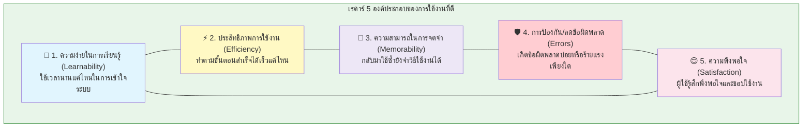

1. **Learnability (ความง่ายในการเรียนรู้):** ผู้ใช้ครั้งแรกเข้าใจวิธีใช้งานได้เร็วแค่ไหน?
2. **Efficiency (ประสิทธิภาพการใช้งาน):** เมื่อใช้เป็นแล้ว สามารถทำภารกิจสำเร็จได้รวดเร็วเพียงใด?
3. **Memorability (ความสามารถในการจดจำ):** เมื่อเว้นการใช้งานไปนาน กลับมาใช้ใหม่ยังจำวิธีใช้ได้หรือไม่?
4. **Errors (ข้อผิดพลาด):** ผู้ใช้ทำข้อผิดพลาดบ่อยไหม และระบบช่วยกู้คืนจากความผิดพลาดได้ง่ายหรือไม่?
5. **Satisfaction (ความพึงพอใจ):** ผู้ใช้รู้สึกเพลิดเพลินและพึงพอใจกับการใช้งานหรือไม่?

## 4.5 สถาปัตยกรรมโมดูล vs การออกแบบโมดูลาร์ (Module vs Modular Design)

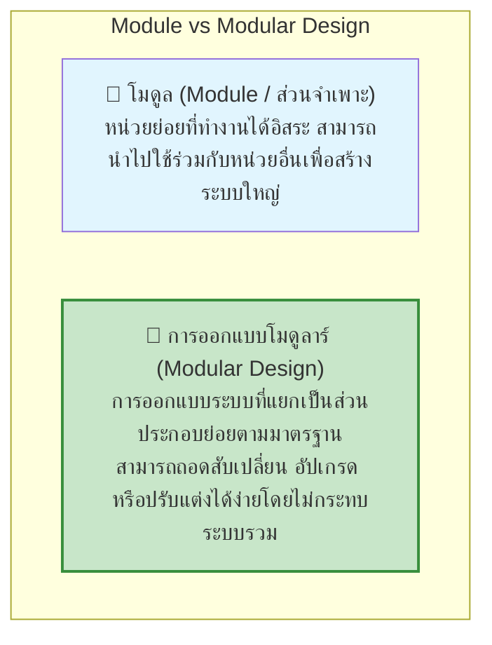

---

# 5. การสร้างต้นแบบและภาพจำลองเหตุการณ์

*📄 Slides 32-40*

## 5.1 วงจรการพัฒนาผลิตภัณฑ์ต้นแบบแบบวนซ้ำ (The Iterative Prototype Loop - Figure 5.6)

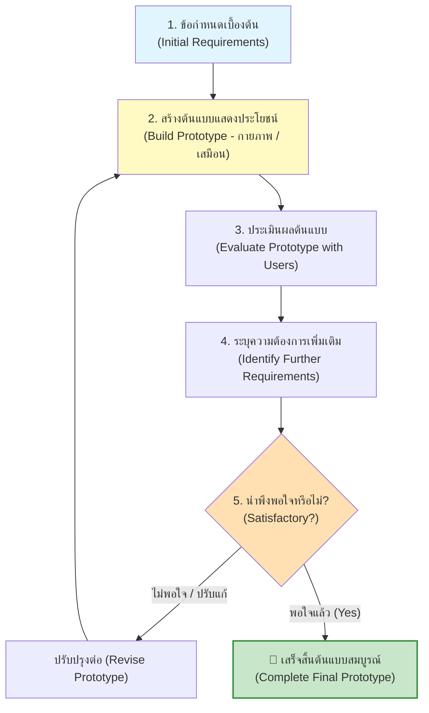

## 5.2 การสร้างภาพจำลองเหตุการณ์และการจำลองสถานการณ์ (Scenario & Simulation Mapping)

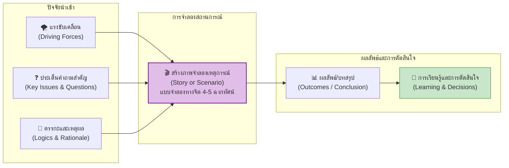

> [!NOTE] ประโยชน์ของ Scenario Planning
> การสร้างสถานการณ์จำลอง 4-5 รูปแบบ (เช่น Best Case, Worst Case, Base Case) ช่วยให้องค์กรเห็นช่วงของผลลัพธ์ที่เป็นไปได้ล่วงหน้า และเตรียมแผนรับมือเชิงกลยุทธ์โดยไม่ต้องเสี่ยงเสียหายในระบบจริง

---

# 📝 สรุปสาระสำคัญประจำบท (Chapter Takeaway)
- นวัตกรรมคือระบบที่ขับเคลื่อนอย่างต่อเนื่องผ่าน **3 วงล้อประสานกัน: วงจรความคิดสร้างสรรค์ (หาปัญหา) $\rightarrow$ นิเวศการพัฒนา (สร้างทางออก) $\rightarrow$ การทดสอบต้นแบบและจำลองสถานการณ์ (ทดสอบกับความจริง)**
- ทีมที่ประสบความสำเร็จต้องมีบทบาทครบทั้ง **ผู้เรียนรู้, ผู้จัดการ, และผู้รังสรรค์ (The 10 Faces of Innovation)**
- การออกแบบต้องยึดหลัก **"Different but Familiar"** และคำนึงถึง **Usability 5 ด้าน**
- การพัฒนาต้นแบบต้องทำแบบ **Iterative Loop** ที่สร้างเร็ว ทดสอบไว และปรับปรุงอย่างต่อเนื่องจนได้ผลิตภัณฑ์ที่ตอบโจทย์ตลาดอย่างแท้จริง
